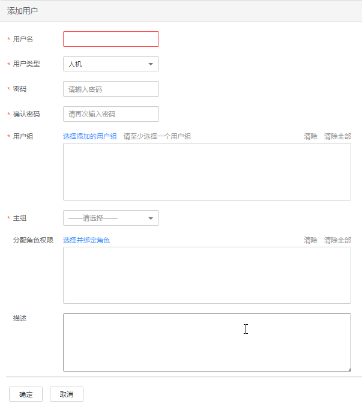

# 创建用户

## 操作场景

该任务指导管理员根据实际业务场景需要，通过Manager创建新用户并指定其操作权限以满足业务使用。

Manager支持的用户数为1000。

如需对新创建用户的密码使用新的密码策略，请先[修改密码策略](修改密码策略-164.md)，再参考本章节创建用户。

> **说明：** 
>该章节操作仅适用于**MRS 3.x**之前版本集群。
>**MRS 3.x**及之后版本集群请参考[创建用户](创建用户.md)章节。

## 前提条件

-   管理员已明确业务需求，并已创建业务场景需要的角色和用户组。
-   开启Kerberos认证的集群或开启弹性公网IP功能的普通集群。

## 操作步骤

1.  访问MRS Manager，详细操作请参见[访问MRS Manager（MRS 2.x及之前版本）](访问MRS-Manager（MRS-2-x及之前版本）.md)。
2.  在MRS Manager，单击“系统设置”。
3.  在“权限配置”区域，单击“用户管理”。
4.  在用户列表上方，单击“添加用户”。

    

5.  根据界面提示配置参数，填写“用户名”。

    > **说明：** 
    >-   不支持创建两个名称相同但大小写不同的用户。例如已创建用户“User1”，无法创建用户“user1”。
    >-   使用已创建的用户时，请输入和用户名完全一样的大小写字符。
    >-   “用户名”为必选参数，字符长度为3到20，可以包含数字、字母和下划线。
    >-   “root“、“omm“和“ommdba“为系统保留用户，请选择其他用户名。

6.  设置“用户类型”，可选值包括“人机”和“机机”。
    -   “人机”用户：用于在MRS Manager的操作运维场景，以及在组件客户端操作的场景。选择该值需同时填写“密码”和“确认密码”。
    -   “机机”用户：用于MRS应用开发的场景。选择该值用户密码随机生成，无需填写。

7.  在“用户组”，单击“选择添加的用户组”，选择对应用户组将用户添加进去。

    > **说明：** 
    >-   如果用户组添加了角色，则用户可获得对应角色中的权限。
    >-   为新用户分配Hive的权限，请将用户加入hive组。
    >-   如果用户需要管理租户资源，用户组必须分配了Manager\_tenant角色以及租户对应的角色。
    >-   通过Manager创建的用户无法添加到通过IAM用户同步功能同步的用户组中。

8.  在“主组”选择一个组作为用户创建目录和文件时的主组。下拉列表包含“用户组”中勾选的全部组。
9.  根据业务实际需要在“分配角色权限”，单击“选择并绑定角色”为用户添加角色。

    > **说明：** 
    >-   创建用户时，如果用户从用户组获得的权限还不满足业务需要，则可以再分配其他已创建的角色。为新用户分配角色授权，最长可能需要3分钟时间生效。
    >-   创建用户时添加角色可细化用户的权限。
    >-   没有为新用户分配角色时，此用户可以访问HDFS、HBase、Yarn、Spark和Hue的WebUI。

10. 根据业务实际需要“描述”。

    “描述”为可选参数。

11. 单击“确定”完成用户创建。

    第一次在MRS集群中使用新创建的用户，例如登录Manager或者使用集群客户端，需要修改密码，具体请参见[修改操作用户密码](修改操作用户密码-161.md)。

