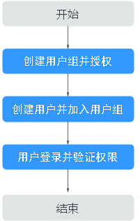

# 创建用户并授权使用MRS

如果您需要对您所拥有的MapReduce服务（MapReduce Service）进行精细的权限管理，您可以使用[统一身份认证服务](https://support.huaweicloud.com/usermanual-iam/iam_01_0001.html)（Identity and Access Management，简称IAM），通过IAM，您可以：

-   根据企业的业务组织，在您的华为云账号中，给企业中不同职能部门的员工创建IAM用户，让员工拥有唯一安全凭证，并使用MRS资源。
-   根据企业用户的职能，设置不同的访问权限，以达到用户之间的权限隔离。
-   将MRS资源委托给更专业、高效的其他华为云账号或者云服务，这些账号或者云服务可以根据权限进行代运维。

如果华为云账号已经能满足您的要求，不需要创建独立的IAM用户，您可以跳过本章节，不影响您使用MRS服务的其它功能。

本章节为您介绍对用户授权的方法，操作流程如[图1](#fig8523123435310)所示。

## 前提条件

给用户组授权之前，请您了解用户组可以添加的MRS权限，并结合实际需求进行选择，MRS支持的系统权限，请参见[权限管理](https://support.huaweicloud.com/productdesc-mrs/mrs_08_0033.html)。若您需要对除MRS之外的其它服务授权，IAM支持服务的所有策略请参见[权限策略](https://support.huaweicloud.com/usermanual-permissions/iam_01_0001.html)。

## 示例流程

**图 1**  给用户授权MRS权限流程  

1.  [创建用户组并授权](https://support.huaweicloud.com/usermanual-iam/iam_03_0001.html)

    在IAM控制台创建用户组，并授予MRS服务对应权限。

2.  [创建用户并加入用户组](https://support.huaweicloud.com/usermanual-iam/iam_02_0001.html)

    在IAM控制台创建用户，并将其加入[1.创建用户组并授权](#li895020818018)中创建的用户组。

3.  [用户登录](https://support.huaweicloud.com/usermanual-iam/iam_01_0552.html)并验证权限

    新创建的用户登录控制台，切换至授权区域，验证权限：

    -   在“服务列表”中选择MRS服务，进入MRS主界面，单击右上角“购买集群”，尝试购买MRS集群，如果无法购买MRS集群（假设当前权限仅包含MRS ReadOnlyAccess），表示“MRS ReadOnlyAccess”已生效。
    -   在“服务列表”中选择除MRS服务外（假设当前策略仅包含MRS ReadOnlyAccess）的任一服务，若提示权限不足，表示“MRS ReadOnlyAccess”已生效。

