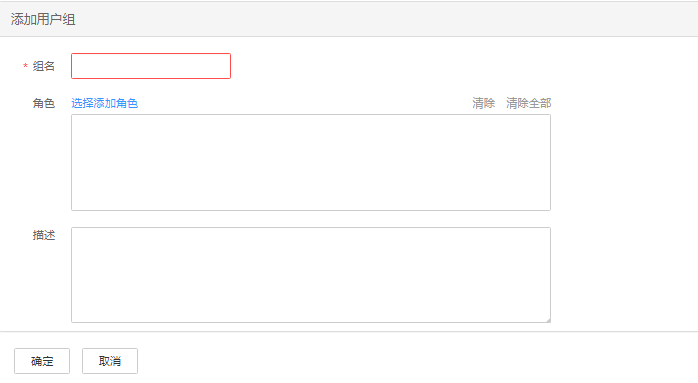

# 创建用户组

## 操作场景

该任务指导管理员用户通过Manager创建新用户组并指定其操作权限，使用户组可以统一管理加入用户组的单个或多个用户。用户加入用户组后，可获得用户组具有的操作权限。

Manager支持用户组数为100。

> **说明：** 
>该章节操作仅适用于**MRS 3.x**之前版本集群。
>**MRS 3.x**及之后版本集群请参考[用户组管理](用户组管理.md)章节。

## 前提条件

-   管理员用户已明确业务需求，并已创建业务场景需要的角色。
-   开启Kerberos认证的集群或开启弹性公网IP功能的普通集群。

## 操作步骤

1.  访问MRS Manager，详细操作请参见[访问MRS Manager（MRS 2.x及之前版本）](访问MRS-Manager（MRS-2-x及之前版本）.md)。
2.  在MRS Manager，单击“系统设置”。
3.  在“权限配置”区域，单击“用户组管理”。
4.  在组列表上方，单击“添加用户组”。

    

5.  填写“组名”和“描述”。

    “组名”为必选参数，字符长度为3到20，可以包含数字、字母和下划线。“描述”为可选参数。

6.  在“角色”，单击“选择添加角色”选择指定的角色并添加。

    如果不添加角色，则当前创建的用户组没有使用MRS集群的权限。

7.  单击“确定”完成用户组创建。

## 相关任务

**修改用户组**

1.  在MRS Manager，单击“系统设置”。
2.  在“权限配置”区域，单击“用户组管理”。
3.  在要修改用户组所在的行，单击“修改“，修改用户组信息。

    > **说明：** 
    >为用户组修改分配的角色权限，最长可能需要3分钟时间生效。

4.  单击“确定”完成修改操作。

**删除用户组**

1.  在MRS Manager，单击“系统设置”。
2.  在“权限配置”区域，单击“用户组管理”。
3.  在要删除用户组所在的行，单击“删除“。
4.  单击“确定”完成删除操作。

