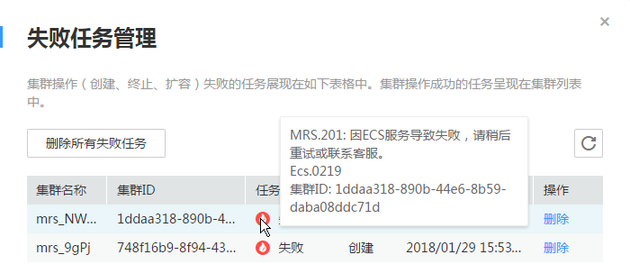

# 创建集群

使用MRS的首要操作就是购买集群，本章节为您介绍如何在MRS管理控制台创建一个新的集群。

## 计费模式

目前MRS商用收费基本要素为集群中弹性云服务器。购买MRS时默认支持按需购买集群节点和包年/包月购买集群节点。

-   包年/包月：根据集群购买时长，一次性支付集群费用。最短时长为1个月，最长时长为1年。时间越长，折扣越大。
-   按需计费：节点按实际使用时长计费，计费周期为一小时。

> **说明：**   
>-   此处费用只是购买集群所需费用，MRS上的数据存储、带宽和流量另外计费。  
>-   扣费时余额不足先提醒用户续费，在保留期冻结集群资源，续费后再解冻。  
>-   包年/包月集群删除后将无法恢复，其相关费用也无法回退，请谨慎删除包年/包月集群。  
>-   包年/包月集群用户账户欠费后集群还能使用，但不能使用按需服务，即不能通过OBS提交作业。  

## 创建MRS 1.8.1版本集群

> **说明：**   
>创建MRS历史版本集群操作请参见[创建集群（历史版本）](创建集群（历史版本）.md)。  

1.  登录MRS管理控制台。
2.  单击“购买集群”，进入“购买集群”页面。

    > **说明：**   
    >创建集群时需要注意配额提醒。当资源配额不足时，建议按照提示申请足够的资源，再创建集群。  

3.  参考下列表格配置集群基本信息。

    **表 1**  配置集群基本信息

    
    <table><thead align="left"><tr id="row155139722215"><th class="cellrowborder" valign="top" width="20%" id="mcps1.2.3.1.1">
参数

    </th>
    <th class="cellrowborder" valign="top" width="80%" id="mcps1.2.3.1.2">
参数说明

    </th>
    </tr>
    </thead>
    <tbody><tr id="row552827172217"><td class="cellrowborder" valign="top" width="20%" headers="mcps1.2.3.1.1 ">
计费模式

    </td>
    <td class="cellrowborder" valign="top" width="80%" headers="mcps1.2.3.1.2 ">
MRS提供两种计费模式：<ul id="ul053917717224"><li>包年/包月</li><li>按需计费</li></ul>
    

    </td>
    </tr>
    <tr id="row3552197162214"><td class="cellrowborder" valign="top" width="20%" headers="mcps1.2.3.1.1 ">
当前区域

    </td>
    <td class="cellrowborder" valign="top" width="80%" headers="mcps1.2.3.1.2 ">
选择区域。

    </td>
    </tr>
    <tr id="row356810713229"><td class="cellrowborder" valign="top" width="20%" headers="mcps1.2.3.1.1 ">
可用分区

    </td>
    <td class="cellrowborder" valign="top" width="80%" headers="mcps1.2.3.1.2 ">
可用区域是使用独立电源和网络资源的物理区域。通过内部网络互联，再以物理方式进行隔离，提高了应用程序的可用性。建议您在不同的可用区域下创建集群。

    
选择集群工作区域下关联的可用区域。集群工作区域在工具菜单处选择，目前工作区域支持“华南-广州”、“华北-北京一”和“华东-上海二”。各工作区域下关联的可用区域如下：

    <ul id="ul660147122219"><li>华北-北京一：可用区1、可用区2</li><li>华东-上海二：可用区1、可用区2、可用区3</li><li>华南-广州：可用区1、可用区2、可用区3</li></ul>
    </td>
    </tr>
    <tr id="row136252079225"><td class="cellrowborder" valign="top" width="20%" headers="mcps1.2.3.1.1 ">
集群名称

    </td>
    <td class="cellrowborder" valign="top" width="80%" headers="mcps1.2.3.1.2 ">
集群名称，集群名称不允许相同。

    
只能由字母、数字、中划线和下划线组成，并且长度为1～64个字符。

    
默认名称为mrs_xxxx，xxxx为字母和数字的四位随机组合数，系统自动组合。

    </td>
    </tr>
    <tr id="row16491571227"><td class="cellrowborder" valign="top" width="20%" headers="mcps1.2.3.1.1 ">
集群版本

    </td>
    <td class="cellrowborder" valign="top" width="80%" headers="mcps1.2.3.1.2 ">
目前支持MRS 1.5.1、MRS 1.6.3、MRS 1.7.2、MRS 1.8.0、MRS 1.8.1版本。默认值为当前最新版本。

    </td>
    </tr>
    <tr id="row1668817713222"><td class="cellrowborder" valign="top" width="20%" headers="mcps1.2.3.1.1 ">
Kerberos认证

    </td>
    <td class="cellrowborder" valign="top" width="80%" headers="mcps1.2.3.1.2 ">
登录MRS Manager管理页面时是否启用Kerberos认证。

    <ul id="ul137018762216"><li>：“Kerberos认证”关闭时，用户可使用MRS集群的所有功能。建议单用户场景下使用。不启用Kerberos认证时的安全配置建议请参见<a href="集群（未启用Kerberos认证）安全配置建议.md">集群（未启用Kerberos认证）安全配置建议</a>。</li><li>：“Kerberos认证”开启时，普通用户无权限使用MRS集群的“文件管理”和“作业管理”功能，并且无法查看Hadoop、Spark的作业记录以及集群资源使用情况。如果需要使用集群更多功能，需要找MRS Manager的管理员分配权限。建议在多用户场景下使用。</li></ul>
    
通过单击或来关闭或开启Kerberos认证。

    
用户在创建了支持Kerberos认证的MRS集群之后，可以使用MRS Manager管理运行中的集群。具体操作请参见<a href="访问支持Kerberos认证的Manager.md">访问支持Kerberos认证的Manager</a>。

    </td>
    </tr>
    <tr id="row19806376224"><td class="cellrowborder" valign="top" width="20%" headers="mcps1.2.3.1.1 ">
用户名

    </td>
    <td class="cellrowborder" valign="top" width="80%" headers="mcps1.2.3.1.2 ">
MRS Manager管理员用户，目前默认为<strong id="b118184702216">admin</strong>用户。

    
对于MRS 1.8.0之前的版本，仅当“Kerberos认证”配置为“开启”：时需要配置此参数。

    </td>
    </tr>
    <tr id="row484207132213"><td class="cellrowborder" valign="top" width="20%" headers="mcps1.2.3.1.1 ">
密码

    </td>
    <td class="cellrowborder" valign="top" width="80%" headers="mcps1.2.3.1.2 ">
配置MRS Manager管理员用户的密码。

    
需要满足：

    <ul id="ul1485917132213"><li>密码长度应在8～32个字符之间</li><li>必须包含如下5种中至少3种字符的组合<ul id="ul88721278226"><li>至少一个小写字母</li><li>至少一个大写字母</li><li>至少一个数字</li><li>至少一个特殊字符：`~!@#$%^&amp;*()-_=+\|[{}];:'",&lt;.&gt;/?</li><li>空格</li></ul>
    </li><li>不能和用户名一样</li><li>不能和用户名的倒写一样</li></ul>
    
安全程度：颜色条红、橙、绿分别表示密码安全强度弱、中、强。

    
对于MRS 1.8.0之前的版本，仅当“Kerberos认证”配置为“开启”：时需要配置此参数。

    </td>
    </tr>
    <tr id="row1093615716229"><td class="cellrowborder" valign="top" width="20%" headers="mcps1.2.3.1.1 ">
确认密码

    </td>
    <td class="cellrowborder" valign="top" width="80%" headers="mcps1.2.3.1.2 ">
再次输入MRS Manager管理员用户的密码。

    
对于MRS 1.8.0之前的版本，仅当“Kerberos认证”配置为“开启”：时需要配置此参数。

    </td>
    </tr>
    <tr id="row179721370221"><td class="cellrowborder" valign="top" width="20%" headers="mcps1.2.3.1.1 ">
集群类型

    </td>
    <td class="cellrowborder" valign="top" width="80%" headers="mcps1.2.3.1.2 ">
提供两种集群类型：<ul id="ul6981207172215"><li>分析集群：用来做离线数据分析，提供的是Hadoop体系的组件。</li><li>流式集群：用来做流处理任务，提供的是流式处理组件。</li></ul>
    

    
 说明： 

MRS流式集群不支持“作业管理”和“文件管理”功能。

    

    </td>
    </tr>
    <tr id="row17162816227"><td class="cellrowborder" valign="top" width="20%" headers="mcps1.2.3.1.1 ">
组件选择

    </td>
    <td class="cellrowborder" valign="top" width="80%" headers="mcps1.2.3.1.2 ">
MRS 1.8.1版本配套的组件如下：

    
分析集群组件<ul id="ul1933148102219"><li>Hadoop 2.8.3：分布式系统基础架构</li><li>Spark 2.2.1：内存分布式系统框架</li><li>Hive 1.2.1：建立在Hadoop上的数据仓库框架</li><li>HBase 1.3.1：分布式列数据库</li><li>Hue 3.11.0：提供Hadoop UI能力，让用户通过浏览器分析处理Hadoop集群数据</li><li>Loader 2.0.0：基于开源sqoop 1.99.7开发，专为Apache Hadoop和结构化数据库（如关系型数据库）设计的高效传输大量数据的工具。
Hadoop为必选组件，且Spark与Hive组件需要配套使用。请根据业务选择搭配组件。

    </li></ul>
    

    
流式集群组件<ul id="ul3892814225"><li>Kafka 1.1.0：提供分布式消息订阅的系统。</li><li>Storm 1.2.1：提供分布式实时计算的系统。</li><li>Flume 1.6.0：提供分布式、高可用、高可靠的海量日志采集、聚合和传输系统。</li></ul>
    

    </td>
    </tr>
    <tr id="row8114286224"><td class="cellrowborder" valign="top" width="20%" headers="mcps1.2.3.1.1 ">
虚拟私有云

    </td>
    <td class="cellrowborder" valign="top" width="80%" headers="mcps1.2.3.1.2 ">
VPC即虚拟私有云，是通过逻辑方式进行网络隔离，提供安全、隔离的网络环境。

    
选择需要创建集群的VPC，单击“查看虚拟私有云”进入VPC服务查看已创建的VPC名称和ID。如果没有VPC，需要创建一个新的VPC。

    </td>
    </tr>
    <tr id="row11358812215"><td class="cellrowborder" valign="top" width="20%" headers="mcps1.2.3.1.1 ">
子网

    </td>
    <td class="cellrowborder" valign="top" width="80%" headers="mcps1.2.3.1.2 ">
通过子网提供与其他网络隔离的、可以独享的网络资源，以提高网络安全。

    
选择需要创建集群的子网，可进入VPC服务查看VPC下已创建的子网名称和ID。若VPC下未创建子网，请单击“创建子网”进行创建。

    
 注意： 

请勿将子网和网络ACL关联。

    

    </td>
    </tr>
    <tr id="row816610814221"><td class="cellrowborder" valign="top" width="20%" headers="mcps1.2.3.1.1 ">
安全组

    </td>
    <td class="cellrowborder" valign="top" width="80%" headers="mcps1.2.3.1.2 ">
安全组是一组对弹性云服务器的访问规则的集合，为同一个VPC内具有相同安全保护需求并相互信任的弹性云服务器提供访问策略。

    
用户创建集群时，可自动创建安全组，也可选择下拉框中已有的安全组。

    </td>
    </tr>
    <tr id="row946703113359"><td class="cellrowborder" valign="top" width="20%" headers="mcps1.2.3.1.1 ">
弹性公网IP

    </td>
    <td class="cellrowborder" valign="top" width="80%" headers="mcps1.2.3.1.2 ">
通过将弹性公网IP与MRS集群绑定，实现使用弹性公网IP访问MRS Manager的目的。

    
用户创建集群时，可选择下拉框中已有的弹性公网IP进行绑定。若下拉框中没有可选的弹性公网IP，可以单击“管理弹性公网IP”进入弹性公网IP服务进行购买。

    
 说明： 
<ul id="ul1531291915418"><li>该参数仅在MRS 1.8.0及以后版本有效。</li><li>弹性公网IP必须和集群在同一区域。</li></ul>
    

    </td>
    </tr>
    <tr id="row518519822212"><td class="cellrowborder" valign="top" width="20%" headers="mcps1.2.3.1.1 ">
集群高可用

    </td>
    <td class="cellrowborder" valign="top" width="80%" headers="mcps1.2.3.1.2 ">
是否开启集群高可用，默认开启。

    
启用高可用特性时，所有组件的管理进程将会部署在两个master节点上，实现双机热备，防止单机故障，提高可靠性。当关闭高可用特性时，所有组件的管理进程只会部署在一个master节点上，当某个组件的进程出现异常时，该组件将无法提供服务。

    <ul id="ul820119872211"><li>：“集群高可用”关闭时，Master节点实例数量固定为1个，Core节点实例数量默认为3个，最小可调整为1个。</li><li>：“集群高可用”开启时，Master节点实例数量固定为2个，Core节点实例数量默认为3个，最小可调整为1个。</li></ul>
    
通过单击或来关闭或开启集群高可用。

    </td>
    </tr>
    </tbody>
    </table>

    **表 2**  集群节点信息

    
    <table><thead align="left"><tr id="row329038122217"><th class="cellrowborder" valign="top" width="20%" id="mcps1.2.3.1.1">
参数

    </th>
    <th class="cellrowborder" valign="top" width="80%" id="mcps1.2.3.1.2">
参数说明

    </th>
    </tr>
    </thead>
    <tbody><tr id="row330718812224"><td class="cellrowborder" valign="top" width="20%" headers="mcps1.2.3.1.1 ">
类型

    </td>
    <td class="cellrowborder" valign="top" width="80%" headers="mcps1.2.3.1.2 ">
MRS提供节点类型：

    <ul id="ul832115818229"><li>Master：指集群Master节点，负责管理集群，协调将集群可执行文件分配到Core节点。此外，还会跟踪每个作业的执行状态，监控DataNode的运行状况。</li><li>Core：指集群Core节点，处理数据并在HDFS中存储过程数据。</li><li>Task：指集群Task节点，主要用于计算，不存放持久数据。主要安装Yarn、Storm组件。Task节点为可选节点，数目可以是零。（MRS 1.6.0及以上版本支持。）
当集群数据量变化不大而集群业务处理能力需求变化比较大，大的业务处理能力只是临时需要，此时选择添加Task节点。

    <ul id="ul19776172184513"><li>临时业务量增大，如年底报表处理。</li><li>需要在短时间内处理完原来需要处理很久的任务，如一些紧急分析任务。</li></ul>
    </li></ul>
    </td>
    </tr>
    <tr id="row7533133584813"><td class="cellrowborder" valign="top" width="20%" headers="mcps1.2.3.1.1 ">
添加Task节点（可选配置）

    </td>
    <td class="cellrowborder" valign="top" width="80%" headers="mcps1.2.3.1.2 ">
单击“添加Task节点”，配置Task节点信息。

    
目前仅当创建按需计费集群时，单击“Task”所在行“关闭”后的 ，进入“弹性伸缩”页面，可启用弹性伸缩策略，详细操作请参见 <a href="弹性伸缩集群.md">弹性伸缩集群</a>。

    </td>
    </tr>
    <tr id="row1337683228"><td class="cellrowborder" valign="top" width="20%" headers="mcps1.2.3.1.1 ">
实例规格

    </td>
    <td class="cellrowborder" valign="top" width="80%" headers="mcps1.2.3.1.2 ">
    
选择主节点和核心节点的实例规格。MRS当前支持主机规格的配型由CPU+内存+Disk共同决定。支持的实例规格详细说明请参见<a href="MRS所使用的弹性云服务器规格.md">MRS所使用的弹性云服务器规格</a>。

    
    
 说明： 
<ul id="ul16495199172216"><li>节点的实例规格配置越高，数据处理分析能力越强，集群所需费用也越高。</li><li>当Core节点规格选择d2.4xlarge.8、d2.8xlarge.8后，“存储空间”参数不显示。因HDD类型虚拟机，会携带数据磁盘，而普通非HDD类型的虚拟机，不会携带数据磁盘，以致需要用户添加磁盘存储空间。</li><li>当Core节点规格选择为HDD磁盘时，MRS无需为数据磁盘付费，但ECS需要为此付费。</li><li>当Core节点规格选择HDD磁盘时，Master节点和Core节点的系统磁盘大小为40GB，或者Master节点的数据磁盘大小为200GB，它们都称为SATA磁盘。</li><li>当Core节点规格选择非HDD磁盘时，Master节点和Core节点的磁盘类型取决于数据磁盘。</li><li>当节点的实例规格选项后标示“已售罄”时，将无法购买此规格的节点，请选择其他规格节点进行购买。</li><li>Master节点中的4核8GB规格不在SLA售后范围内，仅适用于测试环境，不建议用于生产环境。</li></ul>
    

    </td>
    </tr>
    <tr id="row953613911221"><td class="cellrowborder" valign="top" width="20%" headers="mcps1.2.3.1.1 ">
实例数量

    </td>
    <td class="cellrowborder" valign="top" width="80%" headers="mcps1.2.3.1.2 ">
配置主节点和核心节点的个数。

    
Master：

    <ul id="ul2553129152219"><li>开启“集群高可用”时，Master实例数量固定为2个。</li><li>关闭“集群高可用”时，Master实例数量固定为1个。</li></ul>
    
Core节点至少存在一个，Core节点和Task节点的数量之和不能超过500个。

    
 说明： 
<ul id="ul2057213962214"><li>Core节点默认的最大值为500，如果用户需要的Core节点数大于500，可以联系技术支持人员或者调用后台接口修改数据库。</li><li>过小的节点容量会导致您的集群运行缓慢，而过大的节点容量会产生不必要的成本，请根据您要处理的数据对集群节点数量进行调整。</li></ul>
    

    </td>
    </tr>
    <tr id="row75851998222"><td class="cellrowborder" valign="top" width="20%" headers="mcps1.2.3.1.1 ">
数据盘

    </td>
    <td class="cellrowborder" valign="top" width="80%" headers="mcps1.2.3.1.2 ">
Core节点数据磁盘存储空间。为增大数据存储容量，创建集群时可同时购买磁盘，有如下应用场景：

    <ul id="ul759913912212"><li>数据存储和计算分离，数据存储在OBS中，集群存储成本低，存储量不受限制，并且集群可以随时删除，但计算性能取决于OBS访问性能，相对HDFS有所下降，建议在数据计算不频繁场景下使用。</li><li>数据存储和计算不分离，数据存储在HDFS中，集群成本较高，计算性能高，但存储量受磁盘空间限制，删除集群前需将数据导出保存，建议在数据计算频繁场景下使用。</li></ul>
    
目前支持SATA、SAS和SSD存储类型：

    <ul id="ul661879172212"><li>SATA：普通IO</li><li>SAS：高IO</li><li>SSD：超高IO</li></ul>
    
取值范围：100GB～32000GB

    
 说明： 
<ul id="ul1064010972212"><li>创建的节点个数越多，对管理节点（即master节点）的硬盘容量要求越高。为了保证集群能够健康地运行，当创建的节点个数达到300时，建议将master的硬盘容量配置成600GB以上；当创建的节点个数达到500时，建议将master的硬盘容量配置成1TB以上。</li><li>Master节点自动为MRS Manager增加数据磁盘存储空间，硬盘类型与Core节点数据磁盘类型相同，但磁盘空间默认为200GB且不支持修改。</li><li>当Core节点规格选择d2.4xlarge.8、d2.8xlarge.8后，“存储空间”参数不显示。</li></ul>
    

    </td>
    </tr>
    </tbody>
    </table>

    **表 3**  登录信息

    
    <table><thead align="left"><tr id="row136895982219"><th class="cellrowborder" valign="top" width="20%" id="mcps1.2.3.1.1">
参数

    </th>
    <th class="cellrowborder" valign="top" width="80%" id="mcps1.2.3.1.2">
参数说明

    </th>
    </tr>
    </thead>
    <tbody><tr id="row2705179132213"><td class="cellrowborder" valign="top" width="20%" headers="mcps1.2.3.1.1 ">
登录方式

    </td>
    <td class="cellrowborder" valign="top" width="80%" headers="mcps1.2.3.1.2 "><ul id="ul14774310175416"><li>密码
使用密码方式登录ECS节点。

    
密码设置约束如下：

    <ol id="ol1437295125619"><li>字符串类型，可输入的字符串长度为8-26。</li><li>至少包含三种字符组合，如大写字母，小写字母，数字，特殊字符（!@$%^-_=+[{}]:\,./?），但不能包含空格。</li><li>不能与用户名或者倒序用户名相同。</li></ol>
    </li><li>密钥对</li></ul>
    
使用密钥方式登录集群ECS节点。从下拉框中选择密钥对，如果已获取私钥文件，请勾选“我确认已获取该密钥对中的私钥文件<i>SSHkey-bba1.pem</i>，否则无法登录弹性云服务器”。如果没有创建密钥对，请单击“查看密钥对”创建或导入密钥，然后再获取私钥文件。

    
密钥对即SSH密钥，包含SSH公钥和私钥。您可以新建一个SSH密钥，并下载私钥用于远程登录身份认证。为保证安全，私钥只能下载一次，请妥善保管。

    
您可以通过以下两种方式中的任意一种使用SSH密钥。

    <ol id="ol2945123165614"><li>创建SSH密钥：创建SSH密钥，同时会创建公钥和私钥，公钥保存在ECS系统中，私钥保存在用户本机。当登录弹性云服务器时，使用公钥和私钥进行鉴权。</li><li>导入SSH密钥：当用户已有公钥和私钥，可以选择将公钥导入系统。当登录弹性云服务器时，使用公钥和私钥进行鉴权。</li></ol>
    </td>
    </tr>
    </tbody>
    </table>

    **表 4**  购买时长配置

    
    <table><thead align="left"><tr id="row19508942216"><th class="cellrowborder" valign="top" width="20%" id="mcps1.2.3.1.1">
参数

    </th>
    <th class="cellrowborder" valign="top" width="80%" id="mcps1.2.3.1.2">
参数说明

    </th>
    </tr>
    </thead>
    <tbody><tr id="row11967992228"><td class="cellrowborder" valign="top" width="20%" headers="mcps1.2.3.1.1 ">
购买时长

    </td>
    <td class="cellrowborder" valign="top" width="80%" headers="mcps1.2.3.1.2 ">
包年/包月模式下购买集群的时长。最短时长为1个月，最长时长为1年。

    </td>
    </tr>
    </tbody>
    </table>

    **表 5**  高级配置信息

    
    <table><thead align="left"><tr id="row39964912225"><th class="cellrowborder" valign="top" width="20%" id="mcps1.2.3.1.1">
参数

    </th>
    <th class="cellrowborder" valign="top" width="80%" id="mcps1.2.3.1.2">
参数说明

    </th>
    </tr>
    </thead>
    <tbody><tr id="row18121010102211"><td class="cellrowborder" valign="top" width="20%" headers="mcps1.2.3.1.1 ">
现在配置

    </td>
    <td class="cellrowborder" valign="top" width="80%" headers="mcps1.2.3.1.2 ">
单击“现在配置”，呈现添加标签、引导操作、添加作业。

    <ul id="ul265673984011"><li>添加作业具体请参考<a href="作业简介.md">作业简介</a></li><li>添加标签具体请参考<a href="管理集群标签.md">管理集群标签</a></li><li>添加引导操作具体请参考<a href="引导操作简介.md">引导操作简介</a></li></ul>
    </td>
    </tr>
    <tr id="row102801019225"><td class="cellrowborder" valign="top" width="20%" headers="mcps1.2.3.1.1 ">
暂不配置

    </td>
    <td class="cellrowborder" valign="top" width="80%" headers="mcps1.2.3.1.2 ">
暂不配置任何信息。

    </td>
    </tr>
    </tbody>
    </table>

4.  单击“立即购买“。

    > **说明：**   
    >如果您对价格有疑问，可以单击“价格计算器”，根据计费详情来了解产品价格。  

5.  确认集群详情，若选择“包年/包月”集群请单击“提交订单“，若选择“按需计费”集群请单击“提交申请“，成功提交集群创建任务。
6.  单击“返回集群列表”，可以查看到集群创建的状态。

    集群创建的状态过程请参见[表1](集群列表简介.md#table3950169215120)中的“状态”参数说明。

    集群创建需要时间，所创集群的初始状态为“启动中”，创建成功后状态更新为“运行中”，请您耐心等待。

    MRS系统界面支持同一时间并发创建10个集群，且最多支持管理集群100个。

    > **说明：**   
    >当创建集群时，您还可以创建处于Failed或者Terminated状态的同名集群。  

## 集群创建失败

如果集群创建失败后，失败任务会自动转入“失败任务管理”页面。单击[图1](#zh-cn_topic_0095234509_fig36344718114618)中进入“失败任务管理”页面，在“任务状态”列中，将鼠标移动到上可以查看到失败原因，如[图2](#zh-cn_topic_0095234509_fig3132166795925)所示。可以参见[删除失败任务](删除失败任务.md)章节删除失败任务。

**图 1**  失败任务管理  

**图 2**  失败原因  

MRS集群创建失败错误码列表如[表6](#zh-cn_topic_0095234509_table926973411045)所示。

**表 6**  错误码

<table><thead align="left"><tr id="zh-cn_topic_0095234509_row5663532311045"><th class="cellrowborder" valign="top" width="20%" id="mcps1.2.3.1.1">
错误码

</th>
<th class="cellrowborder" valign="top" width="80%" id="mcps1.2.3.1.2">
说明

</th>
</tr>
</thead>
<tbody><tr id="zh-cn_topic_0095234509_row734525211045"><td class="cellrowborder" valign="top" width="20%" headers="mcps1.2.3.1.1 ">
MRS.101

</td>
<td class="cellrowborder" valign="top" width="80%" headers="mcps1.2.3.1.2 ">
用户请求配额不足，请联系客服提升配额。

</td>
</tr>
<tr id="zh-cn_topic_0095234509_row3913540511459"><td class="cellrowborder" valign="top" width="20%" headers="mcps1.2.3.1.1 ">
MRS.102

</td>
<td class="cellrowborder" valign="top" width="80%" headers="mcps1.2.3.1.2 ">
用户Token为空或不合法，请稍后重试或联系客服。

</td>
</tr>
<tr id="zh-cn_topic_0095234509_row196059301155"><td class="cellrowborder" valign="top" width="20%" headers="mcps1.2.3.1.1 ">
MRS.103

</td>
<td class="cellrowborder" valign="top" width="80%" headers="mcps1.2.3.1.2 ">
用户请求不合法，请稍后重试或联系客服。

</td>
</tr>
<tr id="zh-cn_topic_0095234509_row32791181155"><td class="cellrowborder" valign="top" width="20%" headers="mcps1.2.3.1.1 ">
MRS.104

</td>
<td class="cellrowborder" valign="top" width="80%" headers="mcps1.2.3.1.2 ">
用户资源不足，请稍后重试或联系客服。

</td>
</tr>
<tr id="zh-cn_topic_0095234509_row3670590211512"><td class="cellrowborder" valign="top" width="20%" headers="mcps1.2.3.1.1 ">
MRS.105

</td>
<td class="cellrowborder" valign="top" width="80%" headers="mcps1.2.3.1.2 ">
现子网IP不足，请稍后重试或联系客服。

</td>
</tr>
<tr id="zh-cn_topic_0095234509_row629339111512"><td class="cellrowborder" valign="top" width="20%" headers="mcps1.2.3.1.1 ">
MRS.201

</td>
<td class="cellrowborder" valign="top" width="80%" headers="mcps1.2.3.1.2 ">
因ECS服务导致失败，请稍后重试或联系客服。

</td>
</tr>
<tr id="zh-cn_topic_0095234509_row5296188611512"><td class="cellrowborder" valign="top" width="20%" headers="mcps1.2.3.1.1 ">
MRS.202

</td>
<td class="cellrowborder" valign="top" width="80%" headers="mcps1.2.3.1.2 ">
因IAM服务导致失败，请稍后重试或联系客服。

</td>
</tr>
<tr id="zh-cn_topic_0095234509_row62255911512"><td class="cellrowborder" valign="top" width="20%" headers="mcps1.2.3.1.1 ">
MRS.203

</td>
<td class="cellrowborder" valign="top" width="80%" headers="mcps1.2.3.1.2 ">
因VPC服务导致失败，请稍后重试或联系客服。

</td>
</tr>
<tr id="zh-cn_topic_0095234509_row4031235611521"><td class="cellrowborder" valign="top" width="20%" headers="mcps1.2.3.1.1 ">
MRS.400

</td>
<td class="cellrowborder" valign="top" width="80%" headers="mcps1.2.3.1.2 ">
MRS内部出错，请稍后重试或联系客服。

</td>
</tr>
</tbody>
</table>

