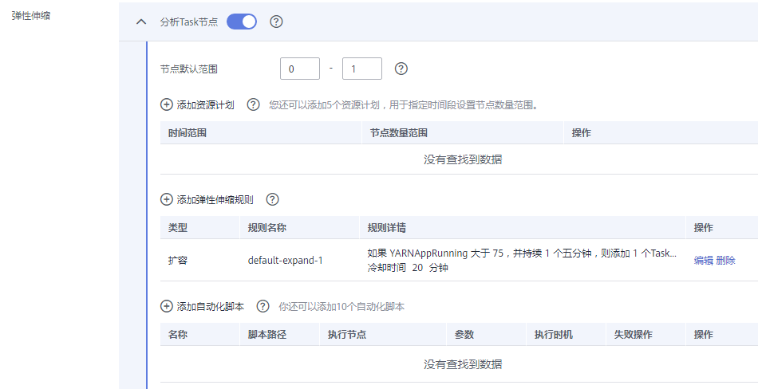

# 创建集群时配置弹性伸缩规则

在大数据应用，尤其是实时分析处理数据的场景中，常常需要根据数据量的变化动态调整集群节点数量以增减资源。MRS的弹性伸缩规则功能支持根据集群负载对集群进行弹性伸缩。此外，如果数据量以天为周期有规律的变化，并且希望在数据量变化前提前完成集群的扩缩容，可以使用MRS的资源计划（按时间段设置Task节点数量范围）特性。

-   弹性伸缩规则：根据集群实时负载对Task节点数量进行调整，数据量变化后触发扩缩容，有一定的延后性。
-   资源计划（按时间段设置Task节点数量范围）：若数据量变化存在周期性规律，则可通过资源计划在数据量变化前提前完成集群的扩缩容，避免出现增加或减少资源的延后。

弹性伸缩规则与资源计划均可触发弹性伸缩，两者必须至少配置其中一种，也可以叠加使用。资源计划与基于负载的弹性伸缩规则叠加使用可以使得集群节点的弹性更好，足以应对偶尔超出预期的数据峰值出现。

当某些业务场景要求在集群扩缩容之后，根据节点数量的变化对资源分配或业务逻辑进行更改时，手动扩缩容的场景客户可以登录集群节点进行操作。对于弹性伸缩场景，MRS支持通过自定义弹性伸缩自动化脚本来解决。自动化脚本可以在弹性伸缩前后执行相应操作，自动适应业务负载的变化，免去了人工操作。同时，自动化脚本给用户实现个性需求提供了途径，完全自定义的脚本与多个可选的执行时机基本可以满足用户的各项需求，使弹性伸缩更具灵活性。

> **说明：**   
>弹性伸缩功能可以创建集群时进行配置，也可以集群创建成功后进行配置。本章节以创建集群时配置弹性伸缩规则为例介绍，集群创建后配置弹性伸缩规则请参考[配置弹性伸缩规则](配置弹性伸缩规则.md)。  

## 背景信息

弹性伸缩规则与资源计划可以触发弹性伸缩，两者必须至少配置其中一种，也可以叠加使用。

-   弹性伸缩规则：
    -   用户对于一个集群，可以同时设置扩容、缩容最多各5条弹性伸缩规则。
    -   系统根据用户的配置顺序从前到后依次判断规则，先扩容，后缩容。请尽量把重要的策略放在前面，以防一次扩容或缩容无法达到预期效果而进行反复触发。
    -   比对因子包括大于、大于等于、小于、小于等于。
    -   集群连续5n（n默认值为1）分钟持续满足配置的指标阈值后才能触发扩容或者缩容。
    -   每次扩容或者缩容后，存在一个冷却时间，冷却时间默认为20分钟，最小值为0。
    -   单次扩容或者缩容的节点数，最小1个节点，最大100个节点。

-   资源计划（按时间段设置Task节点数量范围）：
    -   用户可以按时间段设置集群Task节点的最大数量和最小数量，当集群Task节点数不满足当前时间资源计划节点范围要求时，系统触发扩容或缩容。
    -   用户最多可以为一个集群设置5条资源计划。
    -   资源计划周期以天为单位，起始时间与结束时间可以设置为00:00-23:59之间的任意时间点。起始时间早于结束时间至少30分钟。不同资源计划配置的时间段不可交叉。
    -   资源计划触发扩容或缩容后，存在10分钟的冷却时间，冷却时间内不会再次触发弹性伸缩。
    -   当启用资源计划时，在除配置资源计划配置时间段的其他时间内，集群Task节点数量会被限定在用户配置的默认节点数量范围内。
    -   当不启用资源计划时，集群不会将Task节点数量限制在默认节点数量范围内。

-   自动化脚本：
    -   用户可以设置自定义脚本，当弹性伸缩触发时，在集群节点上自动运行。
    -   用户最多可以为一个集群设置10个自动化脚本。
    -   可以指定自动化脚本某种或多种类型的节点上执行。
    -   脚本执行时机可以是扩容前、扩容后、缩容前或缩容后。
    -   使用自动化脚本前，请先将脚本上传到集群虚拟机或与集群同region的OBS桶中。集群虚拟机上的脚本只能在已有节点上执行，若脚本需要在新扩容的节点上执行，请将脚本上传到OBS。

## 添加弹性伸缩规则

1.  登录MRS管理控制台。
2.  单击“购买集群”，进入“购买集群“页面。
3.  在“高级配置“页签的弹性伸缩栏，单击“添加“。系统显示如[图1](#fig157643355613)所示。

    **图 1**  创建集群时配置弹性伸缩  
    

4.  添加弹性伸缩规则。

    弹性伸缩规则可调控节点数量，也会对实际价格有影响，请谨慎操作。

    -   节点类型：选择配置弹性伸缩规则的Task节点类型。分析集群为“分析Task节点”，流式集群为“流式Task节点”，混合集群为“分析Task节点”和“流式Task节点”
    -   节点默认范围：输入Task实例弹性伸缩的数量范围，此约束应用于所有扩容缩容规则。取值范围为0～500。
    -   添加弹性伸缩规则，配置操作：
        1.  选择“扩容“或者“缩容“。
        2.  配置“规则名称“、“如果“、“持续“、“添加“、“冷却时间“。弹性伸缩指标请参见[表1](配置弹性伸缩规则.md#table15133845184415)。

            **图 2**  添加弹性伸缩规则  
            

        3.  单击“确定“。

            您可以在弹性伸缩规则区域查看配置的规则，在“操作”列可对已添加的规则进行编辑或删除。

        4.  单击“添加弹性伸缩规则”可多次添加规则。

5.  单击“确定“，完成弹性伸缩规则的添加。

    您可以在弹性伸缩区域查看配置的规则，在“操作”列可对已添加的规则进行编辑或删除。

## 添加资源计划

当数据量以天为周期有规律的变化，并且希望在数据量变化前提前完成集群的扩缩容，可以使用MRS的资源计划配置在规定时间内按计划调整Task节点数量。

例如：某项实时处理业务数据量在每天7:00-13:00出现高峰，其他时间保持平稳低水平。假设我们使用MRS流式集群来处理该业务数据，在7:00-13:00时，为应对数据量高峰需要5个task节点的资源，其他时间只需要2个task节点，可按如下步骤进行配置。

1.  登录MRS管理控制台。
2.  单击“购买集群”，进入“购买集群“页面。
3.  在“高级配置“页签的弹性伸缩栏，单击“添加“。系统显示如[图3](#zh-cn_topic_0175901559_fig157643355613)所示。

    **图 3**  创建集群时配置弹性伸缩  
    

4.  添加资源计划。

    资源计划可调控节点数量，也会对实际价格有影响，请谨慎操作。

    -   节点类型：选择配置弹性伸缩规则的Task节点类型。分析集群为“分析Task节点”，流式集群为“流式Task节点”，混合集群为“分析Task节点”和“流式Task节点”
    -   节点默认范围：输入Task实例弹性伸缩的数量范围，此约束应用于所有扩容缩容规则。取值范围为0～500。例如设置为“2-2”，表示除资源计划规定时间范围外，其他时间Task节点数量固定为2个。
    -   添加资源计划，配置操作：
        1.  配置“时间范围“、“节点数量范围“。例如此处“时间范围”设置为“07:00-13:00”，“节点数量范围”设置为“5-5”，表示在该时间范围内，Task节点数量固定为5个。参数说明请参见[表2](配置弹性伸缩规则.md#table1846575414619)。

            **图 4**  添加资源计划  
            

        2.  单击“添加资源计划”可添加多条资源计划。
        3.  单击“确定“。

            您可以在弹性伸缩区域查看或修改配置的弹性伸缩计划，在“操作”列可对已添加的规则进行删除。

5.  （可选）配置引导操作。
    1.  在“高级配置“页签的引导操作栏，单击“添加“。系统显示如[图5](#fig53517217312)所示。

        **图 5**  引导操作脚本  
        

    2.  配置“名称”、“脚本路径”、“参数”、“执行节点”、“执行时机”、“失败操作”。参数详情请参考[表1](#table12821236132315)。

        **表 1**  参数描述

        
        <table><thead align="left"><tr id="zh-cn_topic_0173178961_row1574783017401"><th class="cellrowborder" valign="top" width="27%" id="mcps1.2.3.1.1">
参数

        </th>
        <th class="cellrowborder" valign="top" width="73%" id="mcps1.2.3.1.2">
说明

        </th>
        </tr>
        </thead>
        <tbody><tr id="zh-cn_topic_0173178961_row77471830174011"><td class="cellrowborder" valign="top" width="27%" headers="mcps1.2.3.1.1 ">
名称

        </td>
        <td class="cellrowborder" valign="top" width="73%" headers="mcps1.2.3.1.2 ">
引导操作脚本的名称。

        
只能由数字、英文字符、空格、中划线和下划线组成，且不能以空格开头。

        
可输入的字符串长度为1～64个字符。

        
 说明： 

同一集群内，不允许配置相同的名称。不同集群之间，可以配置相同的名称。

        

        </td>
        </tr>
        <tr id="zh-cn_topic_0173178961_row374783034013"><td class="cellrowborder" valign="top" width="27%" headers="mcps1.2.3.1.1 ">
脚本路径

        </td>
        <td class="cellrowborder" valign="top" width="73%" headers="mcps1.2.3.1.2 ">
脚本的路径。路径可以是OBS桶的路径或虚拟机本地的路径。

        <ul id="zh-cn_topic_0173178961_ul107475303406"><li>OBS桶的路径，必须以obs:://开头，以.sh结尾。如zeppelin安装示例脚本：obs://mrs-samples-bootstrap-cn-north-1/zeppelin/zeppelin_install.sh</li><li>虚拟机本地的路径，脚本所在的路径必须以‘/’开头，以.sh结尾。</li></ul>
        </td>
        </tr>
        <tr id="zh-cn_topic_0173178961_row116331135103210"><td class="cellrowborder" valign="top" width="27%" headers="mcps1.2.3.1.1 ">
参数

        </td>
        <td class="cellrowborder" valign="top" width="73%" headers="mcps1.2.3.1.2 ">
引导操作脚本参数。

        </td>
        </tr>
        <tr id="zh-cn_topic_0173178961_row274823064014"><td class="cellrowborder" valign="top" width="27%" headers="mcps1.2.3.1.1 ">
执行节点

        </td>
        <td class="cellrowborder" valign="top" width="73%" headers="mcps1.2.3.1.2 ">
选择引导操作脚本所执行的节点类型。

        </td>
        </tr>
        <tr id="zh-cn_topic_0173178961_row15749153054013"><td class="cellrowborder" valign="top" width="27%" headers="mcps1.2.3.1.1 ">
执行时机

        </td>
        <td class="cellrowborder" valign="top" width="73%" headers="mcps1.2.3.1.2 ">
选择引导操作脚本执行的时间。

        <ul id="zh-cn_topic_0173178961_ul7461220103311"><li>组件首次启动前</li><li>组件首次启动后</li></ul>
        </td>
        </tr>
        <tr id="zh-cn_topic_0173178961_row474917307402"><td class="cellrowborder" valign="top" width="27%" headers="mcps1.2.3.1.1 ">
失败操作

        </td>
        <td class="cellrowborder" valign="top" width="73%" headers="mcps1.2.3.1.2 ">
该脚本执行失败后，是否继续执行后续脚本和创建集群。
 说明： 

建议您设置为“继续”，无论此引导操作是否执行成功，则集群都能继续创建。

        

        

        </td>
        </tr>
        </tbody>
        </table>

    3.  单击“确定“保存引导操作配置。

