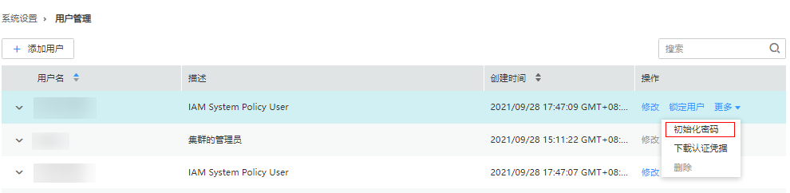

# 初始化系统用户密码

## 操作场景

该任务指导管理员在用户遗忘密码或公共帐号密码需要定期修改时，通过Manager初始化密码。初始化密码后用户首次使用需要修改密码。开启Kerberos认证的集群或开启弹性公网IP功能的普通集群支持该操作。

> **说明：** 
>该章节操作仅适用于**MRS 3.x**之前版本集群。
>**MRS 3.x**及之后版本集群请参考[初始化用户密码](初始化用户密码.md)章节。

## 对系统的影响

初始化MRS集群用户密码后，如果以前下载过用户认证文件，则需要重新下载并获取keytab文件。

## 初始化“人机”用户密码

1.  访问MRS Manager，详细操作请参见[访问Manager](访问Manager-2.md)。
2.  在MRS Manager，单击“系统设置”。
3.  在“权限配置”区域，单击“用户管理”。
4.  在要初始化密码用户所在行，单击“更多  \>  初始化密码“，按界面提示信息修改用户密码。

    

    在弹出窗口中输入当前登录的管理员密码确认管理员身份，单击“确定”，然后在“初始化密码”单击“确定”。

    集群中，默认的密码复杂度要求：

    -   密码字符长度为8～32位。
    -   至少需要包含大写字母、小写字母、数字、空格、特殊字符'\~!@\#$%^&\*\(\)-\_=+\\|\[\{\}\];:'",<.\>/?中的3种类型字符。
    -   不能与用户名或倒序的用户名相同。

## 初始化“机机”用户密码

1.  根据业务情况，准备好客户端，并登录安装客户端的节点。
2.  执行以下命令切换用户。

    **sudo su - omm**

3.  执行以下命令，切换到客户端目录，例如“/opt/Bigdata/client“。

    **cd /opt/Bigdata/client**

4.  执行以下命令，配置环境变量。

    **source bigdata\_env**

5.  执行以下命令，使用kadmin/admin登录控制台。

    > **说明：** 
    >kadmin/admin的默认密码为“KAdmin@123”，首次登录后会提示该密码过期，请按照提示修改密码并妥善保存。

    **kadmin -p kadmin/admin**

6.  执行以下命令，重置组件运行用户密码。此操作对所有服务器生效。

    **cpw** _组件运行用户名_

    例如：**cpw oms/manager**

    集群中，默认的密码复杂度要求：

    -   密码字符长度为8～32位。
    -   至少需要包含大写字母、小写字母、数字、空格、特殊字符'\~!@\#$%^&\*\(\)-\_=+\\|\[\{\}\];:'",<.\>/?中的3种类型字符。
    -   不能与用户名或倒序的用户名相同。

