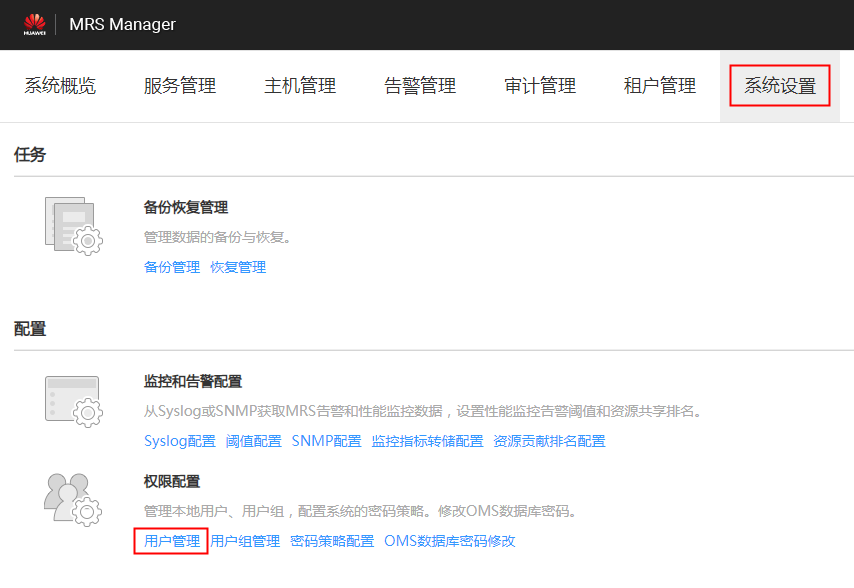
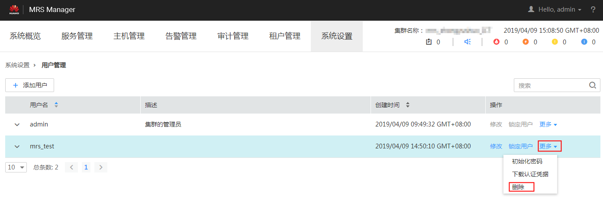

# 删除用户

MRS集群用户不再需要使用时，管理员可以在MRS Manager中删除此用户。

> **说明：** 
>如果删除用户A后，再次准备重新创建同名用户A，如果该用户A已经提交过作业（客户端提交或者MRS console页面提交），那么需要在删除该用户A的同时，删除该用户A残留的文件夹，否则使用重新创建的同名用户A提交作业会失败。
>删除用户残留文件夹操作方法为：依次登录MRS集群的Core节点，在每个Core节点上执行如下两条命令，其中如下命令中“$user”为具体的以用户名命名的文件夹。
>**cd /srv/BigData/hadoop/data1/nm/localdir/usercache/**
>**rm -rf $user**

## 操作步骤

1.  在MRS Manager，单击“系统设置”。
2.  在“权限配置”区域，单击“用户管理”。

    **图 1**  用户管理  
    

3.  在要删除用户所在的行，选择“更多  \>  删除“。

    **图 2**  删除用户  
    

4.  单击“确定”完成删除操作。

