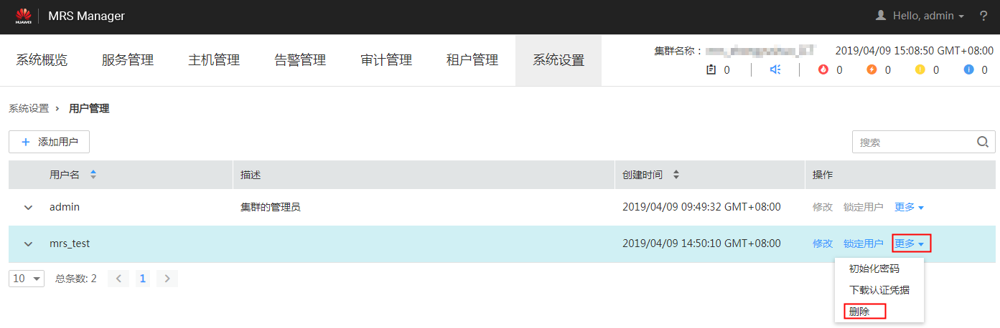

# 删除用户

MRS集群用户不再需要使用时，管理员可以MRS Manager中删除此用户。开启Kerberos认证的集群或开启弹性公网IP功能的普通集群支持该操作。

## 操作步骤

1.  访问MRS Manager，详细操作请参见[访问MRS Manager](访问MRS-Manager.md)。
2.  在MRS Manager，单击“系统设置”。
3.  在“权限配置”区域，单击“用户管理”。

    **图 1**  用户管理  
    

4.  在要删除用户所在的行，选择“更多  \>  删除“。

    **图 2**  删除用户  
    

5.  单击“确定”完成删除操作。

