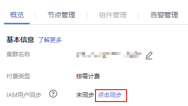

# 删除租户

## 操作场景

当租户需要根据业务需求，将当前不再使用的租户删除时，可以在MRS完成操作。

## 前提条件

-   已添加租户。
-   检查待删除的租户是否存在子租户，如果存在，需要先删除全部子租户，否则无法删除当前租户。
-   待删除租户的角色，不能与任何一个用户或者用户组存在关联关系。该任务对应取消角色与用户的绑定，请参见[修改用户信息](修改用户信息.md)。
-   已完成IAM用户同步（在集群详情页的“概览”页签，单击“IAM用户同步“右侧的“点击同步”进行IAM用户同步）。

    **图 1**  IAM用户同步  
    

## 操作步骤

1.  在集群详情页，单击“租户管理”。

    **图 2**  租户管理  
    

    > **说明：**   
    >针对MRS 1.8.10及之前版本，具体请参见[删除租户](删除租户-150.md)。  

2.  在左侧租户列表，将光标移动到需要删除的租户节点上，单击“删除”。

    界面显示“删除租户“对话框。根据业务需求，需要保留租户已有的数据时请同时勾选“保留该租户的数据”，否则将自动删除租户对应的存储空间。

3.  单击“是”，删除租户。

    保存配置需要等待一段时间，租户成功删除。租户对应的角色、存储空间将删除。

    > **说明：**   
    >-   租户删除后，Yarn中对应的租户任务队列不会被删除。  
    >-   删除父租户时选择不保留数据，如果存在子租户且子租户使用了存储资源，则子租户的数据也会被删除。  

