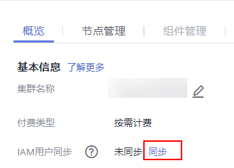
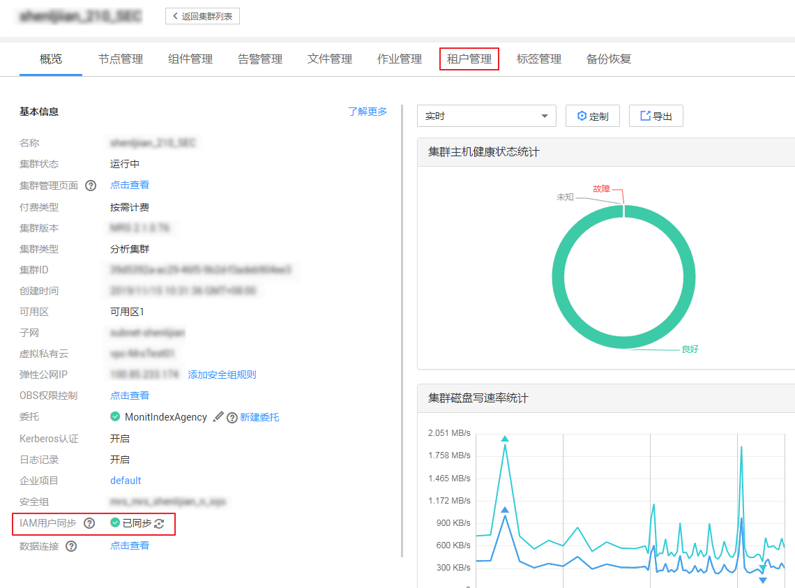

# 删除资源池

## 操作场景

该任务指导用户通过MRS删除已有资源池。

## 前提条件

-   集群中任何一个队列不能使用待删除资源池为默认资源池，删除资源池前需要先取消默认资源池，请参见[配置队列](配置队列.md)。
-   集群中任何一个队列不能在待删除资源池中配置过资源分布策略，删除资源池前需要先清除策略，请参见[清除队列配置](清除队列配置.md)。
-   已完成IAM用户同步（在集群详情页的“概览”页签，单击“IAM用户同步“右侧的“同步”进行IAM用户同步）。

    **图 1**  IAM用户同步  
    

## 操作步骤

1.  在集群详情页，单击“租户管理”。

    **图 2**  租户管理  
    

    > **说明：** 
    >MRS 3.x及之后版本请参考[使用说明](使用说明.md)。

2.  单击“资源池”页签。
3.  在资源池列表指定资源池所在行的“操作”列，单击“删除“。

    在弹出窗口中单击“确定”。

