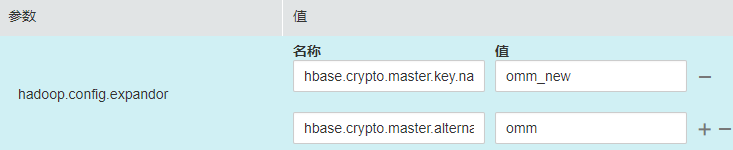
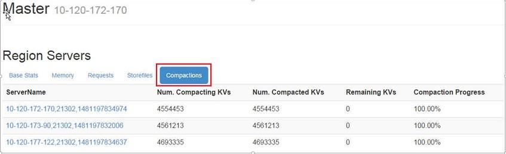

# 加密HFile和WAL内容<a name="admin_guide_000276"></a>

## 加密HFile和WAL内容<a name="s1948b0b624dc4a0caf5f17669ca5244d"></a>

> **须知：** 
>-   设置HFile和WAL为SMS4加密或AES加密方式对系统的影响较大，一旦操作失误会导致数据丢失。不推荐使用此功能。
>-   使用Bulkload批量导入的数据不支持加密。

缺省情况下，HBase中的HFile和WAL（Write ahead log）内容是不加密的。如果用户需要对其进行加密，可通过如下操作进行配置。

1.  <a name="li61064812194556"></a>在任一安装HBase服务节点，使用**omm**用户执行如下命令创建密钥。

    **sh $\{BIGDATA\_HOME\}/FusionInsight\_HD\_**8.1.0.1**/install/FusionInsight-HBase-2.2.3/hbase/bin/hbase-encrypt.sh _<path\>/hbase.jks <type\> <length\> <alias\>_**

    -   _/<path\>/hbase.jks_表示生成的jks文件存储路径。
    -   <type\>表示加密的类型，支持SMS4或AES。
    -   <length\>表示密钥的长度，SMS4支持16位长度，AES支持128位长度。
    -   _<alias\>_为密钥文件的别名，第一次生成时请使用缺省值“omm”。

    例如，生成SMS4加密的密钥执行：

    **sh $\{BIGDATA\_HOME\}/**FusionInsight\_HD\_**8.1.0.1**/install**/FusionInsight-HBase-2.2.3/hbase/bin/hbase-encrypt.sh /home/hbase/conf/hbase.jks SMS4 16 omm**

    生成AES加密的密钥执行：

    **sh $\{BIGDATA\_HOME\}/****FusionInsight\_HD\_****8.1.0.1****/install****/FusionInsight-HBase-2.2.3/hbase/bin/hbase-encrypt.sh /home/hbase/conf/hbase.jks AES 128 omm**

    > **说明：** 
    >-   集群的操作用户需要有_<path\>/hbase.jks_目录的“rw”权限，且要求目录已存在。
    >-   运行命令后需要再输入4遍相同的_<password\>_。其中[3](#li59351885194556)中进行加密的密码与此步骤的密码相同。

2.  将生成的密钥文件分发到集群中所有节点的相同目录下，并为**omm**用户配置该文件的读写权限。

    > **说明：** 
    >-   请管理员根据企业安全要求，选择安全的操作步骤分发密钥。
    >-   如果在使用过程中，有节点出现密钥文件丢失的情况，请按照此步骤从其他节点拷贝到该节点。

3.  <a name="li59351885194556"></a>在FusionInsight Manager界面中，设置“hbase.crypto.keyprovider.parameters.encryptedtext”参数的值为密文密码，设置“hbase.crypto.keyprovider.parameters.uri”参数的值为密钥路径和名称。
    -   “hbase.crypto.keyprovider.parameters.uri”格式为：**jceks://**_<key\_Path\_Name\>_。

        _<key\_Path\_Name\>_填写密钥的存储路径，例如“/home/hbase/conf/hbase.jks“则对应参数值为“jceks:///home/hbase/conf/hbase.jks”。

    -   “hbase.crypto.keyprovider.parameters.encryptedtext”格式为：_<encrypted\_password\>_。

        _<encrypted\_password\>_填写创建密钥时的密文密码，参数值显示为密文。使用**omm**用户在安装HBase服务的节点，执行如下命令获取对应加密后的密码：

        **sh $\{BIGDATA\_HOME\}/******FusionInsight\_HD\_******8.1.0.1******/install******/FusionInsight-HBase-2.2.3/hbase/bin/hbase-encrypt.sh**

        > **说明：** 
        >运行命令后需要输入<password\>。该密码与[1](#li61064812194556)中手动输入的密码相同。


4.  在FusionInsight Manager界面中，设置“hbase.crypto.key.algorithm”参数值为“SMS4”或“AES”，使HFile的内容采用SMS4或AES的方式加密。
5.  在FusionInsight Manager界面中，设置“hbase.crypto.wal.algorithm”参数值为“SMS4”或“AES”，使WAL的内容采用SMS4或AES的方式加密。
6.  在FusionInsight Manager界面中，将“hbase.regionserver.wal.encryption”参数值修改为“true”。
7.  <a name="li42092055194556"></a>保存设置，并重启HBase服务使其生效。
8.  <a name="li50092082194556"></a>在创建HBase表时，需要通过设置加密方式，<type\>表示加密的类型。
    -   通过命令行创建表时，直接设置加密方式为SMS4或AES。

        **_create_** '_<table name\>_', \{_NAME =\> 'd'_, **_ENCRYPTION =\> '_**_<type\>_**'**\}

    -   使用代码创建表时，在代码中添加如下信息设置加密方式为SMS4或AES。

        ```
        public void testCreateTable() 
        { 
            String tableName = "user"; 
            Configuration conf = getConfiguration();    
            HTableDescriptor htd = new HTableDescriptor(TableName.valueOf(tableName)); 
             
            HColumnDescriptor hcd = new HColumnDescriptor("info"); 
            //设置加密方式为SMS4或AES。 
            hcd.setEncryptionType("<type>"); 
            htd.addFamily(hcd); 
         
            HBaseAdmin admin = null; 
            try 
            { 
                admin = new HBaseAdmin(conf); 
                 
                if(!admin.tableExists(tableName)) 
                { 
                    admin.createTable(htd); 
                } 
            } 
            catch (IOException e) 
            { 
                e.printStackTrace(); 
            } 
            finally 
            { 
                if(admin != null) 
                { 
                    try 
                    { 
                        admin.close(); 
                    } 
                    catch (IOException e) 
                    { 
                        e.printStackTrace(); 
                    } 
                } 
            } 
        }
        ```

9.  如果用户已按照[1](#li61064812194556)到[7](#li42092055194556)配置了SMS4或AES加密，但是在执行[8](#li50092082194556)创建表时，未设置对应的加密参数，使得插入的数据未经加密。

    此时，您可以执行如下步骤对之前插入的数据进行加密。

    1.  针对表执行flush动作，将内存中的数据导入到HFile中。

        **flush**_'<table\_name\>'_

    2.  执行以下步骤修改表属性。

        **disable**_'<table\_name\>'_

        **alter**_'__<table\_name\>'**,**_**NAME=\>**_'<column\_name\>'**,**_**ENCRYPTION =\>**_** '**<type\>_**'**

        **enable**_'__<table\_name\>'_

    3.  插入一条新的数据，然后flush表。

        > **说明：** 
        >必须要插入一条新的数据，HFile才会生成新的HFile，使得之前插入的未加密数据进行重写加密。

        **put**_'<table\_name\>'_,**_'_id2','f1:c1','value222222222222222222222222222222222'**

        **flush**_'<table\_name\>'_

    4.  执行如下步骤重写HFile。

        **major\_compact**'_<table\_name\>'_

        > **须知：** 
        >执行此步骤时，HBase表是被禁用的，不能提供表服务。请谨慎使用。


## 修改密钥文件<a name="s6a55bf3a91dd4ae880db8959ff5d0cad"></a>

> **须知：** 
>修改密钥文件的操作对系统影响较大，一旦操作失误会导致数据丢失。不推荐使用此功能。

在[加密HFile和WAL内容](#s1948b0b624dc4a0caf5f17669ca5244d)操作中需要生成对应的密钥文件并设置密码，为确保系统安全，在运行一段时间后，用户可修改密钥，使用新的密钥文件对HFile和WAL内容进行加密。

1.  使用**omm**用户执行如下命令生成新的密钥文件。

    **sh $\{BIGDATA\_HOME\}/********FusionInsight\_HD\_**8.1.0.1******************/install********/FusionInsight-HBase-2.2.3/hbase/bin/hbase-encrypt.sh** _<path\>/hbase.jks__ <type\> <length\> <alias-new\>_

    -   _<path\>/hbase.jks_:表示生成的hbase.jks文件的存储路径。该路径和文件名称需与[加密HFile和WAL内容](#s1948b0b624dc4a0caf5f17669ca5244d)章节生成的密钥文件相同。
    -   _<alias-new\>_：表示密钥文件的别名，请使用与旧密钥文件不同的名字。
    -   _<type\>_表示加密的类型，支持SMS4或AES。
    -   _<length\>_表示密钥的长度，SMS4支持16位长度，AES支持128位长度。

    例如，生成SMS4加密的密钥执行：

    **sh $\{BIGDATA\_HOME\}/**FusionInsight\_HD\_**8.1.0.1**/install**/FusionInsight-HBase-2.2.3/hbase/bin/hbase-encrypt.sh /home/hbase/conf/hbase.jks SMS4 16 omm\_new**

    生成AES加密的密钥执行：

    **sh $\{BIGDATA\_HOME\}/****FusionInsight\_HD\_****8.1.0.1****/install****/FusionInsight-HBase-2.2.3/hbase/bin/hbase-encrypt.sh /home/hbase/conf/hbase.jks AES 128 omm\_new**

    > **说明：** 
    >-   集群的操作用户需要有_<path\>/hbase.jks_目录的“rw”权限，且要求目录已存在。
    >-   运行命令后需要再输入3遍相同的_<password\>_，该密码表示密钥文件的密码，请直接使用旧文件的密码，不会产生安全风险。

2.  <a name="li5110157194747"></a>将生成的密钥文件分发到集群中所有节点的相同目录下，并为**omm**用户配置该文件的读写权限。

    > **说明：** 
    >请管理员根据企业安全要求，选择安全的操作步骤分发密钥。

3.  <a name="li34317298194747"></a>在FusionInsight Manager的HBase服务配置界面中增加自定义配置项，设置“hbase.crypto.master.key.name“为“omm\_new“，设置“hbase.crypto.master.alternate.key.name“为“omm“，然后保存配置。

    

4.  <a name="li40420234194747"></a>重启HBase服务，使配置生效。
5.  在HBase shell中执行**major compact**命令，生成基于新的加密算法的HFile文件。

    **major\_compact** _'<table\_name\>'_

6.  从HMaster的网页中可以查看到major compact进度。

    

7.  所有的“Compaction Progress”都为100%且“Remaining KVs”都为0时，使用**omm**用户执行如下命令销毁旧的密钥文件：

    **sh $\{BIGDATA\_HOME\}/******FusionInsight\_HD\_**8.1.0.1**************/install******/FusionInsight-HBase-2.2.3/hbase/bin/hbase-encrypt.sh **_<path\>/hbase.jks <alias-old\>_

    -   _<path\>/hbase.jks_:表示生成的“hbase.jks”文件的存储路径。该路径和文件名称需与[加密HFile和WAL内容](加密HFile和WAL内容.md)章节生成的密钥文件相同。
    -   _<alias-old\>_：表示要删除的旧密钥文件的别名。

    例如：****

    **sh $\{BIGDATA\_HOME\}/******FusionInsight\_HD\_******8.1.0.1******/install******/FusionInsight-HBase-2.2.3/hbase/bin/hbase-encrypt.sh /home/hbase/conf/hbase.jks omm**

    > **说明：** 
    >集群的操作用户需要有_<path\>/hbase.jks_目录的“rw”权限，且要求目录已存在。

8.  再执行[2](#li5110157194747)，重新分发更新后的密钥文件。
9.  从FusionInsight Manager中删除[3](#li34317298194747)中新增HBase自定义配置项“hbase.crypto.master.alternate.key.name”。
10. 再执行[4](#li40420234194747)使配置生效。

