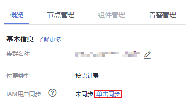
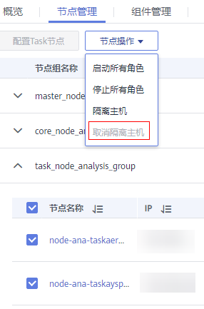
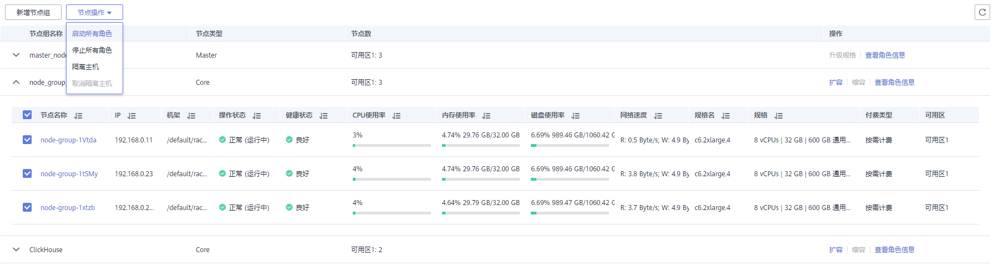

# 取消隔离主机

## 操作场景

用户已排除主机的异常或故障后，需要将主机隔离状态取消才能正常使用。

该任务指导用户在MRS上取消隔离主机。

## 前提条件

-   主机状态为“已隔离”。
-   主机的异常或故障已确认修复。
-   已完成IAM用户同步（在集群详情页的“概览”页签，单击“IAM用户同步“右侧的“同步”进行IAM用户同步）。

    **图 1**  IAM用户同步（以MRS 1.9.2版本为例）  
    

## 操作步骤

1.  在集群详情页，单击“节点管理”。
2.  展开节点组信息，勾选待取消隔离主机前的复选框。
3.  选择“节点操作 \> 取消隔离主机”。

    

4.  确认待取消隔离主机信息并单击“确定”。

    界面提示“操作成功。”，单击“完成”，主机成功取消隔离，“操作状态”显示为“正常”。

5.  勾选已取消隔离的主机，选择“节点操作 \> 启动所有角色”。

    

