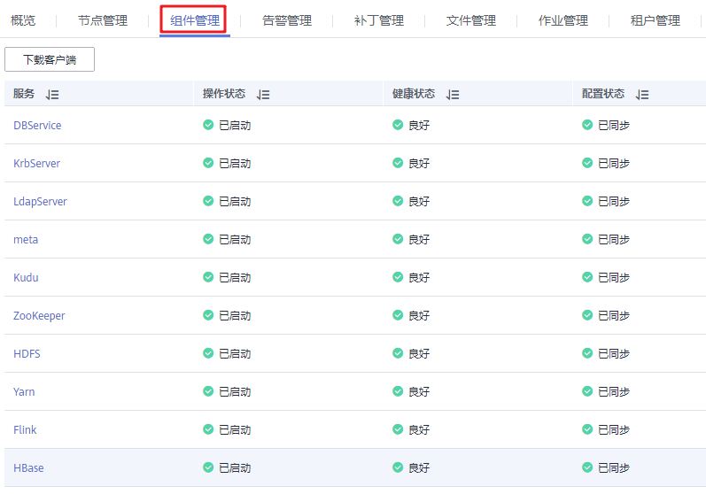
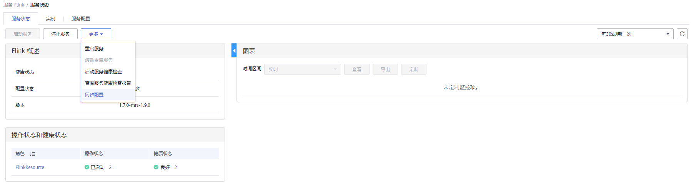

# 同步服务配置

## 操作场景

当用户发现部分服务的“配置状态”为“配置超期”或“配置失败”时，您可以尝试使用同步配置功能，以恢复配置状态。或者集群中所有服务的配置状态为“失败”时，同步指定服务的配置数据与后台配置数据。

## 对系统的影响

同步服务配置后，需要重启配置过期的服务。重启时对应的服务不可用。

## 前提条件

已完成IAM用户同步（在集群详情页的“概览”页签，单击“IAM用户同步“右侧的“同步”进行IAM用户同步）。

**图 1**  IAM用户同步  

## 操作步骤

1.  在集群详情页，单击“组件管理”。

    **图 2**  组件管理（以MRS 1.9.2版本为例）  
    

2.  在服务列表中，单击指定服务名称。
3.  在服务状态页签，选择“更多 \> 同步配置”。

    

4.  在弹出窗口勾选“重启配置过期的服务”，并单击“是”重启配置过期的服务。

