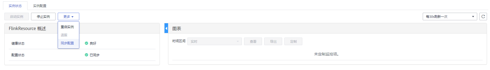

# 同步角色实例配置

## 操作场景

当用户发现角色实例的“配置状态”为“配置超期”或“配置失败”时，可以在MRS尝试使用同步配置功能，同步角色实例的配置数据与后台配置数据，以恢复配置状态。

## 对系统的影响

同步配置角色实例后需要重启配置过期的角色实例。重启时对应的角色实例不可用。

## 前提条件

已完成IAM用户同步（在集群详情页的“概览”页签，单击“IAM用户同步“右侧的“单击同步”进行IAM用户同步）。

**图 1**  IAM用户同步（以MRS 1.9.2版本为例）  

## 操作步骤

1.  在集群详情页，单击“组件管理”。

    **图 2**  组件管理（以MRS 1.9.2版本为例）  
    

2.  选择服务名称。
3.  单击“实例”页签。
4.  在角色实例列表中，单击指定角色实例名称。
5.  在角色实例状态及指标信息上方，选择“更多 \> 同步配置”。

    

6.  在弹出窗口勾选“重启配置过期的服务”，并单击“是”重启角色实例。

