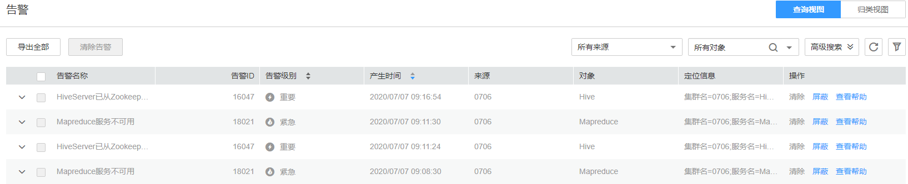
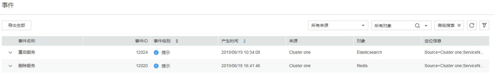

# 告警与事件概述

## 告警

登录FusionInsight Manager，选择“运维  \>  告警  \>  告警“，进入如[图1](#fig46924607173248)所示的界面，用户可以查看FusionInsight Manager中各集群上报的告警信息，包括告警名称、ID、级别、产生时间等信息，默认每页显示最近的十条告警。

**图 1**  FusionInsight Manager告警管理  

单击指定告警名称左侧的，展开完整告警信息参数，各项说明如[表1](#table19183175495311)所示。

**表 1**  告警参数

<table><thead align="left"><tr id="row11189135435318"><th class="cellrowborder" valign="top" width="17.84%" id="mcps1.2.3.1.1">
告警参数

</th>
<th class="cellrowborder" valign="top" width="82.16%" id="mcps1.2.3.1.2">
说明

</th>
</tr>
</thead>
<tbody><tr id="row15191135410539"><td class="cellrowborder" valign="top" width="17.84%" headers="mcps1.2.3.1.1 ">
告警ID

</td>
<td class="cellrowborder" valign="top" width="82.16%" headers="mcps1.2.3.1.2 ">
告警信息的ID。

</td>
</tr>
<tr id="row2019375415314"><td class="cellrowborder" valign="top" width="17.84%" headers="mcps1.2.3.1.1 ">
告警名称

</td>
<td class="cellrowborder" valign="top" width="82.16%" headers="mcps1.2.3.1.2 ">
告警信息的名称。

</td>
</tr>
<tr id="row419745416534"><td class="cellrowborder" valign="top" width="17.84%" headers="mcps1.2.3.1.1 ">
告警级别

</td>
<td class="cellrowborder" valign="top" width="82.16%" headers="mcps1.2.3.1.2 ">
包含紧急、重要、次要、提示四项级别。

</td>
</tr>
<tr id="row183091116183011"><td class="cellrowborder" valign="top" width="17.84%" headers="mcps1.2.3.1.1 ">
来源

</td>
<td class="cellrowborder" valign="top" width="82.16%" headers="mcps1.2.3.1.2 ">
集群名称。

</td>
</tr>
<tr id="row56901835135411"><td class="cellrowborder" valign="top" width="17.84%" headers="mcps1.2.3.1.1 ">
清除时间

</td>
<td class="cellrowborder" valign="top" width="82.16%" headers="mcps1.2.3.1.2 ">
告警检测到已清除的时间。如果未清除，则显示为“--”。

</td>
</tr>
<tr id="row1971819544550"><td class="cellrowborder" valign="top" width="17.84%" headers="mcps1.2.3.1.1 ">
对象

</td>
<td class="cellrowborder" valign="top" width="82.16%" headers="mcps1.2.3.1.2 ">
触发告警的服务、进程或模块。

</td>
</tr>
<tr id="row1147016494565"><td class="cellrowborder" valign="top" width="17.84%" headers="mcps1.2.3.1.1 ">
是否自动清除

</td>
<td class="cellrowborder" valign="top" width="82.16%" headers="mcps1.2.3.1.2 ">
能够在问题修复后自动清除告警。

</td>
</tr>
<tr id="row14786114217588"><td class="cellrowborder" valign="top" width="17.84%" headers="mcps1.2.3.1.1 ">
告警状态

</td>
<td class="cellrowborder" valign="top" width="82.16%" headers="mcps1.2.3.1.2 ">
告警当前状态，包含自动清除、手动清除、未清除。

</td>
</tr>
<tr id="row12200135425310"><td class="cellrowborder" valign="top" width="17.84%" headers="mcps1.2.3.1.1 ">
产生时间

</td>
<td class="cellrowborder" valign="top" width="82.16%" headers="mcps1.2.3.1.2 ">
产生告警的时间。

</td>
</tr>
<tr id="row141313257591"><td class="cellrowborder" valign="top" width="17.84%" headers="mcps1.2.3.1.1 ">
告警原因

</td>
<td class="cellrowborder" valign="top" width="82.16%" headers="mcps1.2.3.1.2 ">
告警可能的原因提示。

</td>
</tr>
<tr id="row1589525016551"><td class="cellrowborder" valign="top" width="17.84%" headers="mcps1.2.3.1.1 ">
序列号

</td>
<td class="cellrowborder" valign="top" width="82.16%" headers="mcps1.2.3.1.2 ">
系统产生的告警计数。

</td>
</tr>
<tr id="row133981732508"><td class="cellrowborder" valign="top" width="17.84%" headers="mcps1.2.3.1.1 ">
附加信息

</td>
<td class="cellrowborder" valign="top" width="82.16%" headers="mcps1.2.3.1.2 ">
相关报错信息。

</td>
</tr>
<tr id="row14202145416539"><td class="cellrowborder" valign="top" width="17.84%" headers="mcps1.2.3.1.1 ">
定位信息

</td>
<td class="cellrowborder" valign="top" width="82.16%" headers="mcps1.2.3.1.2 ">
定位告警的详细信息。主要包含以下信息：

<ul id="ul220525415312"><li>集群名：产品告警的集群</li><li>服务名：产生告警的服务名称</li><li>角色名：产生告警的角色名称</li><li>主机名：产生告警的主机名</li></ul>
</td>
</tr>
</tbody>
</table>

**管理告警**

-   单击“导出全部“可导出全部告警详情。
-   如果有多个告警已完成处理，可选中一个或多个待清除的告警，单击“清除告警“，批量清除告警。每次最多批量清除300条告警。
-   单击手动刷新当前页面，也可在修改告警表格显示的列。
-   支持通过指定对象或集群来筛选指定的告警。
-   单击“高级搜索“显示告警搜索区域，搜索条件包括告警ID、告警名称、告警状态、告警级别、开始时间和结束时间。单击“搜索“显示过滤后的告警，再次单击“高级搜索“，会显示已经填写的搜索条件数量。
-   单个告警支持“清除“、“屏蔽“以及“查看帮助“操作。
-   告警条目较多时，可单击“归类视图”，系统会将未恢复的告警按照告警ID进行归类，方便用户查看。归类后单击告警名称后的未恢复条数，即可查看具体的告警详情。

## 事件

登录FusionInsight Manager，选择“运维  \>  告警  \>  事件“，进入事件界面，用户可以查看集群中所有事件信息，包括名称、ID、级别、产生时间、来源、对象、定位信息，每页默认显示最近的十条事件。

**图 2**  FusionInsight Manager事件管理  

单击指定事件名称左侧的，展开完整信息参数，各项说明如[表2](#table13671201172912)所示。

**表 2**  事件参数

<table><thead align="left"><tr id="row196738112918"><th class="cellrowborder" valign="top" width="17.86%" id="mcps1.2.3.1.1">
事件参数

</th>
<th class="cellrowborder" valign="top" width="82.14%" id="mcps1.2.3.1.2">
说明

</th>
</tr>
</thead>
<tbody><tr id="row4675181192916"><td class="cellrowborder" valign="top" width="17.86%" headers="mcps1.2.3.1.1 ">
事件ID

</td>
<td class="cellrowborder" valign="top" width="82.14%" headers="mcps1.2.3.1.2 ">
事件信息的ID。

</td>
</tr>
<tr id="row3677711295"><td class="cellrowborder" valign="top" width="17.86%" headers="mcps1.2.3.1.1 ">
事件名称

</td>
<td class="cellrowborder" valign="top" width="82.14%" headers="mcps1.2.3.1.2 ">
事件信息的名称。

</td>
</tr>
<tr id="row126791611297"><td class="cellrowborder" valign="top" width="17.86%" headers="mcps1.2.3.1.1 ">
事件级别

</td>
<td class="cellrowborder" valign="top" width="82.14%" headers="mcps1.2.3.1.2 ">
包含紧急、重要、次要、提示共4项级别。

</td>
</tr>
<tr id="row368041112911"><td class="cellrowborder" valign="top" width="17.86%" headers="mcps1.2.3.1.1 ">
产生时间

</td>
<td class="cellrowborder" valign="top" width="82.14%" headers="mcps1.2.3.1.2 ">
事件产生的时间。

</td>
</tr>
<tr id="row963291111413"><td class="cellrowborder" valign="top" width="17.86%" headers="mcps1.2.3.1.1 ">
对象

</td>
<td class="cellrowborder" valign="top" width="82.14%" headers="mcps1.2.3.1.2 ">
事件可能的原因提示。

</td>
</tr>
<tr id="row0117111213147"><td class="cellrowborder" valign="top" width="17.86%" headers="mcps1.2.3.1.1 ">
序列号

</td>
<td class="cellrowborder" valign="top" width="82.14%" headers="mcps1.2.3.1.2 ">
系统产生的事件计数。

</td>
</tr>
<tr id="row106827152911"><td class="cellrowborder" valign="top" width="17.86%" headers="mcps1.2.3.1.1 ">
定位信息

</td>
<td class="cellrowborder" valign="top" width="82.14%" headers="mcps1.2.3.1.2 ">
定位事件的详细信息。主要包含以下信息：

<ul id="ul146848115292"><li>来源：产生事件的集群名称</li><li>服务名：产生事件的服务名称</li><li>角色名：产生事件的角色名称</li><li>主机名：产生事件的主机名</li></ul>
</td>
</tr>
<tr id="row9836162291913"><td class="cellrowborder" valign="top" width="17.86%" headers="mcps1.2.3.1.1 ">
附加信息

</td>
<td class="cellrowborder" valign="top" width="82.14%" headers="mcps1.2.3.1.2 ">
相关报错信息。

</td>
</tr>
<tr id="row18531019141913"><td class="cellrowborder" valign="top" width="17.86%" headers="mcps1.2.3.1.1 ">
事件原因

</td>
<td class="cellrowborder" valign="top" width="82.14%" headers="mcps1.2.3.1.2 ">
事件可能的原因提示。

</td>
</tr>
<tr id="row1569416716408"><td class="cellrowborder" valign="top" width="17.86%" headers="mcps1.2.3.1.1 ">
来源

</td>
<td class="cellrowborder" valign="top" width="82.14%" headers="mcps1.2.3.1.2 ">
集群名称。

</td>
</tr>
</tbody>
</table>

**管理事件**：

-   单击“导出全部“可导出全部事件详情。
-   单击手动刷新当前页面，也可在修改事件表格显示的列。
-   支持通过指定对象或集群来筛选指定的事件。
-   单击“高级搜索“显示事件搜索区域，搜索条件包括事件ID、事件名称、事件级别、开始时间和结束时间。

