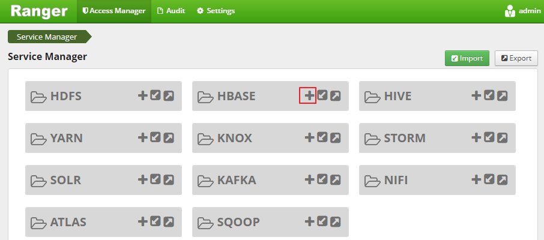
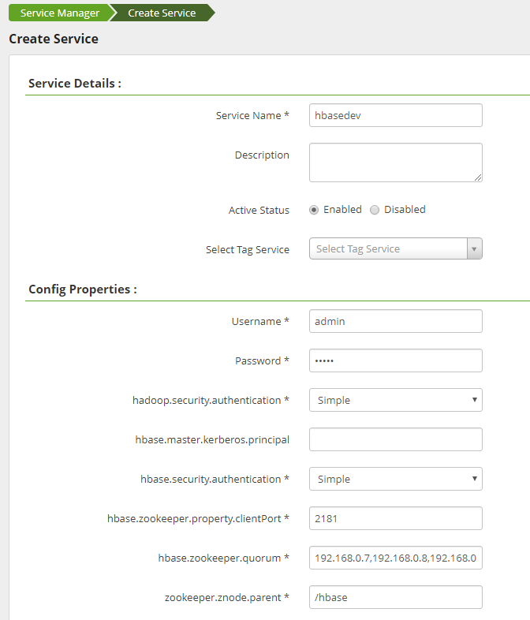
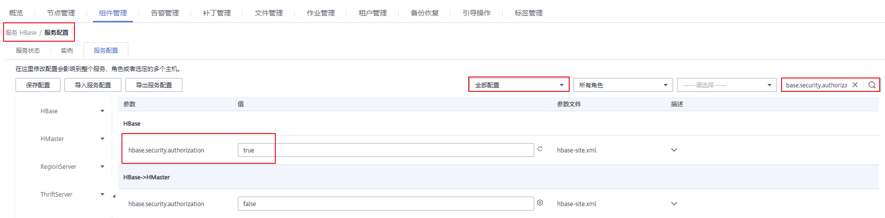
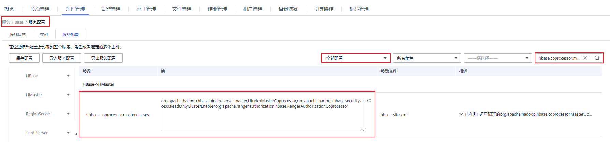
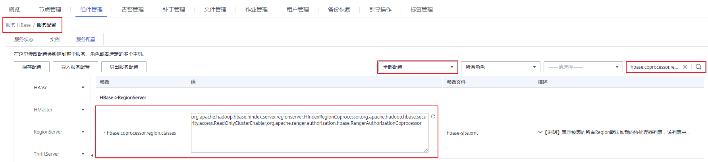
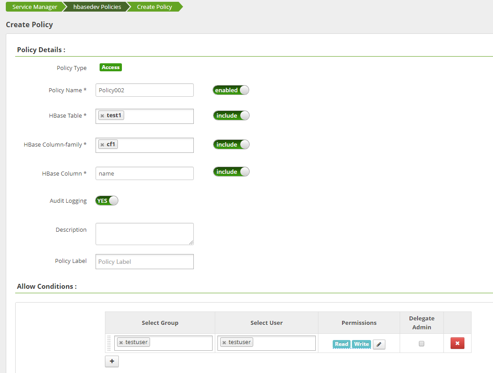
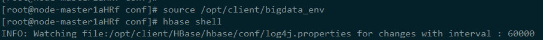
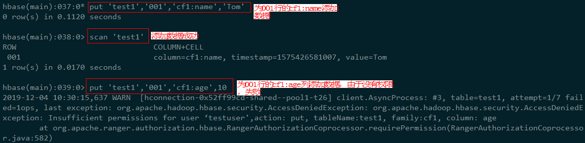

# 在Ranger中配置HBase的访问权限

在创建完安装了Ranger组件的MRS集群后，HBase的权限控制暂未集成在Ranger，本章节主要介绍HBase组件如何集成在Ranger中。

1.  登录Ranger WebUI界面。
2.  在“Service Manager”中的HBASE处，单击添加HBase Service。

    **图 1**  添加HBase Service  
    

3.  请参考[表1](#table74220350178)填写添加HBase Service的相关参数，未在表中列出的参数请保持默认值。

    **表 1** **参数说明**

    
    <table><thead align="left"><tr id="row1743935151719"><th class="cellrowborder" valign="top" width="33.33333333333333%" id="mcps1.2.4.1.1">
名称

    </th>
    <th class="cellrowborder" valign="top" width="33.33333333333333%" id="mcps1.2.4.1.2">
说明

    </th>
    <th class="cellrowborder" valign="top" width="33.33333333333333%" id="mcps1.2.4.1.3">
示例值

    </th>
    </tr>
    </thead>
    <tbody><tr id="row94373551718"><td class="cellrowborder" valign="top" width="33.33333333333333%" headers="mcps1.2.4.1.1 ">
Service Name

    </td>
    <td class="cellrowborder" valign="top" width="33.33333333333333%" headers="mcps1.2.4.1.2 ">
创建的service name名称，固定填写：hbasedev。

    </td>
    <td class="cellrowborder" valign="top" width="33.33333333333333%" headers="mcps1.2.4.1.3 ">
hbasedev

    </td>
    </tr>
    <tr id="row154353515177"><td class="cellrowborder" valign="top" width="33.33333333333333%" headers="mcps1.2.4.1.1 ">
Username

    </td>
    <td class="cellrowborder" valign="top" width="33.33333333333333%" headers="mcps1.2.4.1.2 ">
可以任意填写。

    </td>
    <td class="cellrowborder" valign="top" width="33.33333333333333%" headers="mcps1.2.4.1.3 ">
admin

    </td>
    </tr>
    <tr id="row243143511179"><td class="cellrowborder" valign="top" width="33.33333333333333%" headers="mcps1.2.4.1.1 ">
Password

    </td>
    <td class="cellrowborder" valign="top" width="33.33333333333333%" headers="mcps1.2.4.1.2 ">
可以任意填写。

    </td>
    <td class="cellrowborder" valign="top" width="33.33333333333333%" headers="mcps1.2.4.1.3 ">
-

    </td>
    </tr>
    <tr id="row343153551716"><td class="cellrowborder" valign="top" width="33.33333333333333%" headers="mcps1.2.4.1.1 ">
hadoop.security.authentication

    </td>
    <td class="cellrowborder" valign="top" width="33.33333333333333%" headers="mcps1.2.4.1.2 ">
hadoop的认证方式，固定填写：Simple。

    </td>
    <td class="cellrowborder" valign="top" width="33.33333333333333%" headers="mcps1.2.4.1.3 ">
Simple

    </td>
    </tr>
    <tr id="row174315352174"><td class="cellrowborder" valign="top" width="33.33333333333333%" headers="mcps1.2.4.1.1 ">
hbase.security.authentication

    </td>
    <td class="cellrowborder" valign="top" width="33.33333333333333%" headers="mcps1.2.4.1.2 ">
HBase的认证方式，固定填写：Simple。

    </td>
    <td class="cellrowborder" valign="top" width="33.33333333333333%" headers="mcps1.2.4.1.3 ">
Simple

    </td>
    </tr>
    <tr id="row174314357170"><td class="cellrowborder" valign="top" width="33.33333333333333%" headers="mcps1.2.4.1.1 ">
hbase.zookeeper.property.clientPort

    </td>
    <td class="cellrowborder" valign="top" width="33.33333333333333%" headers="mcps1.2.4.1.2 ">
HBase集群中ZooKeeper的端口号。

    </td>
    <td class="cellrowborder" valign="top" width="33.33333333333333%" headers="mcps1.2.4.1.3 ">
2181

    </td>
    </tr>
    <tr id="row1043335111715"><td class="cellrowborder" valign="top" width="33.33333333333333%" headers="mcps1.2.4.1.1 ">
hbase.zookeeper.quorum

    </td>
    <td class="cellrowborder" valign="top" width="33.33333333333333%" headers="mcps1.2.4.1.2 ">
HBase集群中ZooKeeper地址。

    </td>
    <td class="cellrowborder" valign="top" width="33.33333333333333%" headers="mcps1.2.4.1.3 ">
192.168.0.7,192.168.0.8,192.168.0.9

    </td>
    </tr>
    <tr id="row19708163015201"><td class="cellrowborder" valign="top" width="33.33333333333333%" headers="mcps1.2.4.1.1 ">
zookeeper.znode.parent

    </td>
    <td class="cellrowborder" valign="top" width="33.33333333333333%" headers="mcps1.2.4.1.2 ">
HBase存在ZooKeeper中的根节点路径，固定填写：/hbase。

    </td>
    <td class="cellrowborder" valign="top" width="33.33333333333333%" headers="mcps1.2.4.1.3 ">
/hbase

    </td>
    </tr>
    </tbody>
    </table>

    **图 2**  Create hbasedev  
    

4.  单击“Add”添加服务。
5.  启动Ranger HBase Plugin，授权Ranger管理HBase。
    1.  在MRS控制台，单击集群名称进入集群详情页面。
    2.  选择“组件管理”。
    3.  选择“HBase \> 服务配置”，将“基础配置”切换为“全部配置”。
    4.  搜索并修改“hbase.security.authorization”为“true”（选择第一个HBase下的参数即可）。

        **图 3**  修改hbase.security.authorization  
        

    5.  搜索“hbase.coprocessor.master.classes”，并在原值后追加“,org.apache.ranger.authorization.hbase.RangerAuthorizationCoprocessor”。

        **图 4**  hbase.coprocessor.master.classes  
        

    6.  搜索“hbase.coprocessor.region.classes”，并在原值后追加“,org.apache.ranger.authorization.hbase.RangerAuthorizationCoprocessor”。

        **图 5**  hbase.coprocessor.region.classes  
        

    7.  单击“保存配置”，并勾选“重新启动受影响的服务或实例。”重启HMaster与RegionServer实例。

6.  在HBase Service hbasedev下创建对应的Policy。
    1.  登录Ranger WebUI界面。
    2.  在HBASE区域单击已添加的服务名称“hbasedev”。
    3.  单击“Add New Policy”，新增访问控制策略。
    4.  参考[表2](#table116322231534)配置参数，未在表中列出的参数请保持默认值。

        **表 2**  参数说明

        
        <table><thead align="left"><tr id="row11633152314316"><th class="cellrowborder" valign="top" width="33.33333333333333%" id="mcps1.2.4.1.1">
参数

        </th>
        <th class="cellrowborder" valign="top" width="33.33333333333333%" id="mcps1.2.4.1.2">
说明

        </th>
        <th class="cellrowborder" valign="top" width="33.33333333333333%" id="mcps1.2.4.1.3">
示例值

        </th>
        </tr>
        </thead>
        <tbody><tr id="row1163310231234"><td class="cellrowborder" valign="top" width="33.33333333333333%" headers="mcps1.2.4.1.1 ">
Policy Name

        </td>
        <td class="cellrowborder" valign="top" width="33.33333333333333%" headers="mcps1.2.4.1.2 ">
策略名称。

        </td>
        <td class="cellrowborder" valign="top" width="33.33333333333333%" headers="mcps1.2.4.1.3 ">
Policy002

        </td>
        </tr>
        <tr id="row9633142318314"><td class="cellrowborder" valign="top" width="33.33333333333333%" headers="mcps1.2.4.1.1 ">
HBase Table

        </td>
        <td class="cellrowborder" valign="top" width="33.33333333333333%" headers="mcps1.2.4.1.2 ">
该策略允许访问的HBase表名称。

        </td>
        <td class="cellrowborder" valign="top" width="33.33333333333333%" headers="mcps1.2.4.1.3 ">
test1

        </td>
        </tr>
        <tr id="row863372320317"><td class="cellrowborder" valign="top" width="33.33333333333333%" headers="mcps1.2.4.1.1 ">
HBase Column-family

        </td>
        <td class="cellrowborder" valign="top" width="33.33333333333333%" headers="mcps1.2.4.1.2 ">
该策略允许访问的HBase表对应的列族。

        </td>
        <td class="cellrowborder" valign="top" width="33.33333333333333%" headers="mcps1.2.4.1.3 ">
cf1

        </td>
        </tr>
        <tr id="row1663420237318"><td class="cellrowborder" valign="top" width="33.33333333333333%" headers="mcps1.2.4.1.1 ">
HBase Column

        </td>
        <td class="cellrowborder" valign="top" width="33.33333333333333%" headers="mcps1.2.4.1.2 ">
该策略允许访问的HBase表对应的表的列名。

        </td>
        <td class="cellrowborder" valign="top" width="33.33333333333333%" headers="mcps1.2.4.1.3 ">
name

        </td>
        </tr>
        <tr id="row463413231318"><td class="cellrowborder" valign="top" width="33.33333333333333%" headers="mcps1.2.4.1.1 ">
Allow Conditions

        </td>
        <td class="cellrowborder" valign="top" width="33.33333333333333%" headers="mcps1.2.4.1.2 "><ul id="ul291972075620"><li>Select Group：该策略允许访问的用户组。</li><li>Select User：该策略允许访问的用户组中的用户。</li><li>Permissions：该策略允许用户使用的权限。</li></ul>
        </td>
        <td class="cellrowborder" valign="top" width="33.33333333333333%" headers="mcps1.2.4.1.3 "><ul id="ul11428874228"><li>Select Group：testuser</li><li>Select User：testuser</li><li>Permissions：Create和select</li></ul>
        </td>
        </tr>
        </tbody>
        </table>

        **图 6**  新增hbasedev的访问控制策略  
        

    5.  单击“Add”，完成策略添加，依据如上Policy，testuser用户组中的testuser用户拥有对HBase中“default“namespace下的“test1”表中“cf1:name”列有Create和select的权限，而对于其他列则没有任何的访问权限。

7.  参见[从零开始使用HBase](从零开始使用HBase.md)更新并登录Hbase客户端，验证Ranger是否已经完成集成HBase。
    1.  执行如下命令，进入hbase shell。

        **source /opt/client/bigdata\_env**

        **hbase shell**

        **图 7**  进入hbase shell  
        

    2.  添加数据，验证Ranger是否已经集成成功。

        1.  为“test1”表中“cf1:name”列添加数据。

            **put 'test1','001','cf1:name','tom'**

        2.  为“test1”表中“cf1:age”列添加数据，该列用户无权限会添加数据失败。

            **put 'test1','001','cf1:age',10**

        **图 8**  验证Ranger集成HBase  
        

