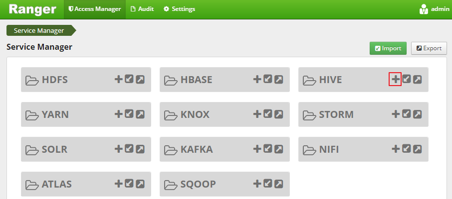
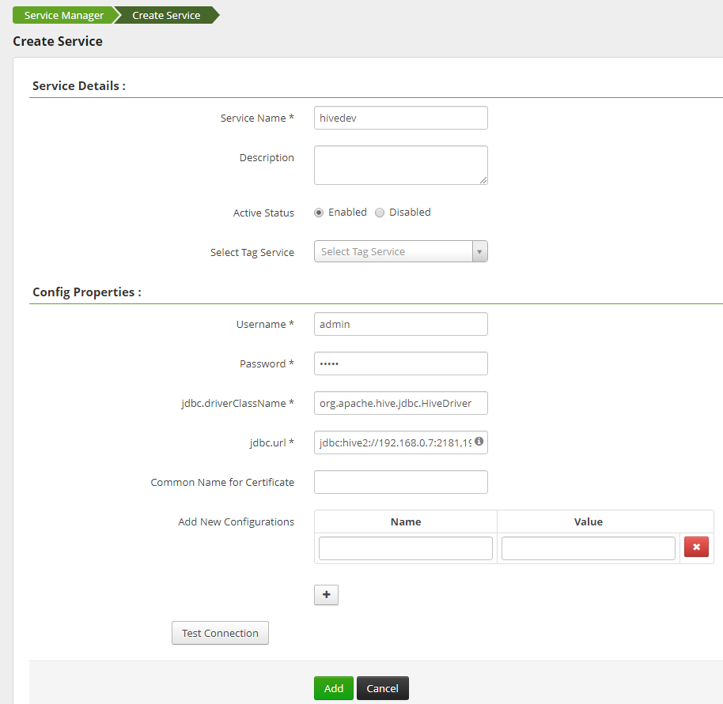
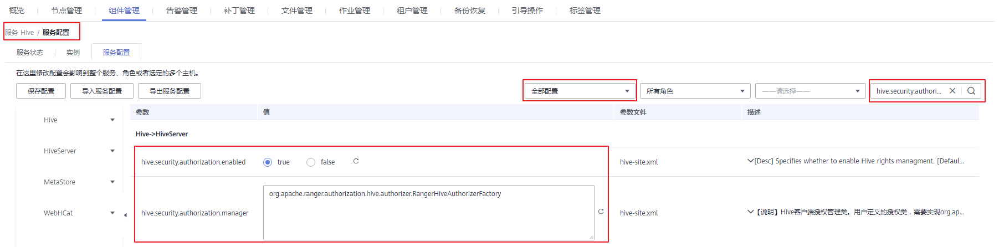
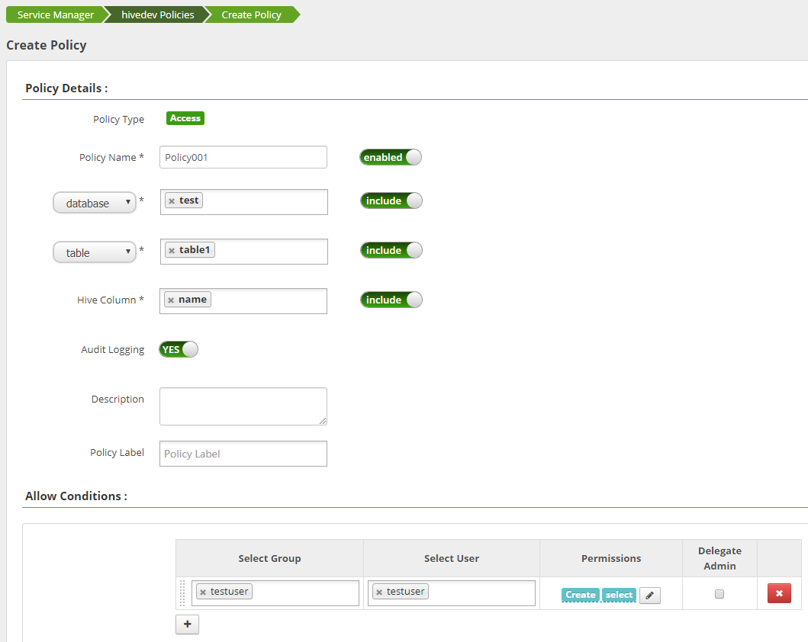
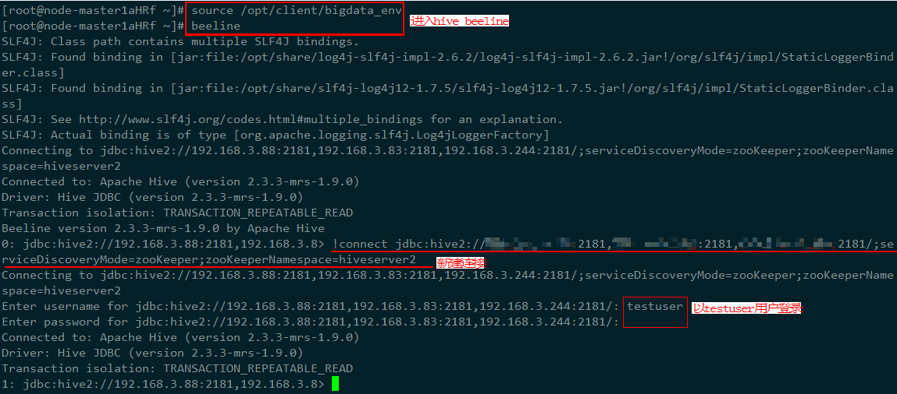
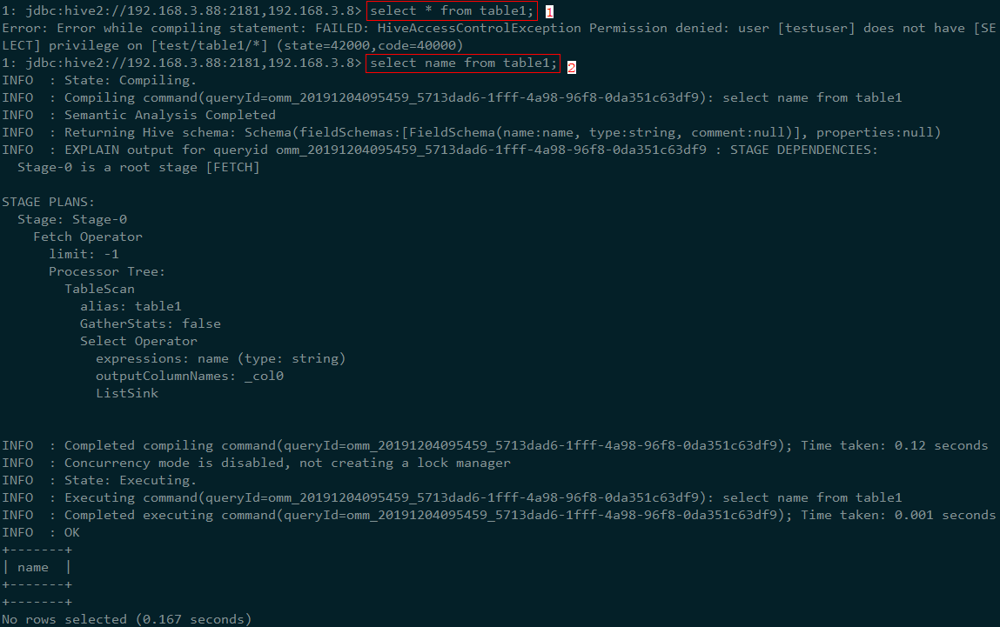

# 在Ranger中配置Hive的访问权限

在创建完安装了Ranger组件的MRS集群后，Hive的权限控制暂未集成在Ranger中，本章节主要介绍Hive组件如何集成在Ranger中。

1.  登录Ranger WebUI界面。
2.  在“Service Manager”中的HIVE处，单击添加Hive Service。

    **图 1**  添加Hive Service  
    

3.  请参考[表1](#table54444329411)填写添加Hive Service的相关参数，未在表中列出的参数请保持默认值。

    **表 1** **参数说明**

    
    <table><thead align="left"><tr id="row1844243264112"><th class="cellrowborder" valign="top" width="33.33333333333333%" id="mcps1.2.4.1.1">
参数

    </th>
    <th class="cellrowborder" valign="top" width="33.33333333333333%" id="mcps1.2.4.1.2">
说明

    </th>
    <th class="cellrowborder" valign="top" width="33.33333333333333%" id="mcps1.2.4.1.3">
示例值

    </th>
    </tr>
    </thead>
    <tbody><tr id="row644393284112"><td class="cellrowborder" valign="top" width="33.33333333333333%" headers="mcps1.2.4.1.1 ">
Service Name

    </td>
    <td class="cellrowborder" valign="top" width="33.33333333333333%" headers="mcps1.2.4.1.2 ">
创建的service name名称，固定填写：hivedev。

    </td>
    <td class="cellrowborder" valign="top" width="33.33333333333333%" headers="mcps1.2.4.1.3 ">
hivedev

    </td>
    </tr>
    <tr id="row34433328419"><td class="cellrowborder" valign="top" width="33.33333333333333%" headers="mcps1.2.4.1.1 ">
Username

    </td>
    <td class="cellrowborder" valign="top" width="33.33333333333333%" headers="mcps1.2.4.1.2 ">
可以任意填写。

    </td>
    <td class="cellrowborder" valign="top" width="33.33333333333333%" headers="mcps1.2.4.1.3 ">
admin

    </td>
    </tr>
    <tr id="row74431532164110"><td class="cellrowborder" valign="top" width="33.33333333333333%" headers="mcps1.2.4.1.1 ">
Password

    </td>
    <td class="cellrowborder" valign="top" width="33.33333333333333%" headers="mcps1.2.4.1.2 ">
可以任意填写。

    </td>
    <td class="cellrowborder" valign="top" width="33.33333333333333%" headers="mcps1.2.4.1.3 ">
-

    </td>
    </tr>
    <tr id="row144353274113"><td class="cellrowborder" valign="top" width="33.33333333333333%" headers="mcps1.2.4.1.1 ">
jdbc.driverClassName

    </td>
    <td class="cellrowborder" valign="top" width="33.33333333333333%" headers="mcps1.2.4.1.2 ">
连接hive的驱动类，固定填写：org.apache.hive.jdbc.HiveDriver。

    </td>
    <td class="cellrowborder" valign="top" width="33.33333333333333%" headers="mcps1.2.4.1.3 ">
org.apache.hive.jdbc.HiveDriver

    </td>
    </tr>
    <tr id="row104441332194110"><td class="cellrowborder" valign="top" width="33.33333333333333%" headers="mcps1.2.4.1.1 ">
jdbc.url

    </td>
    <td class="cellrowborder" valign="top" width="33.33333333333333%" headers="mcps1.2.4.1.2 ">
连接hive的url，格式为ZooKeeper Mode：

    
jdbc:hive2://&lt;host&gt;:2181/;serviceDiscoveryMode=zooKeeper;zooKeeperNamespace=hiveserver2

    
其中&lt;host&gt;为ZooKeeper地址，ZooKeeper地址可通过登录MRS Manager然后选择“服务管理 &gt; ZooKeeper &gt; 实例”，查看ZooKeeper实例的“管理IP”地址获取。

    </td>
    <td class="cellrowborder" valign="top" width="33.33333333333333%" headers="mcps1.2.4.1.3 ">
jdbc:hive2://xx.xx.xx.xx:2181,xx.xx.xx.xx:2181,xx.xx.xx.xx:2181/;serviceDiscoveryMode=zooKeeper;zooKeeperNamespace=hiveserver2

    </td>
    </tr>
    </tbody>
    </table>

    **图 2**  Create hivedev  
    

4.  单击“Add”添加服务。
5.  启动Ranger Hive Plugin，授权Ranger管理Hive。
    1.  在MRS控制台，单击集群名称进入集群详情页面。
    2.  选择“组件管理”。
    3.  选择“Hive \> 服务配置”，将“基础配置”切换为“全部配置”。
    4.  搜索配置“hive.security.authorization”，修改如下两个配置：

        -   hive.security.authorization.enabled = true
        -   hive.security.authorization.manager = org.apache.ranger.authorization.hive.authorizer.RangerHiveAuthorizerFactory

        **图 3**  修改hive.security.authorization  
        

    5.  单击“保存配置”，并勾选“重新启动受影响的服务或实例。”重启Hive服务。

6.  添加访问控制策略，即Policy。
    1.  登录Ranger WebUI界面。
    2.  在HIVE区域单击已添加的服务名称“hivedev”。
    3.  单击“Add New Policy”，新增访问控制策略。
    4.  参考[表2](#table116322231534)配置参数，未在表中列出的参数请保持默认值。

        **表 2**  参数说明

        
        <table><thead align="left"><tr id="row11633152314316"><th class="cellrowborder" valign="top" width="33.33333333333333%" id="mcps1.2.4.1.1">
参数

        </th>
        <th class="cellrowborder" valign="top" width="33.33333333333333%" id="mcps1.2.4.1.2">
说明

        </th>
        <th class="cellrowborder" valign="top" width="33.33333333333333%" id="mcps1.2.4.1.3">
示例值

        </th>
        </tr>
        </thead>
        <tbody><tr id="row1163310231234"><td class="cellrowborder" valign="top" width="33.33333333333333%" headers="mcps1.2.4.1.1 ">
Policy Name

        </td>
        <td class="cellrowborder" valign="top" width="33.33333333333333%" headers="mcps1.2.4.1.2 ">
策略名称。

        </td>
        <td class="cellrowborder" valign="top" width="33.33333333333333%" headers="mcps1.2.4.1.3 ">
Policy001

        </td>
        </tr>
        <tr id="row9633142318314"><td class="cellrowborder" valign="top" width="33.33333333333333%" headers="mcps1.2.4.1.1 ">
database

        </td>
        <td class="cellrowborder" valign="top" width="33.33333333333333%" headers="mcps1.2.4.1.2 ">
该策略允许访问的数据库名称。

        </td>
        <td class="cellrowborder" valign="top" width="33.33333333333333%" headers="mcps1.2.4.1.3 ">
test

        </td>
        </tr>
        <tr id="row863372320317"><td class="cellrowborder" valign="top" width="33.33333333333333%" headers="mcps1.2.4.1.1 ">
table

        </td>
        <td class="cellrowborder" valign="top" width="33.33333333333333%" headers="mcps1.2.4.1.2 ">
该策略允许访问的数据库对应的表名称。

        </td>
        <td class="cellrowborder" valign="top" width="33.33333333333333%" headers="mcps1.2.4.1.3 ">
table1

        </td>
        </tr>
        <tr id="row1663420237318"><td class="cellrowborder" valign="top" width="33.33333333333333%" headers="mcps1.2.4.1.1 ">
Hive Column

        </td>
        <td class="cellrowborder" valign="top" width="33.33333333333333%" headers="mcps1.2.4.1.2 ">
该策略允许访问的数据库对应的表的列名。

        </td>
        <td class="cellrowborder" valign="top" width="33.33333333333333%" headers="mcps1.2.4.1.3 ">
name

        </td>
        </tr>
        <tr id="row463413231318"><td class="cellrowborder" valign="top" width="33.33333333333333%" headers="mcps1.2.4.1.1 ">
Allow Conditions

        </td>
        <td class="cellrowborder" valign="top" width="33.33333333333333%" headers="mcps1.2.4.1.2 "><ul id="ul291972075620"><li>Select Group：该策略允许访问的用户组。</li><li>Select User：该策略允许访问的用户组中的用户。</li><li>Permissions：该策略允许用户使用的权限。</li></ul>
        </td>
        <td class="cellrowborder" valign="top" width="33.33333333333333%" headers="mcps1.2.4.1.3 "><ul id="ul11428874228"><li>Select Group：testuser</li><li>Select User：testuser</li><li>Permissions：Create和select</li></ul>
        </td>
        </tr>
        </tbody>
        </table>

        **图 4**  新增hivedev的访问控制策略  
        

    5.  单击“Add”，完成策略添加，依据如上Policy示例，testuser用户组中的testuser用户将对Hive的“test”数据库中的表“table1”的“name”列有Create和select的权限，而对于其他列则没有任何的访问权限。

7.  参见[从零开始使用Hive](从零开始使用Hive.md)登录hive客户端，验证Ranger是否已经完成集成Hive。
    1.  执行如下命令，进入hive beeline。

        **source /opt/client/bigdata\_env**

        **beeline**

    2.  执行如下命令，建立连接并使用testuser登录。

        **!connect jdbc:hive2://xx.xx.xx.xx:2181,xx.xx.3.81:2181,192.168.3.153:2181/;serviceDiscoveryMode=zooKeeper;zooKeeperNamespace=hiveserver2**

        **图 5**  登录Hive  
        

    3.  查询数据，验证Ranger是否已经集成成功。

        **图 6**  验证Ranger集成Hive  
        

