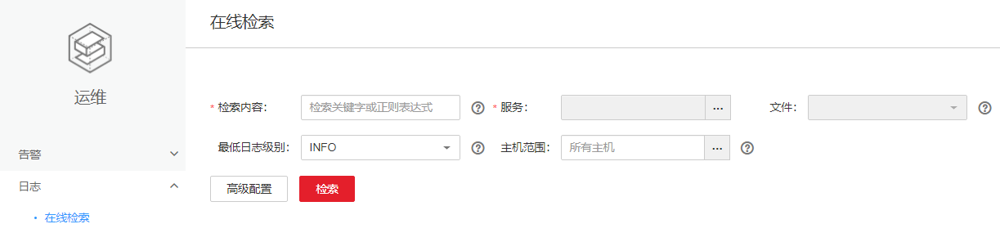

# 在线检索日志

## 操作场景

FusionInsight Manager支持在线检索并显示组件的日志内容，用于问题定位等其他日志查看场景。

## 操作步骤

1.  登录FusionInsight Manager。
2.  选择“运维  \>  日志 \> 在线检索“。

    **图 1**  在线检索  
    

3.  根据所需查询日志分别填写[表1](#zh-cn_topic_0263899600_table14922145885914)各参数，用户可以根据需要选择所需查阅日志时长，缺省时间区间包括：半小时、1小时、2小时、6小时、12小时、1天、1周、1月，也可以单击自定义“开始时间“和“结束时间“：

    **表 1**  日志检索参数

    
    <table><thead align="left"><tr id="zh-cn_topic_0263899600_row17922185819597"><th class="cellrowborder" valign="top" width="14.000000000000002%" id="mcps1.2.3.1.1">
参数名

    </th>
    <th class="cellrowborder" valign="top" width="86%" id="mcps1.2.3.1.2">
说明

    </th>
    </tr>
    </thead>
    <tbody><tr id="zh-cn_topic_0263899600_row1939185875911"><td class="cellrowborder" valign="top" width="14.000000000000002%" headers="mcps1.2.3.1.1 ">
检索内容

    </td>
    <td class="cellrowborder" valign="top" width="86%" headers="mcps1.2.3.1.2 ">
检索的关键字或正则表达式。

    </td>
    </tr>
    <tr id="zh-cn_topic_0263899600_row5939115815917"><td class="cellrowborder" valign="top" width="14.000000000000002%" headers="mcps1.2.3.1.1 ">
服务

    </td>
    <td class="cellrowborder" valign="top" width="86%" headers="mcps1.2.3.1.2 ">
选择所需查询日志的服务或模块。

    </td>
    </tr>
    <tr id="zh-cn_topic_0263899600_row11907111211317"><td class="cellrowborder" valign="top" width="14.000000000000002%" headers="mcps1.2.3.1.1 ">
文件

    </td>
    <td class="cellrowborder" valign="top" width="86%" headers="mcps1.2.3.1.2 ">
当且仅当选择服务中一个角色时，支持选择指定日志文件进行搜索。

    </td>
    </tr>
    <tr id="zh-cn_topic_0263899600_row3939145812593"><td class="cellrowborder" valign="top" width="14.000000000000002%" headers="mcps1.2.3.1.1 ">
最低日志级别

    </td>
    <td class="cellrowborder" valign="top" width="86%" headers="mcps1.2.3.1.2 ">
选择所需查询日志的最低级别，选择某一级别后会显示从本级别到更高级别的日志。

    
级别从低到高依次为：

    
TRACE &lt; DEBUG &lt; INFO &lt; WARN &lt; ERROR &lt; FATAL

    </td>
    </tr>
    <tr id="zh-cn_topic_0263899600_row11939165812590"><td class="cellrowborder" valign="top" width="14.000000000000002%" headers="mcps1.2.3.1.1 ">
主机范围

    </td>
    <td class="cellrowborder" valign="top" width="86%" headers="mcps1.2.3.1.2 "><ul id="zh-cn_topic_0263899600_ul1535102214614"><li>单击可勾选所需主机。</li><li>请输入所需查询日志的节点主机名或管理平面的IP地址。</li><li>各IP地址间用“,”隔开，例如：192.168.10.10,192.168.10.11。</li><li>如果IP地址连续，用“-”连接。例如：192.168.10.[10-20]。</li><li>如果IP地址分段连续，连续时用“-”连接，各IP地址段间用“,”隔开，例如：192.168.10.[10-20,30-40]。
 说明： 
<ul id="zh-cn_topic_0263899600_ul53616270487"><li>如不指定，默认选择所有主机。</li><li>一次性输入最多10个表达式。</li><li>所有表达式一次性最多匹配2000个主机。</li></ul>
    

    </li></ul>
    </td>
    </tr>
    <tr id="zh-cn_topic_0263899600_row19939195875910"><td class="cellrowborder" valign="top" width="14.000000000000002%" headers="mcps1.2.3.1.1 ">
高级配置

    </td>
    <td class="cellrowborder" valign="top" width="86%" headers="mcps1.2.3.1.2 "><ul id="zh-cn_topic_0263899600_ul19670203508"><li>最大数量：一次性显示的最大日志条数，如果检索到的日志数量超过设定值，时间较早的将被忽略。不配表示不限制。</li><li>检索超时：用于限制每个节点上的最大检索时间，超时后会中止搜索，已经搜索到的结果仍会显示。</li></ul>
    </td>
    </tr>
    </tbody>
    </table>

4.  单击“检索“开始搜索，结果包含字段如[表2](#zh-cn_topic_0263899600_table92081419119)所示。

    **表 2**  检索结果

    
    <table><thead align="left"><tr id="zh-cn_topic_0263899600_row162051417116"><th class="cellrowborder" valign="top" width="14.000000000000002%" id="mcps1.2.3.1.1">
参数名

    </th>
    <th class="cellrowborder" valign="top" width="86%" id="mcps1.2.3.1.2">
说明

    </th>
    </tr>
    </thead>
    <tbody><tr id="zh-cn_topic_0263899600_row32016144117"><td class="cellrowborder" valign="top" width="14.000000000000002%" headers="mcps1.2.3.1.1 ">
时间

    </td>
    <td class="cellrowborder" valign="top" width="86%" headers="mcps1.2.3.1.2 ">
该行日志产生的具体时间点。

    </td>
    </tr>
    <tr id="zh-cn_topic_0263899600_row179671220163220"><td class="cellrowborder" valign="top" width="14.000000000000002%" headers="mcps1.2.3.1.1 ">
来源

    </td>
    <td class="cellrowborder" valign="top" width="86%" headers="mcps1.2.3.1.2 ">
产生日志的集群。

    </td>
    </tr>
    <tr id="zh-cn_topic_0263899600_row620314419"><td class="cellrowborder" valign="top" width="14.000000000000002%" headers="mcps1.2.3.1.1 ">
主机名称

    </td>
    <td class="cellrowborder" valign="top" width="86%" headers="mcps1.2.3.1.2 ">
记录该行日志的日志文件所在节点的主机名。

    </td>
    </tr>
    <tr id="zh-cn_topic_0263899600_row122061411115"><td class="cellrowborder" valign="top" width="14.000000000000002%" headers="mcps1.2.3.1.1 ">
位置

    </td>
    <td class="cellrowborder" valign="top" width="86%" headers="mcps1.2.3.1.2 ">
该行日志所在的日志文件的具体路径。

    
单击位置信息可进入在线日志浏览页面。默认显示该日志所在行前后各100条日志，可单击页首或页尾的“更多”显示更多日志信息。单击“下载”可以下载该日志文件到本地。

    </td>
    </tr>
    <tr id="zh-cn_topic_0263899600_row3208145111"><td class="cellrowborder" valign="top" width="14.000000000000002%" headers="mcps1.2.3.1.1 ">
行号

    </td>
    <td class="cellrowborder" valign="top" width="86%" headers="mcps1.2.3.1.2 ">
该行日志在日志文件中所在的行数。

    </td>
    </tr>
    <tr id="zh-cn_topic_0263899600_row18203148119"><td class="cellrowborder" valign="top" width="14.000000000000002%" headers="mcps1.2.3.1.1 ">
级别

    </td>
    <td class="cellrowborder" valign="top" width="86%" headers="mcps1.2.3.1.2 ">
该行日志的级别。

    </td>
    </tr>
    <tr id="zh-cn_topic_0263899600_row142061417117"><td class="cellrowborder" valign="top" width="14.000000000000002%" headers="mcps1.2.3.1.1 ">
日志

    </td>
    <td class="cellrowborder" valign="top" width="86%" headers="mcps1.2.3.1.2 ">
日志的具体内容。

    </td>
    </tr>
    </tbody>
    </table>

    > **说明：** 
    >在检索过程中可单击“停止”强制停止当前检索进度，并在列表中显示已检索出的结果。

5.  单击“过滤“，可以针对界面上已经显示的日志信息进行二次筛选，具体字段如[表3](#zh-cn_topic_0263899600_table5795173012197)所示。填写完毕后，单击“过滤“进行检索，单击“重置“可清空已填写信息。

    **表 3**  过滤

    
    <table><thead align="left"><tr id="zh-cn_topic_0263899600_row1281015302196"><th class="cellrowborder" valign="top" width="15%" id="mcps1.2.3.1.1">
参数名

    </th>
    <th class="cellrowborder" valign="top" width="85%" id="mcps1.2.3.1.2">
说明

    </th>
    </tr>
    </thead>
    <tbody><tr id="zh-cn_topic_0263899600_row158101330191914"><td class="cellrowborder" valign="top" width="15%" headers="mcps1.2.3.1.1 ">
关键字

    </td>
    <td class="cellrowborder" valign="top" width="85%" headers="mcps1.2.3.1.2 ">
需要检索的日志关键字。

    </td>
    </tr>
    <tr id="zh-cn_topic_0263899600_row1081015309199"><td class="cellrowborder" valign="top" width="15%" headers="mcps1.2.3.1.1 ">
主机名称

    </td>
    <td class="cellrowborder" valign="top" width="85%" headers="mcps1.2.3.1.2 ">
需要检索的主机名。

    </td>
    </tr>
    <tr id="zh-cn_topic_0263899600_row16810133021915"><td class="cellrowborder" valign="top" width="15%" headers="mcps1.2.3.1.1 ">
位置

    </td>
    <td class="cellrowborder" valign="top" width="85%" headers="mcps1.2.3.1.2 ">
所需检索的日志文件路径。

    </td>
    </tr>
    <tr id="zh-cn_topic_0263899600_row1781063013193"><td class="cellrowborder" valign="top" width="15%" headers="mcps1.2.3.1.1 ">
开始时间

    </td>
    <td class="cellrowborder" valign="top" width="85%" headers="mcps1.2.3.1.2 ">
所需检索日志信息的开始时间。

    </td>
    </tr>
    <tr id="zh-cn_topic_0263899600_row796993973311"><td class="cellrowborder" valign="top" width="15%" headers="mcps1.2.3.1.1 ">
结束时间

    </td>
    <td class="cellrowborder" valign="top" width="85%" headers="mcps1.2.3.1.2 ">
所需检索日志信息的结束时间。

    </td>
    </tr>
    <tr id="zh-cn_topic_0263899600_row1466113493310"><td class="cellrowborder" valign="top" width="15%" headers="mcps1.2.3.1.1 ">
来源集群

    </td>
    <td class="cellrowborder" valign="top" width="85%" headers="mcps1.2.3.1.2 ">
需要检索的集群。

    </td>
    </tr>
    </tbody>
    </table>

