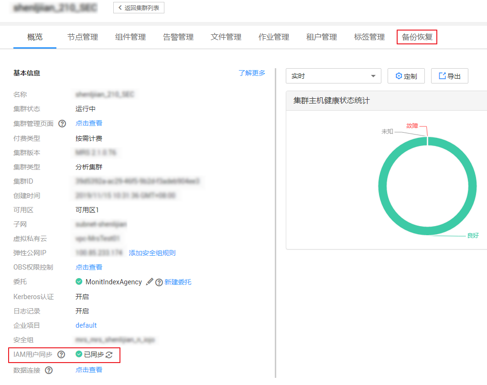

# 备份元数据

## 操作场景

为了确保元数据信息安全，或者用户需要对元数据功能进行重大操作（如扩容缩容、安装补丁包、升级或迁移等）前后，需要对元数据进行备份，从而保证系统在出现异常或未达到预期结果时可以及时进行数据恢复，将对业务的影响降到最低。元数据包含OMS数据、LdapServer数据、DBService数据和NameNode数据。备份Manager数据包含同时备份OMS数据和LdapServer数据。

默认情况下，元数据备份由“default“任务支持。该任务指导用户通过MRS创建备份任务并备份元数据。支持创建任务自动或手动备份数据。

## 前提条件

-   需要准备一个用于备份数据的备集群，且网络连通。每个集群的安全组，需分别添加对端集群的安全组入方向规则，允许安全组中所有弹性云服务器全部协议全部端口的访问请求。
-   根据业务需要，规划备份的类型、周期和策略等规格，并检查主备管理节点“数据存放路径/LocalBackup/”是否有充足的空间。
-   已完成IAM用户同步（在集群详情页的“概览”页签，单击“IAM用户同步“右侧的“单击同步”进行IAM用户同步）。

    **图 1**  IAM用户同步  
    

## 操作步骤

1.  创建备份任务。
    1.  在集群详情页，单击“备份恢复”。

        **图 2**  备份恢复  
        

        > **说明：** 
        >MRS 3.x版本请参考[备份数据](备份数据.md)。

    2.  在“备份管理”页签单击“创建备份任务”。

2.  设置备份策略。
    1.  在“任务名称”填写备份任务的名称。
    2.  在“备份类型”选择备份任务的运行类型，“周期备份”表示按周期自动执行备份，“手动备份”表示由手工执行备份。

        创建周期备份任务，还需要填写以下参数：

        -   “开始时间”：表示任务第一次启动的时间。
        -   “周期”：表示任务下次启动，与上一次运行的时间间隔，支持“按小时”或“按天”。
        -   “备份策略”：表示任务每次启动时备份的数据量。支持“首次全量备份，后续增量备份”、“每次都全量备份”和“每n次进行一次全量备份”。选择“每n次进行一次全量备份”时，需要指定**n**的值。

3.  选择备份源。

    在“备份配置”，勾选元数据选项，例如“OMS”和“LdapServer”。

4.  设置备份参数。
    1.  在“OMS”和“LdapServer”的“路径类型”，选择一个备份目录的类型。

        备份目录支持以下类型：

        -   “LocalDir”：表示将备份文件保存在主管理节点的本地磁盘上，备管理节点将自动同步备份文件。默认保存目录为“数据存放路径/LocalBackup/”。选择此参数值，还需要配置“最大备份数”，表示备份目录中可保留的备份文件集数量。
        -   “LocalHDFS”：表示将备份文件保存在当前集群的HDFS目录。选择此参数值，还需要配置以下参数：
            -   “目的端路径”：填写备份文件在HDFS中保存的目录。不支持填写HDFS中的隐藏目录，例如快照或回收站目录；也不支持默认的系统目录。
            -   “最大备份数”：填写备份目录中可保留的备份文件集数量。
            -   “目标实例名称”：选择备份目录对应的NameService名称。默认值为“hacluster”。

    2.  单击“确定”保存。

5.  执行备份任务。在备份任务列表中已创建任务的“操作”列：

    -   若“备份类型”选择“周期备份”请单击“即时备份”。
    -   若“备份类型”选择“手动备份”请单击“启动“，开始执行备份任务。

    备份任务执行完成后，系统自动在备份目录中为每个备份任务创建子目录，目录名为_备份任务名_\__任务创建时间_，用于保存数据源的备份文件。备份文件的名称为_版本号_\__数据源_\__任务执行时间_.tar.gz。

