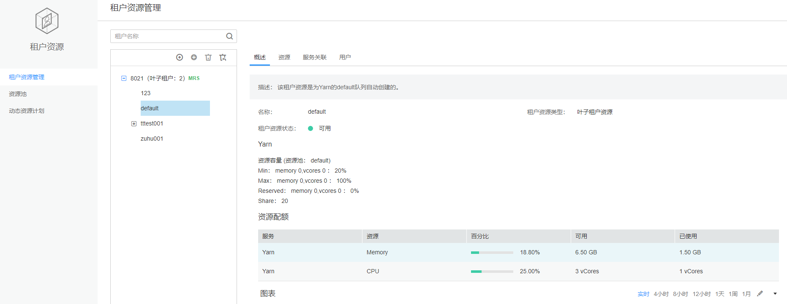
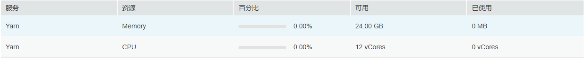
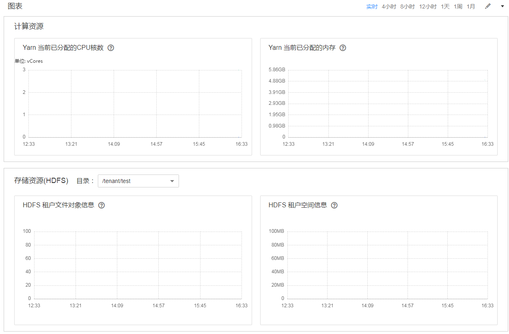

# 多租户管理页面概述

## 统一的多租户管理

FusionInsight Manager作为统一的多租户管理平台，集成了租户生命周期管理、租户资源配置、租户服务关联和租户资源使用统计等功能，为企业提供了成熟的多租户管理模型，实现集中式的租户和业务管理。

**图形化的操作界面**

FusionInsight Manager实现全图形化的多租户管理界面：通过树形结构实现多级租户的管理和操作，将当前租户的基本信息和资源配额集成在一个界面中，方便运维和管理，如[图1](#fig2773161717323)所示。

**图 1**  多租户管理  

**层级式的租户管理**

FusionInsight Manager支持层级式的租户管理，可以为租户进一步添加子租户，实现资源的再次配置。一级租户下一级的子租户属于二级租户，以此类推。为企业提供了成熟的多租户管理模型，实现集中式的租户和业务管理。

## 简化的权限管理

FusionInsight Manager对普通用户封闭了租户内部的权限管理细节，对管理员简化了权限管理的操作方法，提升了租户权限管理的易用性和用户体验。

-   使用RBAC方式，在多租户管理时，可根据业务场景为各用户分别配置不同权限。
-   租户的管理员，具有租户的管理权限，包括：查看当前租户的资源和服务、在当前租户中添加/删除子租户并管理子租户资源的权限。支持定义单个租户的管理员，可以将租户的管理权限委托给系统管理员之外的其它用户。
-   租户对应的角色，具有租户的计算资源和存储资源的全部权限。创建租户时，系统自动创建租户对应的角色，可以添加用户并绑定该角色为其他用户授权，以使用该租户的资源。

## 清晰的资源管理

-   **资源自主配置**

    FusionInsight Manager支持在创建租户时配置计算资源和存储资源，和进一步添加、修改、删除租户内资源。

    修改租户的计算资源或存储资源，当前租户对应的角色所关联的权限将自动更新。

-   **资源使用统计**

    资源使用统计是管理员获取当前集群应用和服务的运行状态，提高集群运维效率，做出运维决策的重要依据。FusionInsight Manager通过“资源配额“展示租户的资源统计，包括租户动态计算资源VCores和Memory， HDFS存储资源（Space）的使用统计。

    > **说明：** 
    >-   “资源配额”视图动态计算租户资源使用情况。
    >    
    >    Superior调度器可用资源计算方式分别如下：
    >    -   Superior
    >        Yarn可用资源（Memory、CPU）为资源池容量按照队列权重按比例分配。
    >-   当租户管理员绑定一个租户角色时，租户管理员将拥有该租户的管理权限，以及该租户全部资源的权限。

-   **资源图形化监控**

    资源图形化监控支持[表1](#table3621114917574)中监控项图形化显示，如[图2](#fig136061232032)所示。

    **图 2**  精细化监控  
    

    默认显示实时的监控数据，用户可单击自定义时间区间，缺省时间区间包括：4小时、8小时、12小时、1天、1周、1月，单击，在弹出菜单中选择“导出“，导出对应的监控项信息。

    **表 1**  监控项

    
    <table><thead align="left"><tr id="row1162118491577"><th class="cellrowborder" valign="top" width="17%" id="mcps1.2.4.1.1">
所属服务

    </th>
    <th class="cellrowborder" valign="top" width="35%" id="mcps1.2.4.1.2">
监控指标项

    </th>
    <th class="cellrowborder" valign="top" width="48%" id="mcps1.2.4.1.3">
说明

    </th>
    </tr>
    </thead>
    <tbody><tr id="row56211649135710"><td class="cellrowborder" rowspan="2" valign="top" width="17%" headers="mcps1.2.4.1.1 ">
HDFS

    </td>
    <td class="cellrowborder" valign="top" width="35%" headers="mcps1.2.4.1.2 ">
HDFS租户空间信息

    <ul id="ul1739993754210"><li>分配的空间大小</li><li>已使用的空间大小</li></ul>
    </td>
    <td class="cellrowborder" rowspan="2" valign="top" width="48%" headers="mcps1.2.4.1.3 ">
HDFS可选择指定的存储目录进行监控。存储目录与当前租户在“资源”中添加的目录一致。

    </td>
    </tr>
    <tr id="row156211849155718"><td class="cellrowborder" valign="top" headers="mcps1.2.4.1.1 ">
HDFS租户文件对象信息

    <ul id="ul43331760425"><li>已使用的文件对象个数</li></ul>
    </td>
    </tr>
    <tr id="row962124919572"><td class="cellrowborder" rowspan="2" valign="top" width="17%" headers="mcps1.2.4.1.1 ">
Yarn

    </td>
    <td class="cellrowborder" valign="top" width="35%" headers="mcps1.2.4.1.2 ">
Yarn当前已分配的CPU核数

    <ul id="ul6446355183514"><li>AM分配的最大CPU核数</li><li>已分配的CPU核数</li><li>AM已使用的CPU核数</li></ul>
    </td>
    <td class="cellrowborder" rowspan="2" valign="top" width="48%" headers="mcps1.2.4.1.3 ">
当前租户的监控信息。如某租户未配置相应子项，则不显示。

    
监控数据取自Yarn原生WebUI中“Scheduler &gt; Application Queues &gt; Queue:<em id="i10297194512539">租户名</em> ”。

    </td>
    </tr>
    <tr id="row15638649115714"><td class="cellrowborder" valign="top" headers="mcps1.2.4.1.1 ">
Yarn当前已分配的内存

    <ul id="ul1901726103714"><li>AM分配的最大内存</li><li>已分配的内存</li><li>AM已使用的内存</li></ul>
    </td>
    </tr>
    </tbody>
    </table>

