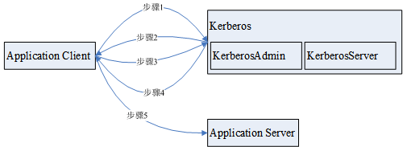

# 安全认证原理和认证机制<a name="mrs_07_020001"></a>

## 功能<a name="zh-cn_topic_0269458072_s6c8c2d7cd9934c0d8d9abeff23cf605e"></a>

开启了 Kerberos认证的安全模式集群，进行应用开发时需要进行安全认证。

Kerberos这一名词来源于希腊神话“三个头的狗——地狱之门守护者”，后来沿用作为安全认证的概念，使用Kerberos的系统在设计上采用“客户端/服务器”结构与AES等加密技术，并且能够进行相互认证（即客户端和服务器端均可对对方进行身份认证）。可以用于防止窃听、防止replay攻击、保护数据完整性等场合，是一种应用对称密钥体制进行密钥管理的系统。

## 结构<a name="zh-cn_topic_0269458072_s2a96ac6f28614fd89e42309ec712ef7d"></a>

Kerberos的原理架构如[图1](#zh-cn_topic_0269458072_f203af1d5f55e4832ba0f6891e6c38839)所示，各模块的说明如[表1](#zh-cn_topic_0269458072_t16ccb1745d994539a7b6d7b4d728ff02)所示。

**图 1**  原理架构<a name="zh-cn_topic_0269458072_f203af1d5f55e4832ba0f6891e6c38839"></a>  


**表 1**  模块说明

<a name="zh-cn_topic_0269458072_t16ccb1745d994539a7b6d7b4d728ff02"></a>
<table><thead align="left"><tr id="zh-cn_topic_0269458072_rbc7bb7fa190c4b91b9dd879a5a0dcf19"><th class="cellrowborder" valign="top" width="50%" id="mcps1.2.3.1.1"><p id="zh-cn_topic_0269458072_a827851072b6f467583d96a15fd54b6c2"><a name="zh-cn_topic_0269458072_a827851072b6f467583d96a15fd54b6c2"></a><a name="zh-cn_topic_0269458072_a827851072b6f467583d96a15fd54b6c2"></a>模块</p>
</th>
<th class="cellrowborder" valign="top" width="50%" id="mcps1.2.3.1.2"><p id="zh-cn_topic_0269458072_a7599c3b3a30f4a9fb66bf115df4a42f9"><a name="zh-cn_topic_0269458072_a7599c3b3a30f4a9fb66bf115df4a42f9"></a><a name="zh-cn_topic_0269458072_a7599c3b3a30f4a9fb66bf115df4a42f9"></a>说明</p>
</th>
</tr>
</thead>
<tbody><tr id="zh-cn_topic_0269458072_r39216f8d390b4a72859ab3f82c76e3e5"><td class="cellrowborder" valign="top" width="50%" headers="mcps1.2.3.1.1 "><p id="zh-cn_topic_0269458072_a70235e04d95d4b3b9b2a362d8b97718e"><a name="zh-cn_topic_0269458072_a70235e04d95d4b3b9b2a362d8b97718e"></a><a name="zh-cn_topic_0269458072_a70235e04d95d4b3b9b2a362d8b97718e"></a>Application Client</p>
</td>
<td class="cellrowborder" valign="top" width="50%" headers="mcps1.2.3.1.2 "><p id="zh-cn_topic_0269458072_ad4f60228fc074d81969979ca475718a6"><a name="zh-cn_topic_0269458072_ad4f60228fc074d81969979ca475718a6"></a><a name="zh-cn_topic_0269458072_ad4f60228fc074d81969979ca475718a6"></a>应用客户端，通常是需要提交任务（或者作业）的应用程序。</p>
</td>
</tr>
<tr id="zh-cn_topic_0269458072_rd2efd668fbb447eb83b0689e8e9a6e3f"><td class="cellrowborder" valign="top" width="50%" headers="mcps1.2.3.1.1 "><p id="zh-cn_topic_0269458072_a6b3aec8431c44f2286d9f905dd33d108"><a name="zh-cn_topic_0269458072_a6b3aec8431c44f2286d9f905dd33d108"></a><a name="zh-cn_topic_0269458072_a6b3aec8431c44f2286d9f905dd33d108"></a>Application Server</p>
</td>
<td class="cellrowborder" valign="top" width="50%" headers="mcps1.2.3.1.2 "><p id="zh-cn_topic_0269458072_a763d0eeed7be42e48b3e59d675b0f980"><a name="zh-cn_topic_0269458072_a763d0eeed7be42e48b3e59d675b0f980"></a><a name="zh-cn_topic_0269458072_a763d0eeed7be42e48b3e59d675b0f980"></a>应用服务端，通常是应用客户端需要访问的应用程序。</p>
</td>
</tr>
<tr id="zh-cn_topic_0269458072_r5a99587223b444b28d9890250af93e59"><td class="cellrowborder" valign="top" width="50%" headers="mcps1.2.3.1.1 "><p id="zh-cn_topic_0269458072_a76c1abda92344a4996d317a164fcd894"><a name="zh-cn_topic_0269458072_a76c1abda92344a4996d317a164fcd894"></a><a name="zh-cn_topic_0269458072_a76c1abda92344a4996d317a164fcd894"></a>Kerberos</p>
</td>
<td class="cellrowborder" valign="top" width="50%" headers="mcps1.2.3.1.2 "><p id="zh-cn_topic_0269458072_a5349cc43d41148ad86f1e7ae777bbb19"><a name="zh-cn_topic_0269458072_a5349cc43d41148ad86f1e7ae777bbb19"></a><a name="zh-cn_topic_0269458072_a5349cc43d41148ad86f1e7ae777bbb19"></a>提供安全认证的服务。</p>
</td>
</tr>
<tr id="zh-cn_topic_0269458072_rf42e960c772e4ad4a1794bb7affff973"><td class="cellrowborder" valign="top" width="50%" headers="mcps1.2.3.1.1 "><p id="zh-cn_topic_0269458072_a8a4bb082fce94de6aaa81b1c247fea10"><a name="zh-cn_topic_0269458072_a8a4bb082fce94de6aaa81b1c247fea10"></a><a name="zh-cn_topic_0269458072_a8a4bb082fce94de6aaa81b1c247fea10"></a>KerberosAdmin</p>
</td>
<td class="cellrowborder" valign="top" width="50%" headers="mcps1.2.3.1.2 "><p id="zh-cn_topic_0269458072_a47f8ec72d44d4a93a6d3089cd1a44b6d"><a name="zh-cn_topic_0269458072_a47f8ec72d44d4a93a6d3089cd1a44b6d"></a><a name="zh-cn_topic_0269458072_a47f8ec72d44d4a93a6d3089cd1a44b6d"></a>提供认证用户管理的进程。</p>
</td>
</tr>
<tr id="zh-cn_topic_0269458072_reeb79043e358483abe3216484b62af79"><td class="cellrowborder" valign="top" width="50%" headers="mcps1.2.3.1.1 "><p id="zh-cn_topic_0269458072_a9629821e584b44fb9e8e4d7a61f8e069"><a name="zh-cn_topic_0269458072_a9629821e584b44fb9e8e4d7a61f8e069"></a><a name="zh-cn_topic_0269458072_a9629821e584b44fb9e8e4d7a61f8e069"></a>KerberosServer</p>
</td>
<td class="cellrowborder" valign="top" width="50%" headers="mcps1.2.3.1.2 "><p id="zh-cn_topic_0269458072_aa3800136f9804ee78231f29aafec323d"><a name="zh-cn_topic_0269458072_aa3800136f9804ee78231f29aafec323d"></a><a name="zh-cn_topic_0269458072_aa3800136f9804ee78231f29aafec323d"></a>提供认证票据分发的进程。</p>
</td>
</tr>
</tbody>
</table>

步骤原理说明：

应用客户端（Application Client）可以是集群内某个服务，也可以是客户二次开发的一个应用程序，应用程序可以向应用服务提交任务或者作业。

1.  应用程序在提交任务或者作业前，需要向Kerberos服务申请TGT（Ticket-Granting Ticket），用于建立和Kerberos服务器的安全会话。
2.  Kerberos服务在收到TGT请求后，会解析其中的参数来生成对应的TGT，使用客户端指定的用户名的密钥进行加密响应消息。
3.  应用客户端收到TGT响应消息后，解析获取TGT，此时，再由应用客户端（通常是rpc底层）向Kerberos服务获取应用服务端的ST（Server Ticket）。
4.  Kerberos服务在收到ST请求后，校验其中的TGT合法后，生成对应的应用服务的ST，再使用应用服务密钥将响应消息进行加密处理。
5.  应用客户端收到ST响应消息后，将ST打包到发给应用服务的消息里面传输给对应的应用服务端（Application Server）。
6.  应用服务端收到请求后，使用本端应用服务对应的密钥解析其中的ST，并校验成功后，本次请求合法通过。

## 基本概念<a name="zh-cn_topic_0269458072_s2783747b1978447da29d6289ad65d9f2"></a>

以下为常见的基本概念，可以帮助用户减少学习Kerberos框架所花费的时间，有助于更好的理解Kerberos业务。以HDFS安全认证为例：

**TGT**

票据授权票据（Ticket-Granting Ticket），由Kerberos服务生成，提供给应用程序与Kerberos服务器建立认证安全会话，该票据的默认有效期为24小时，24小时后该票据自动过期。

TGT申请方式\(以HDFS为例\)：

1.  通过HDFS提供的接口获取。

    ```
    /**
      * login Kerberos to get TGT, if the cluster is in security mode
      * @throws IOException if login is failed
      */
      private void login() throws IOException {       
      // not security mode, just return
        if (! "kerberos".equalsIgnoreCase(conf.get("hadoop.security.authentication"))) {
            return;
        }
            
        //security mode
        System.setProperty("java.security.krb5.conf", PATH_TO_KRB5_CONF);
            
        UserGroupInformation.setConfiguration(conf);
        UserGroupInformation.loginUserFromKeytab(PRNCIPAL_NAME, PATH_TO_KEYTAB);        
      }
    ```

2.  通过客户端shell命令以**kinit**方式获取。

**ST**

服务票据（Server Ticket），由Kerberos服务生成，提供给应用程序与应用服务建立安全会话，该票据一次性有效。

ST的生成在FusionInsight产品中，基于hadoop-rpc通信，由rpc底层自动向Kerberos服务端提交请求，由Kerberos服务端生成。

## 认证代码实例讲解<a name="zh-cn_topic_0269458072_sccbe5dd62134413384349cad06854dce"></a>

```
package com.huawei.bigdata.hdfs.examples;

import java.io.IOException;

import org.apache.hadoop.conf.Configuration;
import org.apache.hadoop.fs.FileStatus;
import org.apache.hadoop.fs.FileSystem;
import org.apache.hadoop.fs.Path;
import org.apache.hadoop.security.UserGroupInformation;

public class KerberosTest {
    private static String PATH_TO_HDFS_SITE_XML = KerberosTest.class.getClassLoader().getResource("hdfs-site.xml")
            .getPath();
    private static String PATH_TO_CORE_SITE_XML = KerberosTest.class.getClassLoader().getResource("core-site.xml")
            .getPath();
    private static String PATH_TO_KEYTAB = KerberosTest.class.getClassLoader().getResource("user.keytab").getPath();
    private static String PATH_TO_KRB5_CONF = KerberosTest.class.getClassLoader().getResource("krb5.conf").getPath();
    private static String PRNCIPAL_NAME = "develop";
    private FileSystem fs;
    private Configuration conf;
    
    /**
     * initialize Configuration
     */
    private void initConf() {
        conf = new Configuration();
        
        // add configuration files
        conf.addResource(new Path(PATH_TO_HDFS_SITE_XML));
        conf.addResource(new Path(PATH_TO_CORE_SITE_XML));
    }
    
    /**
     * login Kerberos to get TGT, if the cluster is in security mode
     * @throws IOException if login is failed
     */
    private void login() throws IOException {       
        // not security mode, just return
        if (! "kerberos".equalsIgnoreCase(conf.get("hadoop.security.authentication"))) {
            return;
        }
        
        //security mode
        System.setProperty("java.security.krb5.conf", PATH_TO_KRB5_CONF);
        
        UserGroupInformation.setConfiguration(conf);
        UserGroupInformation.loginUserFromKeytab(PRNCIPAL_NAME, PATH_TO_KEYTAB);        
    }
    
    /**
     * initialize FileSystem, and get ST from Kerberos
     * @throws IOException
     */
    private void initFileSystem() throws IOException {
        fs = FileSystem.get(conf);
    }
    
    /**
     * An example to access the HDFS
     * @throws IOException
     */
    private void doSth() throws IOException {
        Path path = new Path("/tmp");
        FileStatus fStatus = fs.getFileStatus(path);
        System.out.println("Status of " + path + " is " + fStatus);
        //other thing
    }


    public static void main(String[] args) throws Exception {
        KerberosTest test = new KerberosTest();
        test.initConf();
        test.login();
        test.initFileSystem();
        test.doSth();       
    }
}
```

> **说明：** 
>1.  Kerberos认证时需要配置Kerberos认证所需要的文件参数，主要包含keytab路径，Kerberos认证的用户名称，Kerberos认证所需要的客户端配置krb5.conf文件。
>2.  方法login\(\)为调用hadoop的接口执行Kerberos认证，生成TGT票据。
>3.  方法doSth\(\)调用hadoop的接口访问文件系统，此时底层RPC会自动携带TGT去Kerberos认证，生成ST票据。
>4.  以上代码可在安全模式下的HDFS二次开发样例工程中创建KerberosTest.java，运行并查看调测结果，具体操作过程请参考[HDFS开发指南（安全模式）](https://support.huaweicloud.com/devg3-mrs/mrs_07_090000.html)。

