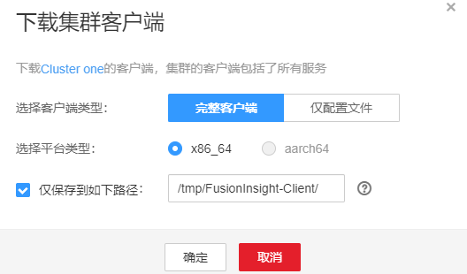

# 安装客户端<a name="admin_guide_000171"></a>

## 操作场景<a name="zh-cn_topic_0263899490_zh-cn_topic_0193213980_s1a1a66848fb546e98ca950c8283b62d9"></a>

该操作指导安装工程师安装MRS集群所有服务（不包含Flume）的客户端。MRS针对不同服务提供了Shell脚本，供开发维护人员在不同场景下登录其对应的服务维护客户端完成对应的维护任务。

> **说明：** 
>-   通过Manager界面修改服务端配置或系统升级后，建议重新安装客户端，否则客户端与服务端版本将不一致。

## 前提条件<a name="zh-cn_topic_0263899490_zh-cn_topic_0193213980_s1afb479ab58e4b0387e014dabf861bb0"></a>

-   安装目录可以不存在，会自动创建。但如果存在，则必须为空。目录路径不能包含空格。
-   客户端节点为集群外部服务器时，必须能够与集群业务平面网络互通，否则安装会失败。
-   客户端必须启用NTP服务，并保持与服务端时间一致，否则安装会失败。
-   对于下载所有组件客户端的情况，HDFS与Mapreduce是合一目录（“_客户端目录_/HDFS/”）。
-   安装和使用客户端可以使用任意用户进行操作，用户名和密码请从管理员处获取，本章节以“user\_client”进行举例。要求“user\_client”用户为服务器文件目录（如“/opt/Bigdata/client”）和客户端安装目录（如“/opt/Bigdata/hadoopclient”）的“owner”，两个目录的权限为“755”。
-   使用客户端需要已从管理员处获取“组件业务用户”（默认用户或新增用户）和“密码”。
-   使用**omm**和**root**以外的用户安装客户端时，若“/var/tmp/patch”目录已存在，需将此目录权限修改为“777”，将此目录内的日志权限修改为“666”。

## 操作步骤<a name="zh-cn_topic_0263899490_zh-cn_topic_0193213980_s6870771d9133462aa75d095bd7e63aa9"></a>

1.  获取软件包。

    登录FusionInsight Manager，在“集群”下拉列表中单击需要操作的集群名称。

    选择“更多 \> 下载客户端“，弹出“下载集群客户端”信息提示框。

    **图 1**  下载客户端<a name="zh-cn_topic_0263899490_zh-cn_topic_0193213980_fig10575324119"></a>  
    

    > **说明：** 
    >在只安装单个服务的客户端的场景中，选择“集群 \>  _待操作集群的名称_  \> 服务 \>  _服务名称_  \> 更多 \> 下载客户端”，弹出“下载客户端”信息提示框。

2.  “选择客户端类型”中选择“完整客户端”。

    “仅配置文件”下载的客户端配置文件，适用于应用开发任务中，完整客户端已下载并安装后，管理员通过Manager界面修改了服务端配置，开发人员需要更新客户端配置文件的场景。

    平台类型包括x86\_64和aarch64两种：

    -   x86\_64：可以部署在X86平台的客户端软件包。
    -   aarch64：可以部署在TaiShan服务器的客户端软件包。

    > **说明：** 
    >集群支持下载x86\_64和aarch64两种类型客户端，但是客户端类型必须待安装节点的架构匹配，否则客户端会安装失败。

3.  是否在集群的节点中生成客户端文件？
    -   是，勾选“仅保存到如下路径”，单击“确定”开始生成客户端文件，文件生成后默认保存在主管理节点“/tmp/FusionInsight-Client”。支持自定义其他目录且**omm**用户拥有目录的读、写与执行权限。单击“确定”，等待下载完成后，使用**omm**用户或**root**用户将获取的软件包复制到将要安装客户端的服务器文件目录，例如“/opt/Bigdata/client”。然后执行[5](#zh-cn_topic_0263899490_zh-cn_topic_0193213980_zh-cn_topic_0046662333_u_login)。

        > **说明：** 
        >当用户无法获取**root**用户权限，需要用**omm**用户操作。

    -   否，单击“确定”指定本地的保存位置，开始下载完整客户端，等待下载完成，执行[4](#zh-cn_topic_0263899490_zh-cn_topic_0193213980_li4528442311580)。

4.  <a name="zh-cn_topic_0263899490_zh-cn_topic_0193213980_li4528442311580"></a>上传软件包。

    使用WinSCP工具，以准备安装客户端的用户（如“user\_client”），将获取的软件包上传到将要安装客户端的服务器文件目录，例如“/opt/Bigdata/client”。

    客户端软件包名称格式为：“FusionInsight\_Cluster\__<集群ID\>_\_Services\_Client.tar”。

    后续步骤及章节以FusionInsight\_Cluster\_1\_Services\_Client.tar进行举例。

    > **说明：** 
    >客户端所在主机可以是集群内节点，也可以是集群外节点。当该节点为集群外部服务器时，必须能够与集群网络互通，并启用NTP服务以保持与服务端时间一致。
    >例如可以为外部服务器配置与集群一样的NTP时钟源，配置之后可以执行**ntpq -np**命令检查时间是否同步。
    >-   如果显示结果的NTP时钟源IP地址前有“\*”号，表示同步正常，如下：
    >    ```
    >    remote refid st t when poll reach delay offset jitter 
    >    ============================================================================== 
    >    *10.10.10.162 .LOCL. 1 u 1 16 377 0.270 -1.562 0.014
    >    ```
    >-   如果显示结果的NTP时钟源IP前无“\*”号，且“refid”项内容为“.INIT.”，或者回显异常，表示同步不正常，请联系技术支持。
    >    ```
    >    remote refid st t when poll reach delay offset jitter 
    >    ============================================================================== 
    >    10.10.10.162 .INIT. 1 u 1 16 377 0.270 -1.562 0.014
    >    ```
    >也可以为外部服务器配置与集群一样的chrony时钟源，配置之后可以执行**chronyc sources**命令检查时间是否同步。
    >-   如果显示结果的主OMS节点chrony服务IP地址前有“\*”号，表示同步正常，如下：
    >    ```
    >    MS Name/IP address         Stratum Poll Reach LastRx Last sample               
    >    ===============================================================================
    >    ^* 10.10.10.162             10  10   377   626    +16us[  +15us] +/-  308us
    >    ```
    >-   如果显示结果的主OMS节点NTP服务IP前无“\*”号，且“**Reach**”项内容为“0”，表示同步不正常。
    >    ```
    >    MS Name/IP address         Stratum Poll Reach LastRx Last sample               
    >    ===============================================================================
    >    ^? 10.1.1.1                      0  10     0     -     +0ns[   +0ns] +/-    0ns
    >    ```

5.  <a name="zh-cn_topic_0263899490_zh-cn_topic_0193213980_zh-cn_topic_0046662333_u_login"></a>以**user\_client**用户登录将要安装客户端的服务器。
6.  解压软件包。

    进入安装包所在目录，例如“/opt/Bigdata/client”。执行如下命令解压安装包到本地目录。

    **tar -xvf FusionInsight\_Cluster\_1\_Services\_Client.tar**

7.  校验软件包。

    执行**sha256sum**命令校验解压得到的文件，检查回显信息与sha256文件里面的内容是否一致，例如：

    **sha256sum -c FusionInsight\_Cluster\_1\_Services\_ClientConfig.tar.sha256**

    ```
    FusionInsight_Cluster_1_Services_ClientConfig.tar: OK     
    ```

8.  解压获取的安装文件。

    **tar -xvf FusionInsight\_Cluster\_1\_Services\_ClientConfig.tar**

9.  配置客户端网络连接。

    1.  确保客户端所在主机能与解压目录下“hosts”文件（例如“/opt/Bigdata/client/FusionInsight\_Cluster\__<集群ID\>_\_Services\_ClientConfig/hosts”）中所列出的各主机在网络上互通。
    2.  当客户端所在主机不是集群中的节点时，需要在客户端所在节点的“/etc/hosts”文件（更改此文件需要**root**用户权限）中设置集群所有节点主机名和业务平面IP地址映射，主机名和IP地址请保持一一对应，可执行以下步骤在hosts文件中导入集群的域名映射关系。
        1.  切换至**root**用户或者其他具有修改hosts文件权限的用户。

            **su - root**

        2.  进入客户端解压目录。

            **cd /opt/Bigdata/client/FusionInsight\_Cluster\_1\_Services\_ClientConfig**

        3.  执行**cat realm.ini \>\> /etc/hosts**，将域名映射关系导入到hosts文件中。

    > **说明：** 
    >-   当客户端所在主机不是集群中的节点时，配置客户端网络连接，可避免执行客户端命令时出现错误。
    >-   如果采用yarn-client模式运行Spark任务，请在“_客户端安装目录_/Spark/spark/conf/spark-defaults.conf”文件中添加参数“spark.driver.host”，并将参数值设置为客户端的IP地址。
    >-   当采用yarn-client模式时，为了Spark WebUI能够正常显示，需要在Yarn的主备节点（即集群中的ResourceManager节点）的hosts文件中，配置客户端的IP地址及主机名对应关系。

10. 进入安装包所在目录，执行如下命令安装客户端到指定目录（绝对路径），例如安装到“/opt/hadoopclient”目录。

    **cd /opt/Bigdata/client/FusionInsight\_Cluster\_1\_Services\_ClientConfig**

    执行**./install.sh /opt/hadoopclient**命令，等待客户端安装完成（以下只显示部分屏显结果）。

    ```
    The component client is installed successfully
    ```

    > **说明：** 
    >-   如果已经安装的全部服务或某个服务的客户端使用了“/opt/hadoopclient”目录，再安装其他服务的客户端时，需要使用不同的目录。
    >-   卸载客户端请删除客户端安装目录。
    >-   如果要求安装后的客户端仅能被该安装用户（如“user\_client”）使用，请在安装时加“-o”参数，即执行**./install.sh /opt/hadoopclient -o**命令安装客户端。
    >-   如果安装NTP服务器为chrony模式，请在安装时加“chrony”参数，即执行**./install.sh /opt/hadoopclient -o** **chrony**命令安装客户端。
    >-   由于HBase使用的Ruby语法限制，如果安装的客户端中包含了HBase客户端，建议客户端安装目录路径只包含大写字母、小写字母、数字以及\_-?.@+=字符。
    >-   客户端节点为集群外部服务器且此节点无法与主oms节点的业务平面IP互通时或者无法访问主节点的20029端口时，客户端可以正常安装成功，但无法注册到集群中，无法在界面上进行展示。

11. 检查客户端是否安装成功，请登录客户端。
    1.  执行**cd /opt/hadoopclient**命令进入客户端安装目录。
    2.  执行**source bigdata\_env**命令配置客户端环境变量。
    3.  如果集群为安全模式，执行以下命令，设置**kinit**认证，输入客户端用户登录密码；普通模式集群无需执行用户认证。

        **kinit admin**

        ```
        Password for admin@HADOOP.COM: #输入admin用户登录密码（与登录集群的用户密码一致）
        ```

    4.  输入**klist**命令查询并确认权限内容。

        ```
        Ticket cache: FILE:/tmp/krb5cc_0 
        Default principal: admin@HADOOP.COM   
        
        Valid starting     Expires            Service principal 
        04/09/2021 18:22:35  04/10/2021 18:22:29  krbtgt/HADOOP.COM@HADOOP.COM
        ```

        > **说明：** 
        >-   使用kinit认证时，票据默认会存放到“/tmp/krb5cc\__uid_”目录中_。_
        >    _uid_表示当前登录操作系统的用户id，例如root用户的uid为0，那么root用户登录系统后使用kinit认证的票据会默认存放在“/tmp/krb5cc\_0“。
        >-   使用kinit认证时，如果使用相同的用户登录操作系统，则存在票据相互覆盖的风险。可使用**-c **_cache\_name_参数指定票据缓存位置，或者通过设置KRB5CCNAME环境变量避免该问题。


12. 集群重装后，之前安装的客户端将不再可用，需要重新部署客户端。
    1.  以**root**用户登录客户端所在节点。
    2.  使用以下命令查看客户端所在目录（下例中“/opt/hadoopclient”为客户端所在目录）。

        **ll /opt**

        ```
        drwxr-x---. 6 root root       4096 Dec 11 19:00 hadoopclient 
        drwxr-xr-x. 3 root root       4096 Dec  9 02:04 godi 
        drwx------. 2 root root      16384 Nov  6 01:03 lost+found 
        drwxr-xr-x. 2 root root       4096 Nov  7 09:49 rh 
        ```

    3.  使用**mv**命令移除所有客户端程序所在文件夹内的文件（例如移除“/opt/hadoopclient”文件夹）。

        **mv /opt/hadoopclient** _/tmp/clientbackup_

    4.  重新安装客户端。


