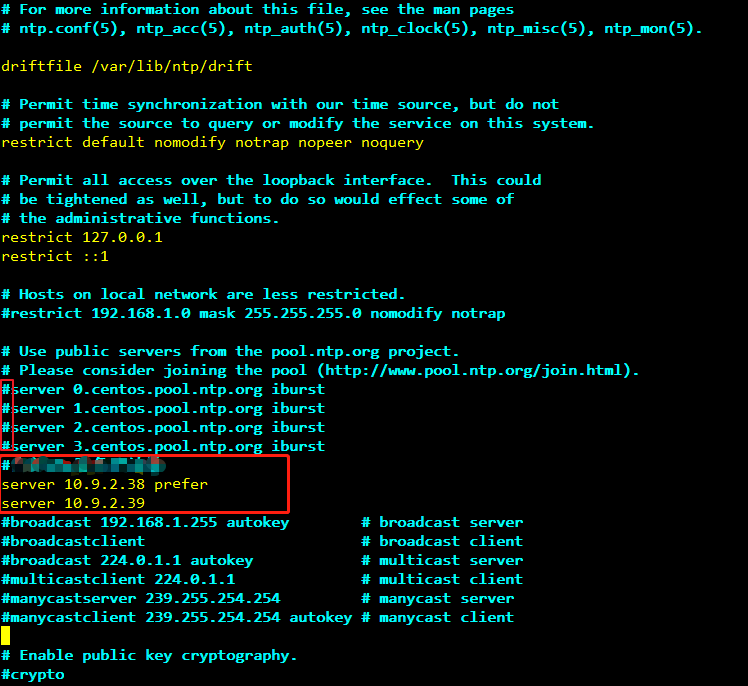

# 安装客户端（3.x之前版本）<a name="mrs_01_0091"></a>

## 操作场景<a name="section47062638171526"></a>

用户需要使用MRS客户端。MRS集群客户端可以安装在集群内的Master节点或者Core节点，也可以安装在集群外节点上。

MRS 3.x之前版本集群在集群创建后，在主Master节点默认安装有客户端，可以直接使用，安装目录为“/opt/client”。

MRS 3.x及之后版本客户端的安装请参考[安装客户端（3.x及之后版本）](安装客户端（3-x及之后版本）.md)。

> **说明：** 
>如果集群外的节点已安装客户端且只需要更新客户端，请使用安装客户端的用户例如“root“。

## 在集群外节点安装客户端前提条件<a name="section3219221104310"></a>

-   针对MRS 3.x之前版本的集群，需要先确认当前MRS集群节点的CPU架构。针对MRS 3.x之前版本的集群，该弹性云服务器的CPU架构请和MRS集群节点保持一致，MRS 3.x及之后版本MRS客户端兼容两种CPU架构。
-   已准备一个弹性云服务器，主机操作系统及版本请参见[表1](#table40818788104630)。

    **表 1**  参考列表

    <a name="table40818788104630"></a>
    <table><thead align="left"><tr id="row38578049104630"><th class="cellrowborder" valign="top" width="15%" id="mcps1.2.4.1.1"><p id="p147543306359"><a name="p147543306359"></a><a name="p147543306359"></a>CPU架构</p>
    </th>
    <th class="cellrowborder" valign="top" width="25%" id="mcps1.2.4.1.2"><p id="p37814246104630"><a name="p37814246104630"></a><a name="p37814246104630"></a>操作系统</p>
    </th>
    <th class="cellrowborder" valign="top" width="60%" id="mcps1.2.4.1.3"><p id="p43055100104630"><a name="p43055100104630"></a><a name="p43055100104630"></a>支持的版本号</p>
    </th>
    </tr>
    </thead>
    <tbody><tr id="row3952911204620"><td class="cellrowborder" valign="top" width="15%" headers="mcps1.2.4.1.1 "><p id="p067995812372"><a name="p067995812372"></a><a name="p067995812372"></a>x86计算</p>
    <p id="p8755103010357"><a name="p8755103010357"></a><a name="p8755103010357"></a></p>
    <p id="p8755330123511"><a name="p8755330123511"></a><a name="p8755330123511"></a></p>
    </td>
    <td class="cellrowborder" valign="top" width="25%" headers="mcps1.2.4.1.2 "><p id="p1341716202466"><a name="p1341716202466"></a><a name="p1341716202466"></a>Euler</p>
    </td>
    <td class="cellrowborder" valign="top" width="60%" headers="mcps1.2.4.1.3 "><a name="ul16570141110378"></a><a name="ul16570141110378"></a><ul id="ul16570141110378"><li>可用：Euler OS 2.2</li><li>可用：Euler OS 2.3</li><li>可用：Euler OS 2.5</li></ul>
    </td>
    </tr>
    <tr id="row176952056184517"><td class="cellrowborder" valign="top" width="15%" headers="mcps1.2.4.1.1 "><p id="p15246194518374"><a name="p15246194518374"></a><a name="p15246194518374"></a>鲲鹏计算(ARM)</p>
    </td>
    <td class="cellrowborder" valign="top" width="25%" headers="mcps1.2.4.1.2 "><p id="p126771821194219"><a name="p126771821194219"></a><a name="p126771821194219"></a>Euler</p>
    </td>
    <td class="cellrowborder" valign="top" width="60%" headers="mcps1.2.4.1.3 "><p id="p1329205172516"><a name="p1329205172516"></a><a name="p1329205172516"></a>可用：Euler OS 2.8</p>
    </td>
    </tr>
    </tbody>
    </table>

    例如，用户可以选择操作系统为**Euler**的弹性云服务器准备操作。

    同时为弹性云服务分配足够的磁盘空间，例如“40GB“。

-   弹性云服务器的VPC需要与MRS集群在同一个VPC中。
-   弹性云服务器的安全组需要和MRS集群Master节点的安全组相同。

    如果不同，请修改弹性云服务器安全组或配置弹性云服务器安全组的出入规则允许MRS集群所有安全组的访问。

-   需要允许用户使用密码方式登录Linux弹性云服务器（SSH方式），请参见[SSH密码方式登录](https://support.huaweicloud.com/usermanual-ecs/zh-cn_topic_0017955633.html)。

## 在Core节点安装客户端<a name="section9804155211019"></a>

1.  登录MRS Manager页面，选择“服务管理 \> 下载客户端”下载客户端安装包至主管理节点。

    > **说明：** 
    >如仅需更新客户端配置文件，请参考[更新客户端（3.x之前版本）](更新客户端（3-x之前版本）.md)页面的方法二操作。

2.  使用IP地址搜索主管理节点并使用VNC登录主管理节点。
3.  在主管理节点，执行以下命令切换用户。

    **sudo su - omm**

4.  在MRS管理控制台，查看指定集群“节点管理“页面的“IP“地址。

    记录需使用客户端的Core节点IP地址。

5.  在主管理节点，执行以下命令，将客户端安装包从主管理节点文件拷贝到当前Core节点：

    **scp -p /tmp/MRS-client/MRS\_Services\_Client.tar** _Core节点的IP地址_**:///opt/client**

6.  使用“root“登录Core节点。

    Master节点支持Cloud-Init特性，Cloud-init预配置的用户名“root“，密码为创建集群时设置的密码。

7.  执行以下命令，安装客户端：

    **cd /opt/client**

    **tar -xvf** **MRS\_Services\_Client.tar**

    **tar -xvf MRS**\_**Services\_ClientConfig.tar**

    **cd /opt/client/MRS\_Services\_ClientConfig**

    **./install.sh** _客户端安装目录_

    例如，执行命令：

    **./install.sh /opt/client**

8.  客户端的使用请参见[使用MRS客户端](#section8796733802)。

## 使用MRS客户端<a name="section8796733802"></a>

1.  在已安装客户端的节点，执行**sudo su - omm**命令切换用户。执行以下命令切换到客户端目录：

    **cd /opt/client**

2.  执行以下命令配置环境变量：

    **source bigdata\_env**

3.  如果当前集群已启用Kerberos认证，执行以下命令认证当前用户。如果当前集群未启用Kerberos认证，则无需执行此命令。

    **kinit** _MRS集群用户_

    例如，**kinit admin**。

    > **说明：** 
    >启用Kerberos认证的MRS集群默认创建“admin”用户帐号，用于集群管理员维护集群。

4.  直接执行组件的客户端命令。

    例如：使用HDFS客户端命令查看HDFS根目录文件，执行**hdfs dfs -ls /**。


## 在集群外节点上安装客户端<a name="section6090605618256"></a>

1.  根据前提条件，创建一个满足要求的弹性云服务器。
2.  <a name="li1148114223118"></a>登录MRS Manager页面，具体请参见[访问Manager](访问Manager-2.md)，然后选择“服务管理”。
3.  单击“下载客户端“。
4.  在“客户端类型“选择“完整客户端“。
5.  在“下载路径“选择“远端主机“。
6.  <a name="li24260068101924"></a>将“主机IP“设置为ECS的IP地址，设置“主机端口“为“22“，并将“存放路径“设置为“/tmp“。
    -   如果使用SSH登录ECS的默认端口“22“被修改，请将“主机端口“设置为新端口。
    -   “存放路径“最多可以包含256个字符。

7.  “登录用户“设置为“root“。

    如果使用其他用户，请确保该用户对保存目录拥有读取、写入和执行权限。

8.  在“登录方式“选择“密码“或“SSH私钥“。
    -   密码：输入创建集群时设置的root用户密码。
    -   SSH私钥：选择并上传创建集群时使用的密钥文件。

9.  单击“确定“开始生成客户端文件。

    若界面显示以下提示信息表示客户端包已经成功保存。单击“关闭“。客户端文件请到下载客户端时设置的远端主机的“存放路径“中获取。

    ```
    下载客户端文件到远端主机成功。
    ```

    若界面显示以下提示信息，请检查用户名密码及远端主机的安全组配置，确保用户名密码正确，及远端主机的安全组已增加SSH\(22\)端口的入方向规则。然后从[2](#li1148114223118)执行重新开始下载客户端。

    ```
    连接到服务器失败，请检查网络连接或参数设置。
    ```

    > **说明：** 
    >生成客户端会占用大量的磁盘IO，不建议在集群处于安装中、启动中、打补丁中等非稳态场景下载客户端。

10. 使用VNC方式，登录弹性云服务器。参见[远程登录（VNC方式）](https://support.huaweicloud.com/usermanual-ecs/ecs_03_0136.html)。

    所有镜像均支持Cloud-init特性。Cloud-init预配置的用户名“root”，密码为创建集群时设置的密码。首次登录建议修改。

11. 执行ntp时间同步，使集群外节点的时间与MRS集群时间同步。
    1.  检查安装NTP服务有没有安装，未安装请执行**yum install ntp -y**命令自行安装。
    2.  执行**vim /etc/ntp.conf**命令编辑NTP客户端配置文件，并增加MRS集群中Master节点的IP并注释掉其他**server**的地址。

        ```
        server master1_ip prefer
        server master2_ip 
        ```

        **图 1**  增加Master节点的IP<a name="fig74146519424"></a>  
        

    3.  执行**service ntpd stop**命令关闭NTP服务。
    4.  执行**/usr/sbin/ntpdate  _主Master节点的IP_**命令手动同步一次时间。
    5.  执行**service ntpd start**或**systemctl restart ntpd**命令启动NTP服务。
    6.  执行**ntpstat**命令查看时间同步结果。

12. 在弹性云服务器，切换到**root**用户，并将[6](#li24260068101924)中“存放路径“中的安装包复制到目录“/opt“，例如“存放路径“设置为“/tmp“时命令如下。

    **sudo su - root**

    **cp /tmp/MRS\_Services\_Client.tar /opt**

13. 在“/opt“目录执行以下命令，解压压缩包获取校验文件与客户端配置包。

    **tar -xvf MRS\_Services\_Client.tar**

14. 执行以下命令，校验文件包。

    **sha256sum -c MRS\_Services\_ClientConfig.tar.sha256**

    界面显示如下：

    ```
    MRS_Services_ClientConfig.tar: OK
    ```

15. 执行以下命令，解压“MRS\_Services\_ClientConfig.tar“。

    **tar -xvf MRS\_Services\_ClientConfig.tar**

16. 执行以下命令，安装客户端到新的目录，例如“/opt/Bigdata/client“。安装时自动生成目录。

    **sh /opt/MRS\_Services\_ClientConfig/install.sh /opt/Bigdata/client**

    查看安装输出信息，如有以下结果表示客户端安装成功：

    ```
    Components client installation is complete.
    ```

17. 验证弹性云服务器节点是否与集群Master节点的IP是否连通？

    例如，执行以下命令：**ping** _Master节点IP地址_

    -   是，执行[18](#li6406429718107)。
    -   否，检查VPC、安全组是否正确，是否与MRS集群在相同VPC和安全组，然后执行[18](#li6406429718107)。

18. <a name="li6406429718107"></a>执行以下命令配置环境变量：

    **source /opt/Bigdata/client/bigdata\_env**

19. 如果当前集群已启用Kerberos认证，执行以下命令认证当前用户。如果当前集群未启用Kerberos认证，则无需执行此命令。

    **kinit_MRS集群用户_**

    例如,  **kinit admin**

20. 执行组件的客户端命令。

    例如，执行以下命令查看HDFS目录：

    **hdfs dfs -ls /**


