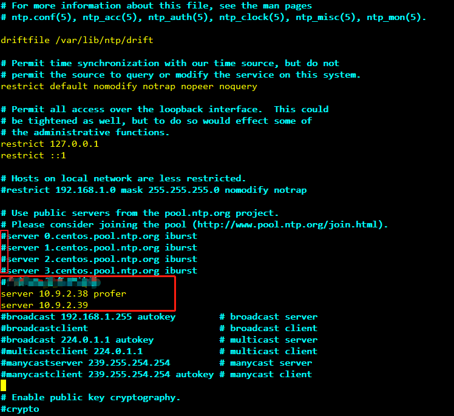

# 安装客户端（3.x及之后版本）<a name="mrs_01_0090"></a>

## 操作场景<a name="section65278330165558"></a>

该操作指导安装工程师安装MRS集群所有服务（不包含Flume）的客户端。Flume客户端安装请参见[安装Flume客户端](https://support.huaweicloud.com/cmpntguide-mrs/mrs_01_0392.html)。

客户端可以安装集群内节点，也可以安装在集群外节点，本章节以安装目录“/opt/hadoopclient”为例进行介绍，请以实际集群版本为准。

## 在集群外节点安装客户端前提条件<a name="zh-cn_topic_0270713152_mrs_01_0091_section3219221104310"></a>

-   已准备一个Linux弹性云服务器，主机操作系统及版本建议参见[表1](#zh-cn_topic_0270713152_mrs_01_0091_table40818788104630)。

    **表 1**  参考列表

    <a name="zh-cn_topic_0270713152_mrs_01_0091_table40818788104630"></a>
    <table><thead align="left"><tr id="zh-cn_topic_0270713152_mrs_01_0091_row38578049104630"><th class="cellrowborder" valign="top" width="15%" id="mcps1.2.4.1.1"><p id="zh-cn_topic_0270713152_mrs_01_0091_p147543306359"><a name="zh-cn_topic_0270713152_mrs_01_0091_p147543306359"></a><a name="zh-cn_topic_0270713152_mrs_01_0091_p147543306359"></a>CPU架构</p>
    </th>
    <th class="cellrowborder" valign="top" width="25%" id="mcps1.2.4.1.2"><p id="zh-cn_topic_0270713152_mrs_01_0091_p37814246104630"><a name="zh-cn_topic_0270713152_mrs_01_0091_p37814246104630"></a><a name="zh-cn_topic_0270713152_mrs_01_0091_p37814246104630"></a>操作系统</p>
    </th>
    <th class="cellrowborder" valign="top" width="60%" id="mcps1.2.4.1.3"><p id="zh-cn_topic_0270713152_mrs_01_0091_p43055100104630"><a name="zh-cn_topic_0270713152_mrs_01_0091_p43055100104630"></a><a name="zh-cn_topic_0270713152_mrs_01_0091_p43055100104630"></a>支持的版本号</p>
    </th>
    </tr>
    </thead>
    <tbody><tr id="zh-cn_topic_0270713152_mrs_01_0091_row3952911204620"><td class="cellrowborder" rowspan="4" valign="top" width="15%" headers="mcps1.2.4.1.1 "><p id="zh-cn_topic_0270713152_mrs_01_0091_p067995812372"><a name="zh-cn_topic_0270713152_mrs_01_0091_p067995812372"></a><a name="zh-cn_topic_0270713152_mrs_01_0091_p067995812372"></a>x86计算</p>
    </td>
    <td class="cellrowborder" valign="top" width="25%" headers="mcps1.2.4.1.2 "><p id="zh-cn_topic_0270713152_mrs_01_0091_p1341716202466"><a name="zh-cn_topic_0270713152_mrs_01_0091_p1341716202466"></a><a name="zh-cn_topic_0270713152_mrs_01_0091_p1341716202466"></a>Euler</p>
    </td>
    <td class="cellrowborder" valign="top" width="60%" headers="mcps1.2.4.1.3 "><p id="p782123814365"><a name="p782123814365"></a><a name="p782123814365"></a>Euler OS 2.5</p>
    </td>
    </tr>
    <tr id="zh-cn_topic_0270713152_mrs_01_0091_row64911082104630"><td class="cellrowborder" valign="top" headers="mcps1.2.4.1.1 "><p id="zh-cn_topic_0270713152_mrs_01_0091_p23306329104630"><a name="zh-cn_topic_0270713152_mrs_01_0091_p23306329104630"></a><a name="zh-cn_topic_0270713152_mrs_01_0091_p23306329104630"></a>SuSE</p>
    </td>
    <td class="cellrowborder" valign="top" headers="mcps1.2.4.1.2 "><p id="p16974173323612"><a name="p16974173323612"></a><a name="p16974173323612"></a>SUSE Linux Enterprise Server 12 SP4（SUSE 12.4）</p>
    </td>
    </tr>
    <tr id="zh-cn_topic_0270713152_mrs_01_0091_row60240262104630"><td class="cellrowborder" valign="top" headers="mcps1.2.4.1.1 "><p id="zh-cn_topic_0270713152_mrs_01_0091_p47623054104630"><a name="zh-cn_topic_0270713152_mrs_01_0091_p47623054104630"></a><a name="zh-cn_topic_0270713152_mrs_01_0091_p47623054104630"></a>RedHat</p>
    </td>
    <td class="cellrowborder" valign="top" headers="mcps1.2.4.1.2 "><p id="p970920248360"><a name="p970920248360"></a><a name="p970920248360"></a>RedHat-7.5-x86_64（RedHat 7.5）</p>
    </td>
    </tr>
    <tr id="zh-cn_topic_0270713152_mrs_01_0091_row30103971104630"><td class="cellrowborder" valign="top" headers="mcps1.2.4.1.1 "><p id="zh-cn_topic_0270713152_mrs_01_0091_p22502558104630"><a name="zh-cn_topic_0270713152_mrs_01_0091_p22502558104630"></a><a name="zh-cn_topic_0270713152_mrs_01_0091_p22502558104630"></a>CentOS</p>
    </td>
    <td class="cellrowborder" valign="top" headers="mcps1.2.4.1.2 "><p id="p12811549123617"><a name="p12811549123617"></a><a name="p12811549123617"></a>CentOS-7.6版本（CentOS 7.6）</p>
    </td>
    </tr>
    <tr id="zh-cn_topic_0270713152_mrs_01_0091_row176952056184517"><td class="cellrowborder" rowspan="2" valign="top" width="15%" headers="mcps1.2.4.1.1 "><p id="zh-cn_topic_0270713152_mrs_01_0091_p15246194518374"><a name="zh-cn_topic_0270713152_mrs_01_0091_p15246194518374"></a><a name="zh-cn_topic_0270713152_mrs_01_0091_p15246194518374"></a>鲲鹏计算(ARM)</p>
    </td>
    <td class="cellrowborder" valign="top" width="25%" headers="mcps1.2.4.1.2 "><p id="zh-cn_topic_0270713152_mrs_01_0091_p126771821194219"><a name="zh-cn_topic_0270713152_mrs_01_0091_p126771821194219"></a><a name="zh-cn_topic_0270713152_mrs_01_0091_p126771821194219"></a>Euler</p>
    </td>
    <td class="cellrowborder" valign="top" width="60%" headers="mcps1.2.4.1.3 "><p id="zh-cn_topic_0270713152_mrs_01_0091_p1329205172516"><a name="zh-cn_topic_0270713152_mrs_01_0091_p1329205172516"></a><a name="zh-cn_topic_0270713152_mrs_01_0091_p1329205172516"></a>Euler OS 2.8</p>
    </td>
    </tr>
    <tr id="zh-cn_topic_0270713152_mrs_01_0091_row7244555103511"><td class="cellrowborder" valign="top" headers="mcps1.2.4.1.1 "><p id="zh-cn_topic_0270713152_mrs_01_0091_p11246555203516"><a name="zh-cn_topic_0270713152_mrs_01_0091_p11246555203516"></a><a name="zh-cn_topic_0270713152_mrs_01_0091_p11246555203516"></a>CentOS</p>
    </td>
    <td class="cellrowborder" valign="top" headers="mcps1.2.4.1.2 "><p id="zh-cn_topic_0270713152_mrs_01_0091_p776320021018"><a name="zh-cn_topic_0270713152_mrs_01_0091_p776320021018"></a><a name="zh-cn_topic_0270713152_mrs_01_0091_p776320021018"></a>CentOS-7.6版本（CentOS 7.6）</p>
    </td>
    </tr>
    </tbody>
    </table>

    同时为弹性云服务分配足够的磁盘空间，例如“40GB“。

-   弹性云服务器的VPC需要与MRS集群在同一个VPC中。
-   弹性云服务器的安全组需要和MRS集群Master节点的安全组相同。
-   弹性云服务器操作系统已安装NTP服务，且NTP服务运行正常。

    若未安装，在配置了**yum**源的情况下，可执行**yum install ntp -y**命令自行安装。

-   需要允许用户使用密码方式登录Linux弹性云服务器（SSH方式）。

## 集群内节点安装客户端<a name="section181806577218"></a>

1.  获取软件包。

    [访问FusionInsight Manager（MRS 3.x及之后版本）](访问FusionInsight-Manager（MRS-3-x及之后版本）.md)，在“集群”下拉列表中单击需要操作的集群名称。

    选择“更多 \> 下载客户端“，弹出“下载集群客户端”信息提示框。

    **图 1**  下载客户端<a name="zh-cn_topic_0193213980_fig10575324119"></a>  
    

    > **说明：** 
    >在只安装单个服务的客户端的场景中，选择“集群 \> 服务 \>  _服务名称_  \> 更多 \> 下载客户端”，弹出“下载客户端”信息提示框。

2.  “选择客户端类型”中选择“完整客户端”。

    “仅配置文件”下载的客户端配置文件，适用于应用开发任务中，完整客户端已下载并安装后，管理员通过Manager界面修改了服务端配置，开发人员需要更新客户端配置文件的场景。

    平台类型包括x86\_64和aarch64两种：

    -   x86\_64：可以部署在X86平台的客户端软件包。
    -   aarch64：可以部署在TaiShan服务器的客户端软件包。

    > **说明：** 
    >集群支持下载x86\_64和aarch64两种类型客户端，但是客户端类型必须待安装节点的架构匹配，否则客户端会安装失败。

3.  是否在集群的节点中生成客户端文件？
    -   是，勾选“仅保存到如下路径”，单击“确定”开始生成客户端文件，文件生成后默认保存在主管理节点“/tmp/FusionInsight-Client”。支持自定义其他目录且**omm**用户拥有目录的读、写与执行权限。单击“确定”，等待下载完成后，使用**omm**用户或**root**用户将获取的软件包复制到将要安装客户端的服务器文件目录，例如“/opt/Bigdata/client”。然后执行[5](#li1742384219595)。

        > **说明：** 
        >当用户无法获取**root**用户权限，需要用**omm**用户操作。

    -   否，单击“确定”指定本地的保存位置，开始下载完整客户端，等待下载完成，执行[4](#li18423342195918)。

4.  <a name="li18423342195918"></a>上传软件包。

    使用WinSCP工具，以准备安装客户端的用户（如“user\_client”），将获取的软件包上传到将要安装客户端的服务器文件目录，例如“/opt/Bigdata/client”。

    客户端软件包名称格式为：“FusionInsight\_Cluster\__<集群ID\>_\_Services\_Client.tar”。

    后续步骤及章节以FusionInsight\_Cluster\_1\_Services\_Client.tar进行举例。

5.  <a name="li1742384219595"></a>以**user\_client**用户登录将要安装客户端的服务器。
6.  解压软件包。

    进入安装包所在目录，例如“/opt/Bigdata/client”。执行如下命令解压安装包到本地目录。

    **tar -xvf** **FusionInsight\_Cluster\_1\_Services\_Client.tar**

7.  校验软件包。

    执行**sha256sum**命令校验解压得到的文件，检查回显信息与sha256文件里面的内容是否一致，例如：

    **sha256sum -c** **FusionInsight\_Cluster\_1\_Services\_ClientConfig.tar.sha256**

    ```
    FusionInsight_Cluster_1_Services_Client.tar: OK     
    ```

8.  解压获取的安装文件。

    **tar -xvf** **FusionInsight\_Cluster\_1\_Services\_ClientConfig.tar**

9.  进入安装包所在目录，执行如下命令安装客户端到指定目录（绝对路径），例如安装到“/opt/hadoopclient”目录。

    **cd /opt/Bigdata/client/FusionInsight\_Cluster\_1\_Services\_ClientConfig**

    执行**./install.sh /opt/hadoopclient**命令，等待客户端安装完成（以下只显示部分屏显结果）。

    ```
    The component client is installed successfully
    ```

    > **说明：** 
    >-   如果已经安装的全部服务或某个服务的客户端使用了“/opt/hadoopclient”目录，再安装其他服务的客户端时，需要使用不同的目录。
    >-   卸载客户端请删除客户端安装目录。
    >-   如果要求安装后的客户端仅能被该安装用户（如“user\_client”）使用，请在安装时加“-o”参数，即执行**./install.sh /opt/hadoopclient -o**命令安装客户端。
    >-   由于HBase使用的Ruby语法限制，如果安装的客户端中包含了HBase客户端，建议客户端安装目录路径只包含大写字母、小写字母、数字以及\_-?.@+=字符。


## 使用客户端<a name="section8796733802"></a>

1.  在已安装客户端的节点，执行**sudo su - omm**命令切换用户。执行以下命令切换到客户端目录：

    **cd /opt/hadoopclient**

2.  执行以下命令配置环境变量：

    **source bigdata\_env**

3.  如果当前集群已启用Kerberos认证，执行以下命令认证当前用户。如果当前集群未启用Kerberos认证，则无需执行此命令。

    **kinit**_MRS集群用户_

    例如，**kinit admin**。

    > **说明：** 
    >启用Kerberos认证的MRS集群默认创建“admin”用户帐号，用于集群管理员维护集群。

4.  直接执行组件的客户端命令。

    例如：使用HDFS客户端命令查看HDFS根目录文件，执行**hdfs dfs -ls /**。


## 集群外节点安装客户端<a name="section49281012266"></a>

1.  根据前提条件，创建一个满足要求的弹性云服务器。
2.  执行ntp时间同步，使集群外节点的时间与MRS集群时间同步。
    1.  执行**vi /etc/ntp.conf**命令编辑NTP客户端配置文件，并增加MRS集群中Master节点的IP并注释掉其他**server**的地址。

        ```
        server master1_ip profer
        server master2_ip 
        ```

        **图 2**  增加Master节点的IP<a name="zh-cn_topic_0270713152_mrs_01_0091_fig74146519424"></a>  
        

    2.  执行**service ntpd stop**命令关闭NTP服务。
    3.  执行**/usr/sbin/ntpdate **_主Master节点的IP地址_命令手动同步一次时间。
    4.  执行**service ntpd start**或**systemctl restart ntpd**命令启动NTP服务。
    5.  执行**ntpstat**命令查看时间同步结果。

3.  参考以下步骤，从FusionInsight Manager下载集群客户端软件包并复制到ECS节点后安装客户端。
    1.  [访问FusionInsight Manager（MRS 3.x及之后版本）](访问FusionInsight-Manager（MRS-3-x及之后版本）.md)，参考[集群内节点安装客户端](#section181806577218)下载集群客户端到主管理节点的指定目录。
    2.  使用**root**用户登录主管理节点。

        **sudo su - omm**

    3.  执行以下命令复制客户端到待安装客户端的节点：

        **scp -p /tmp/FusionInsight-Client/FusionInsight\_Cluster\_1\_Services\_Client.tar** _待安装客户端节点的IP地址_**:/tmp**

    4.  使用待安装客户端的用户登录待安装客户端节点。

        执行以下命令安装客户端，如果无文件操作权限需使用**root**用户修改文件权限：

        **cd /tmp**

        **tar -xvf FusionInsight\_Cluster\_1\_Services\_Client.tar**

        **tar -xvf FusionInsight\_Cluster\_1\_Services\_ClientConfig.tar**

        **cd /tmp/FusionInsight\_Cluster\_1\_Services\_ClientConfig**

        **./install.sh /opt/mrsclient**

    5.  执行以下命令，切换到客户端目录并配置环境变量：

        **cd /opt/mrsclient**

        **source bigdata\_env**

    6.  如果当前集群已启用Kerberos认证，执行以下命令认证当前用户。如果当前集群未启用Kerberos认证，则无需执行此命令。

        **kinit** _MRS集群用户_

        例如，**kinit admin**。

    7.  直接执行组件的客户端命令。

        例如使用HDFS客户端命令查看HDFS根目录文件，执行**hdfs dfs -ls /**。


