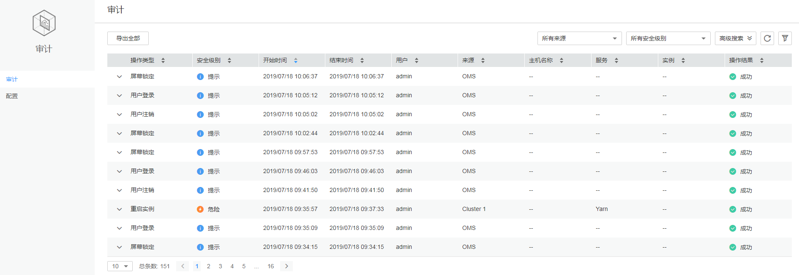

# 审计管理页面概述

登录FusionInsight Manager，单击“审计“，界面展示如[图1](#zh-cn_topic_0263899482_fig143491215103920)所示FusionInsight Manager审计信息，包括操作类型、安全级别、开始时间、结束时间、用户、主机名称、服务、实例、操作结果等。

**图 1**  审计信息列表  

-   用户可以在“所有安全级别”中选择高危、危险、一般和提示级别的审计日志。
-   在高级搜索中，用户可设置过滤条件来查询审计日志。
    1.  在“操作类型“中，用户可根据用户管理、集群、服务、健康检查等来指定操作类型查询对应的审计日志。
    2.  在“服务“中，用户可选择相应的服务来查询审计日志。

        > **说明：** 
        >在服务中选择“--”，表示除服务以外其他类型的审计日志。

    3.  在“操作结果“中，用户可选择成功、失败和未知来查询审计日志。

-   单击手动刷新当前页面，也可在修改审计表格显示的列。
-   单击“导出全部”，可一次性导出所有审计信息，可导出“TXT“或者“CSV“格式。
-   审计管理包含的审计内容信息，请参考[审计日志](关于日志-110.md#zh-cn_topic_0263899623_s481f1c14aca34ee788baed345970a5c0)。

