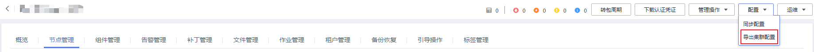

# 导出集群的配置数据

## 操作场景

为了满足实际业务的需求，用户可以在MRS中将集群所有配置数据导出，导出文件用于快速更新服务配置。

> **说明：** 
>**MRS 3.x**版本暂不支持在管理控制台执行本章节操作。

## 前提条件

已完成IAM用户同步（在集群详情页的“概览”页签，单击“IAM用户同步“右侧的“同步”进行IAM用户同步）。

**图 1**  IAM用户同步  

## 操作步骤

在集群详情页，单击页面右上角“配置 \> 导出集群配置”。

**图 2**  导出集群配置（以MRS 1.9.2版本为例）  

导出文件用于更新服务配置，请参见[配置服务参数](配置服务参数.md)中**导入服务配置参数**。

