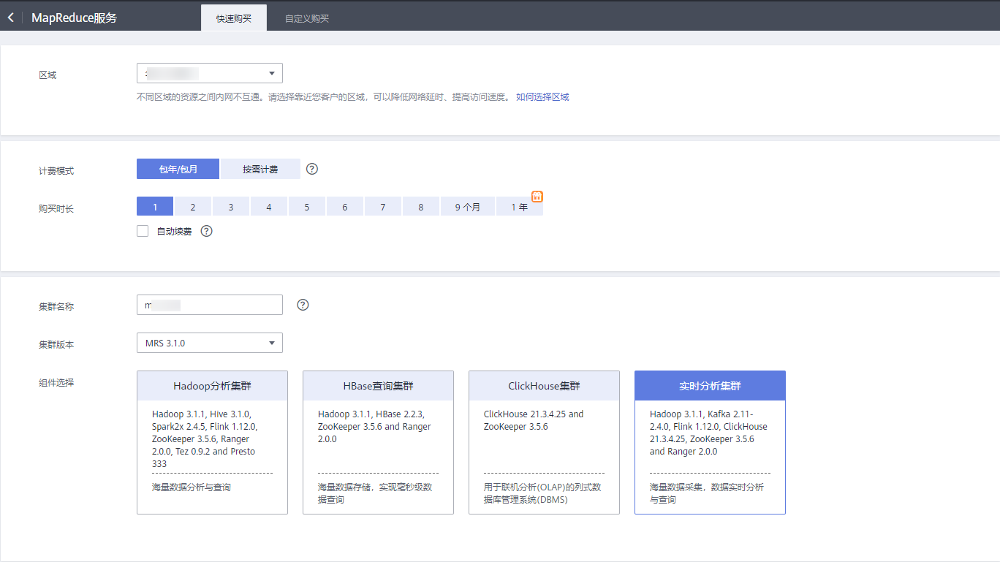
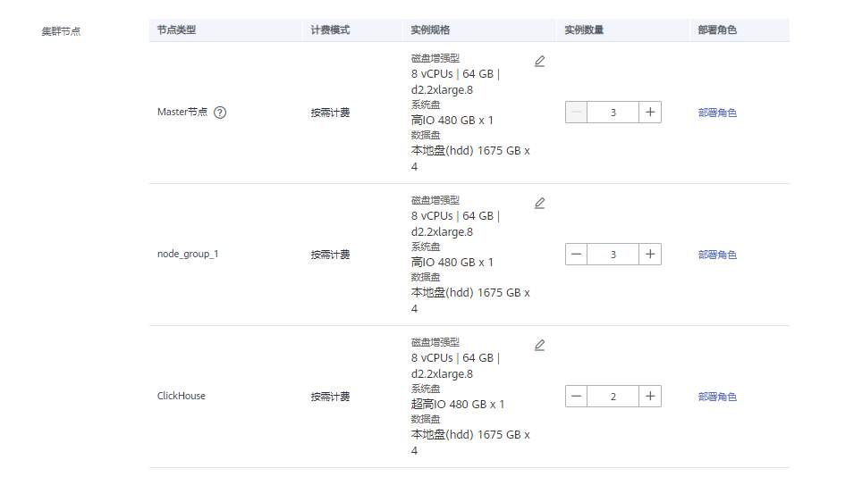

# 快速购买实时分析集群

本章节为您介绍如何快速购买一个实时分析集群，实时分析集群使用Hadoop、Kafka、Flink和ClickHouse组件提供一个海量的数据采集、数据的实时分析和查询的系统。

集群包含的组件信息实时分析：

-   MRS 3.1.0版本：Hadoop 3.1.1、Kafka 2.11-2.4.0、Flink 1.12.0、ClickHouse 21.3.4.25、ZooKeeper 3.5.6、Ranger 2.0.0。

## 快速购买实时分析集群

1.  登录MRS管理控制台。
2.  单击“购买集群“，进入“购买集群“页面。
3.  在购买集群页面，选择“快速购买”页签。
4.  参考下列参数说明配置集群基本信息，参数详细信息请参考[自定义购买集群](自定义购买集群.md)。

    -   区域：默认即可。
    -   计费模式：选择“按需计费”。
    -   集群名称：可以设置为系统默认名称，但为了区分和记忆，建议带上项目拼音缩写或者日期等。例如：“mrs\_20201130”。
    -   集群版本：默认选择最新版本即可（不同版本集群提供的组件有所不同，请根据需要选择集群版本）。
    -   组件选择：选择“实时分析集群”。
    -   可用区：默认即可。
    -   虚拟私有云：默认即可。如果没有虚拟私有云，请单击“查看虚拟私有云”进入虚拟私有云，创建一个新的虚拟私有云。
    -   子网：默认即可。
    -   企业项目：默认即可。
    -   CPU架构：默认即可。MRS 3.x版本无该参数。
    -   集群节点：请根据自身需要选择集群节点规格数量等。
    -   Kerberos认证：选择是否开启Kerberos认证。
    -   用户名：默认为“root/admin”，root用于远程登录ECS机器，admin用于登录集群管理页面。
    -   密码：设置root用户和admin用户密码。
    -   确认密码：再次输入设置的root用户和admin用户密码。

    **图 1**  实时分析集群  
    

    **图 2**  集群节点配置  
    

5.  勾选“确认授权”开通通信安全授权，通信安全授权详情请参考[授权安全通信](授权安全通信.md)。
6.  单击“立即购买”。

    当集群开启Kerberos认证时，需要确认是否需要开启Kerberos认证，若确认开启请单击“继续”，若无需开启Kerberos认证请单击“返回”关闭Kerberos认证后再创建集群。

    > **说明：** 
    >如果您对价格有疑问，可以单击页面左下角“了解计费详情”，根据计费详情来了解产品价格。

7.  单击“返回集群列表”，可以查看到集群创建的状态。单击“访问集群”，可以查看集群详情。

    集群创建的状态过程请参见[表1](集群列表简介.md#table3950169215120)中的“状态”参数说明。

    集群创建需要时间，所创集群的初始状态为“启动中”，创建成功后状态更新为“运行中”，请您耐心等待。

    MRS系统界面支持同一时间并发创建10个集群，且最多支持管理100个集群。

