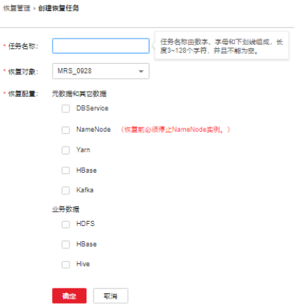

# 恢复OMS数据<a name="admin_guide_000216"></a>

## 操作场景<a name="safc2b00533004c3788bff296c58f1e8d"></a>

在用户意外修改、删除或需要找回数据时，系统管理员对FusionInsight Manager系统进行重大数据调整等操作后，系统数据出现异常或未达到预期结果，模块全部故障无法使用，需要对Manager进行恢复数据操作。

管理员可以通过FusionInsight Manager创建恢复Manager任务。只支持创建任务手动恢复数据。

> **须知：** 
>-   只支持进行数据备份时的系统版本与当前系统版本一致时的数据恢复。
>-   当业务正常时需要恢复数据，建议手动备份最新管理数据后，再执行恢复数据操作。否则会丢失从备份时刻到恢复时刻之间的Manager数据。

## 对系统的影响<a name="s1fd7ea57302248acb667b3bcff0914a7"></a>

-   恢复过程中需要重启Controller，重启时FusionInsight Manager无法登录和操作。
-   恢复过程中需要重启所有集群，集群重启时无法访问。
-   Manager数据恢复后，会丢失从备份时刻到恢复时刻之间的数据，例如系统设置、用户信息、告警信息或审计信息。可能导致无法查询到数据，或者某个用户无法访问集群。
-   Manager数据恢复后，系统将强制各集群的LdapServer从OLadp同步一次数据。

## 前提条件<a name="s67a2038be72b4ce386d42778b477898b"></a>

-   如果需要从远端HDFS恢复数据，需要准备备集群。如果主集群部署为安全模式，且主备集群不是由同一个FusionInsight Manager管理，则必须配置系统互信，请参见[配置跨Manager集群互信](配置跨Manager集群互信.md)。如果主集群部署为普通模式，则不需要配置互信。

-   主备集群必须已配置跨集群拷贝，请参见[启用集群间拷贝功能](启用集群间拷贝功能.md)。
-   主备集群上的时间必须一致，而且主备集群上的NTP服务必须使用同一个时间源。

-   检查OMS资源状态是否正常，检查各集群的LdapServer实例状态是否正常。如果不正常，不能执行恢复操作。
-   检查集群主机和服务的状态是否正常。如果不正常，不能执行恢复操作。
-   检查恢复数据时集群主机拓扑结构与备份数据时是否相同。如果不相同，不能执行恢复操作，必须重新备份。
-   检查恢复数据时集群中已添加的服务与备份数据时是否相同。如果不相同，不能执行恢复操作，必须重新备份。
-   停止依赖集群运行的上层业务应用。

## 操作步骤<a name="scfa2f31cdcb44a10b86dd991eef78b36"></a>

1.  在FusionInsight Manager，选择“运维  \>  备份恢复  \>  备份管理“  。
2.  在任务列表指定任务的“操作”列，选择“更多 \> 查询历史“，打开备份任务执行历史记录。

    在弹出的窗口中，在指定一次执行成功记录的“备份路径”列，单击“查看”，打开此次任务执行的备份路径信息，查找以下信息：

    -   “备份对象”表示备份的数据源。
    -   “备份路径”表示备份文件保存的完整路径。

        选择正确的项目，在“备份路径”手工选中备份文件的完整路径并复制。

3.  选择“运维  \>  备份恢复  \>  恢复管理  \>  创建 “。

    **图 1**  创建恢复任务<a name="fig1419910472356"></a>  
    

4.  在“任务名称”填写恢复任务的名称。
5.  在“恢复对象”选择“OMS”。
6.  勾选“OMS”。
7.  在“OMS”的“路径类型”，选择一个备份目录的类型。

    选择不同的备份目录时，对应设置如下：

    -   “LocalDir”：表示备份文件保存在主管理节点的本地磁盘上。

        选择此参数值，还需要配置“源端路径”，表示要恢复的备份文件。例如，“_版本号\___数据源\___任务执行时间.tar.gz_”。

    -   “LocalHDFS”：表示备份文件保存在当前集群的HDFS目录。

        选择此参数值，还需要配置以下参数：

        -   “源端路径”：表示备份文件在HDFS中保存的完整路径。例如“_备份路径__/__备份任务名\___任务创建时间/__版本号\___数据源\___任务执行时间.tar.gz_”。
        -   “恢复时使用集群”：表示选择恢复任务执行时使用集群的名称。
        -   “源NameService名称”：选择恢复任务执行时备份目录对应的NameService名称。默认值为“hacluster”。

    -   “RemoteHDFS”：表示备份文件保存在备集群的HDFS目录。

        选择此参数值，还需要配置以下参数：

        -   “源端NameService名称”：填写备份数据集群的NameService名称。可以输入集群内置的远端集群的NameService名称：haclusterX，haclusterX1，haclusterX2，haclusterX3，haclusterX4；也可输入其他已配置的远端集群NameService名称。
        -   “IP 模式”：目标IP的IP地址模式。系统会根据集群网络类型自动选择对应的IP模式，如IPv4或者IPv6。
        -   “源端NameNode IP地址”：填写备集群NameNode业务平面IP地址，支持主节点或备节点。
        -   “源端路径”：填写备集群保存备份数据的完整HDFS路径。例如，“_备份路径__/__备份任务名\___数据源\___任务创建时间/__版本号\___数据源\___任务执行时间.tar.gz_”。
        -   “源集群”：选择恢复数据使用的Yarn队列所在的集群。
        -   “队列名称”：填写备份任务执行时使用的Yarn队列的名称。需和集群中已存在且状态正常的队列名称相同。

    -   “NFS”：表示将备份文件通过NFS协议保存在NAS中。选择此参数值，还需要配置以下参数：
        -   “IP 模式”：目标IP的IP地址模式。系统会根据集群网络类型自动选择对应的IP模式，如IPv4或者IPv6。
        -   “服务器IP地址”：填写NAS服务器IP地址。
        -   “源端路径”：填写备份文件在NAS服务器中保存的完整路径。例如，“_备份路径__/__备份任务名\___数据源\___任务创建时间/__版本号\___数据源\___任务执行时间.tar.gz_”。

    -   “CIFS”：表示将备份文件通过CIFS协议保存在NAS中。选择此参数值，还需要配置以下参数：
        -   “IP 模式”：目标IP的IP地址模式。系统会根据集群网络类型自动选择对应的IP模式，如IPv4或者IPv6。
        -   “服务器IP地址”：填写NAS服务器IP地址。
        -   “端口号”：填写CIFS协议连接NAS服务器使用的端口号，默认值为“445”。
        -   “用户名”：填写配置CIFS协议时设置的用户名。
        -   “密码”：填写配置CIFS协议时设置的密码。
        -   “源端路径”：填写备份文件在NAS服务器中保存的完整路径。例如，“_备份路径__/__备份任务名\___数据源\___任务创建时间/__版本号\___数据源\___任务执行时间.tar.gz_”。

    -   “SFTP”：表示备份文件通过SFTP协议保存到服务器中。

        选择此参数值，还需要配置以下参数：

        -   “IP 模式”：目标IP的IP地址模式。系统会根据集群网络类型自动选择对应的IP模式，如IPv4或者IPv6。

        -   “服务器IP地址”：填写备份数据的服务器IP地址。
        -   “端口号”：填写SFTP协议连接备份服务器使用的端口号，默认值为“22”。
        -   “用户名”：填写使用SFTP协议连接服务器时的用户名。
        -   “密码”：填写使用SFTP协议连接服务器时的密码。
        -   “源端路径”：填写备份文件在备份服务器中保存的完整路径。例如，“_备份路径__/__备份任务名\___数据源\___任务创建时间/__版本号\___数据源\___任务执行时间.tar.gz_”。

    -   “OBS”：表示将备份文件保存在OBS中。

        选择此参数值，还需要配置以下参数：

        -   “源端路径”：填写备份文件在OBS中保存的完整路径。例如，“_备份路径__/__备份任务名\___数据源\___任务创建时间/__版本号\___数据源\___任务执行时间.tar.gz_”。

            > **说明：** 
            >MRS 3.1.0及之后版本才支持将备份文件保存到OBS。


8.  单击“确定”保存。
9.  在恢复任务列表已创建任务的“操作”列，单击“执行”，开始执行恢复任务。
    -   恢复成功后进度显示为绿色。
    -   恢复成功后此恢复任务不支持再次执行。
    -   如果恢复任务在第一次执行时由于某些原因未执行成功，在排除错误原因后单击“重试”，重试恢复任务。

10. 以**omm**用户分别登录主、备管理节点。
11. 执行以下命令，重新启动OMS。

    **sh $\{BIGDATA\_HOME\}/om-server/om/sbin/restart-oms.sh**

    提示以下信息表示命令执行成功：

    ```
    start HA successfully.
    ```

    执行**sh $\{BIGDATA\_HOME\}/om-server/om/sbin/status-oms.sh**，查看管理节点的“HAAllResOK”是否为“Normal”，并可以重新登录FusionInsight Manager表示重启OMS成功。

12. 在FusionInsight Manager，选择“集群  \>  _待操作的集群名称_  \> 服务 \> KrbServer  \>  更多  \>  同步配置“，单击“确定”，等待KrbServer服务配置同步过程完成。
13. 选择“集群 \>  _待操作集群的名称_  \> 更多 \> 同步配置”，单击“确定”，等待集群配置同步成功。
14. 选择“集群  \>  _待操作集群的名称_  \> 更多  \>  重启“，输入当前登录的用户密码确认身份，单击“确定”，等待集群重启成功。

