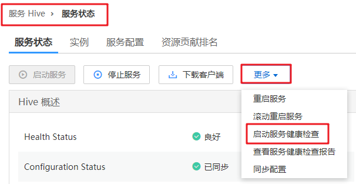

# 执行健康检查

## 操作场景

该任务指导用户在日常运维中完成集群进行健康检查的工作，以保证集群各项参数、配置以及监控没有异常、能够长时间稳定运行。

> **说明：** 
>系统健康检查的范围包含Manager、服务级别和主机级别的健康检查：
>-   Manager关注集群统一管理平台是否提供管理功能。
>-   服务级别关注组件是否能够提供正常的服务。
>-   主机级别关注主机的一系列指标是否正常。
>系统健康检查可以包含三方面检查项：各检查对象的“健康状态”、相关的告警和自定义的监控指标，检查结果并不能等同于界面上显示的“健康状态”。

## 操作步骤

-   手动执行所有服务的健康检查

    1.  单击“服务管理”并选择对应服务。
    2.  选择“更多 \> 启动服务健康检查”，启动服务健康检查。

        **图 1**  启动服务健康检查  
        

    > **说明：** 
    >-   集群健康检查包含了Manager、服务与主机状态的检查。
    >-   在MRS Manager界面，选择“系统设置 \> 健康检查 \> 集群健康检查”，也可以执行集群健康检查。
    >-   手动执行健康检查的结果可直接在检查列表左上角单击“导出报告”，选择导出结果。

-   手动执行单个服务的健康检查
    1.  选择“服务管理”，在服务列表中单击服务指定名称。
    2.  选择“更多 \> 启动服务健康检查”启动指定服务健康检查。

-   手动执行主机健康检查
    1.  单击“主机管理”。
    2.  勾选待检查主机前的复选框。
    3.  选择“更多 \> 启动主机健康检查”启动指定主机健康检查。

-   自动执行健康检查
    1.  单击“系统设置”。
    2.  单击“维护”下方的“健康检查”。
    3.  单击“健康检查配置”，配置自动执行健康检查。

        “定期健康检查”配置是否启用自动执行健康检查。“定期健康检查“的开关默认为关闭，单击可启用该功能，根据管理需要选择“每天”、“每周”或“每月”。

    4.  单击“确定”保存配置。系统右上角弹出提示“健康检查配置保存成功。”。

