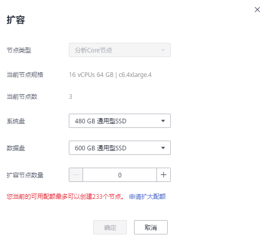
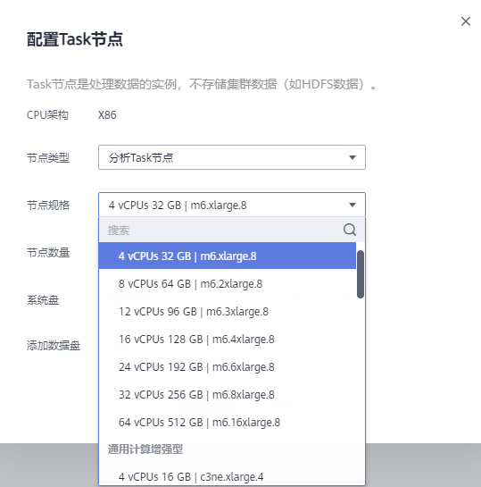
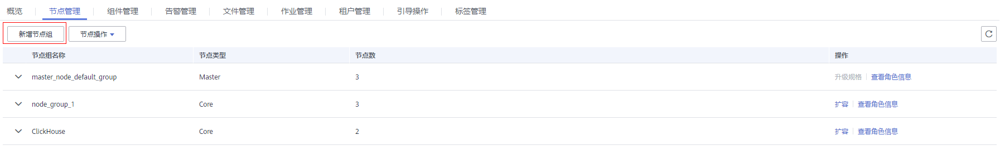

# 扩容集群

MRS的扩容不论在存储还是计算能力上，都可以简单地通过增加Core节点或者Task节点来完成，不需要修改系统架构，降低运维成本。集群Core节点不仅可以处理数据，也可以存储数据。可以在集群中添加Core节点，通过增加节点数量处理峰值负载。集群Task节点主要用于处理数据，不存放持久数据。

扩容后，集群内节点已安装的客户端无需更新，集群外节点安装的客户端请参考[更新客户端](更新客户端.md)进行更新。

扩容后，如需对HDFS数据进行均衡操作，请参考[配置DataNode容量均衡](https://support.huaweicloud.com/cmpntguide-mrs/mrs_01_1667.html)。如需对Kafka数据进行均衡操作，请参考[Kafka均衡工具使用说明](https://support.huaweicloud.com/cmpntguide-mrs/mrs_01_1040.html)。

## 背景信息

目前支持扩容Core节点和Task节点，不支持扩容Master节点。此处扩容的最大Core/Task节点数为（500 - 集群Core/Task节点数）。例如：当前集群Core节点数为3，此处扩容的Core节点数必须小于等于497。如果集群扩容失败，用户可重新进行扩容操作。

选择的版本不同，扩容集群的操作也不同。

## 扩容按需集群

1.  登录MRS管理控制台。
2.  选择  “集群列表  \>  现有集群“  ，选中一个运行中的集群并单击集群名称，进入集群信息页面。
3.  选择“节点管理”页签，在需要扩容的节点组的“操作”列单击“扩容”，进入扩容集群页面。

    只有运行中的集群才能进行扩容操作。

4.  设置“系统盘“和“数据盘“的类型、“扩容节点数量“、“启动组件”和“执行引导操作”参数，并单击“确定“。“启动组件”和“执行引导操作”参数仅MRS 3.x之前版本集群支持。

    

    > **说明：** 
    >-   若集群中没有Task节点组，请参考[相关任务](#section60245328163721)配置Task节点。
    >-   如果创建集群时添加了引导操作，则“执行引导操作”参数有效，开启该功能时扩容的节点会把创建集群时添加的引导操作脚本都执行一遍。
    >-   如果“新节点规格“参数有效，则表示与原有节点相同的规格已售罄或已下架，新扩容的节点将按照“新节点规格“增加。
    >-   扩容集群前需要检查集群安全组是否配置正确，要确保集群入方向安全组规则中有一条全部协议，全部端口，源地址为可信任的IP访问范围的规则。

5.  进入“扩容节点“窗口，单击“确认“。
6.  页面右上角弹出扩容节点提交成功提示框。

    集群扩容过程说明如下：

    -   扩容中：集群正在扩容时集群状态为“扩容中“。已提交的作业会继续执行，也可以提交新的作业，但不允许继续扩容和删除集群，也不建议重启集群和修改集群配置。
    -   扩容成功：集群扩容成功后集群状态为“运行中“，计费会按照新增节点加上已有节点使用的资源计算。
    -   扩容失败：集群扩容失败时集群状态为“运行中“。用户可以执行作业，也可以重新进行扩容操作。

    扩容成功后，可以在集群详情的“节点管理”页签查看集群的节点信息。

## 扩容包周期集群

1.  登录MRS管理控制台。
2.  选择  “集群列表  \>  现有集群“  ，选中一个运行中的集群并单击集群名称，进入集群信息页面。
3.  选择“节点管理”页签，在需要扩容的节点组的“操作”列单击“扩容”，进入扩容集群页面。

    只有运行中的集群才能进行扩容操作。

4.  设置“系统盘“和“数据盘“的类型、“扩容节点数量“、“启动组件”和“执行引导操作”参数。系统呈现集群使用的到期时间和此次扩容节点所需的费用。“启动组件”和“执行引导操作”参数仅MRS 3.x之前版本集群支持。

    > **说明：** 
    >-   如果创建集群时添加了引导操作，则“执行引导操作”参数有效，开启该功能时扩容的节点会把创建集群时添加的引导操作脚本都执行一遍。引导操作仅在MRS 1.9.2版本支持**。**
    >-   如果“新节点规格“参数有效，则表示与原有节点相同的规格已售罄或已下架，新扩容的节点将按照“新节点规格“增加。
    >-   扩容集群前需要检查集群安全组是否配置正确，要确保集群入方向安全组规则中有一条全部协议，全部端口，源地址为可信任的IP访问范围的规则。

    -   单击“提交订单“。

    进入“购买MapReduce服务“页面，单击“确认付款“。

    -   单击“确认订单，暂不付款“。

    进入“集群信息页面“。选择“费用 \> 我的订单“，单击“支付“，进入费用中心进行支付。

5.  支付成功后，返回MRS控制台，可查看集群状态。

    集群扩容过程说明如下：

    -   扩容中：集群正在扩容时集群状态为“扩容中“。已提交的作业会继续执行，也可以提交新的作业，但不允许继续扩容和删除集群，也不建议重启集群和修改集群配置。
    -   扩容成功：集群扩容成功后集群状态为“运行中“，计费会按照新增节点加上已有节点使用的资源计算。
    -   扩容失败：集群扩容失败时集群状态为“运行中“。用户可以执行作业，也可以重新进行扩容操作。

    扩容成功后，可以在集群详情的“节点管理”页签查看集群的节点信息。

## 配置Task节点

添加Task节点操作步骤：

1.  在集群详情页面，选择“节点管理”页签，单击“配置Task节点“，进入“配置Task节点”页面。
2.  配置“节点类型“、“节点规格“、“节点数量“、“系统盘“，如开启“添加数据盘“后，还需要配置数据盘的存储类型、大小和数量。

    

3.  单击“确定“。

## 添加节点组

> **说明：** 
>用于增加节点组，适用MRS 3.x版本的自定义集群。

1.  在集群详情页面，选择“节点管理”页签，单击“新增节点组“，进入“新增节点组”页面。

    

2.  根据需求配置参数。
3.  单击“确定”。

