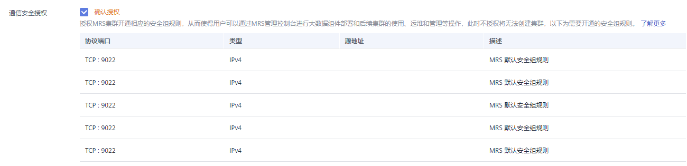
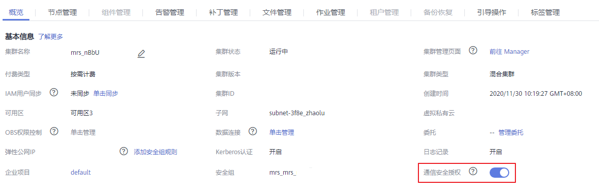
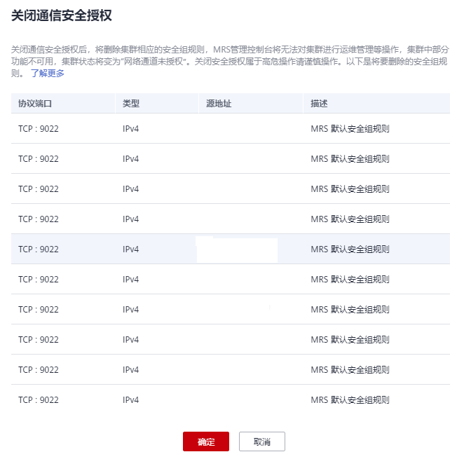
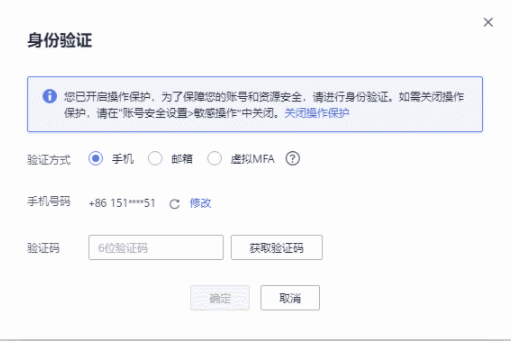
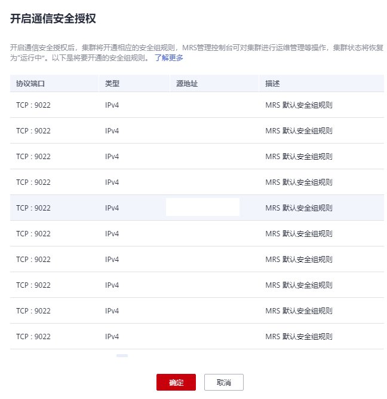
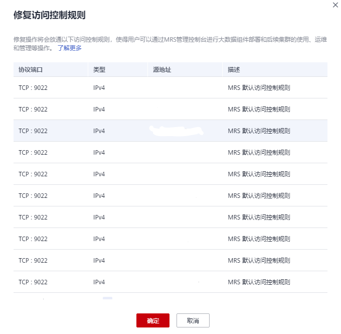

# 授权安全通信

MRS集群通过管理控制台为用户发放、管理和使用大数据组件，大数据组件部署在用户的VPC内部，MRS管理控制台需要直接访问部署在用户VPC内的大数据组件时需要开通相应的安全组规则，而开通相应的安全组规则需要获取用户授权，此授权过程称为通信安全授权。

若不开启通信安全授权，MRS将无法创建集群。集群创建成功后若关闭通信将导致集群状态为“网络通道未授权”且如下功能将受到影响：

-   大数据组件安装、集群扩容、集群缩容、升级Master节点规格功能不可用。
-   集群的运行状态、告警、事件无法监控。
-   集群详情页的节点管理、组件管理、告警管理、文件管理、作业管理、补丁管理、租户管理功能不可用。
-   Manager页面、各组件的Web站点无法访问。

再次开启通信安全授权，集群状态会恢复为“运行中”，以上功能将恢复为可用。具体操作请参见[为关闭安全通信的集群开启安全通信](#section177319347305)。

当集群中授权的安全组规则不足以支撑MRS集群管理控制台为用户发放、管理和使用大数据组件的操作时，“通信安全授权”右侧出现的提示，请单击“一键修复”按钮进行修复，具体请参考[一键修复](#section171375139619)。

## 创建集群时开启安全通信

1.  登录MRS管理控制台。
2.  单击“购买集群”，进入购买集群页面。
3.  在购买集群页面，选择“快速购买”或“自定义购买”。
4.  参考[购买自定义集群](购买自定义集群.md)配置集群信息。
5.  在“高级配置”页签的“通信安全授权”栏，勾选“确认授权”。

    **图 1**  确认授权  
    

6.  单击“立即购买”创建集群。

    当集群开启Kerberos认证时，需要确认是否需要开启Kerberos认证，若确认开启请单击“继续”，若无需开启Kerberos认证请单击“返回”关闭Kerberos认证后再创建集群。

## 集群创建成功后关闭安全通信

1.  登录MRS管理控制台。
2.  在现有集群列表中，单击待关闭安全通信的集群名称。

    系统跳转至该集群详情页面。

    **图 2**  通信安全授权  
    

3.  单击“通信安全授权”右侧的开关关闭授权，在弹出窗口单击“确定”。

    关闭授权后将导致集群状态变更为“网络通道未授权”，集群部分功能不可用，请谨慎操作。

    **图 3**  关闭通信安全授权  
    

4.  若用户已开启敏感操作保护（详见IAM服务的[敏感操作](https://support.huaweicloud.com/usermanual-iam/iam_07_0002.html)）,则输入选择的对应验证方式获取的验证码进行进行验证，避免误操作带来的风险和损失。

    **图 4**  身份验证  
    

## 为关闭安全通信的集群开启安全通信

1.  登录MRS管理控制台。
2.  在现有集群列表中，单击待开启安全通信的集群名称。

    系统跳转至该集群详情页面。

3.  单击“通信安全授权”右侧的开关开启授权。

    开启授权后集群状态变更为“运行中”。

    **图 5**  开启通信安全授权  
    

## 一键修复

当集群中授权的安全组规则不足以支撑MRS集群管理控制台为用户发放、管理和使用大数据组件的操作时，“通信安全授权”右侧出现的提示，请单击“一键修复”按钮进行修复。

1.  登录MRS管理控制台。
2.  在现有集群列表中，单击待修复安全通信的集群名称。

    系统跳转至该集群详情页面。

3.  单击“通信安全授权”右侧的“一键修复”。

    **图 6**  一键修复  
    

4.  单击“确定”，完成修复。

    **图 7**  修复访问控制策略  
    

