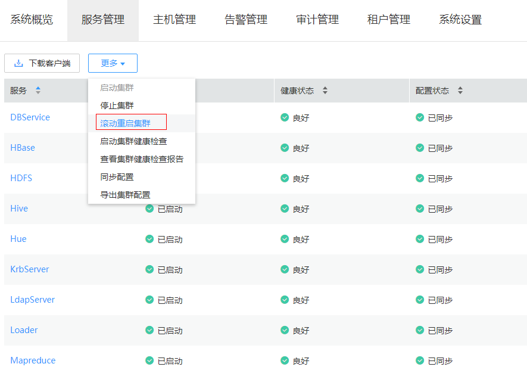

# 支持滚动重启

在修改了大数据组件的配置项后，需要重启对应的服务来使得配置生效，使用普通重启方式会并发重启所有服务或实例，可能引起业务断服。为了确保服务重启过程中，尽量减少或者不影响业务运行，可以通过滚动重启来按批次重启服务或实例（对于有主备状态的实例，会先重启备实例，再重启主实例）。滚动重启方式的重启时间比普通重启时间久。

当前MRS集群中，以下服务或者进程不支持滚动重启：SparkResource 、Hue、Loader。

## 滚动重启服务

1.  在MRS Manager，单击“服务管理“，选择需要滚动重启的服务，进入服务页面。
2.  在“服务状态“页签单击“更多“，选择“滚动重启服务“。

    **图 1**  服务状态  
    

3.  输入管理员密码后，弹出“滚动重启服务“页面，勾选“仅重启配置过期的实例“，单击确认，开始滚动重启服务。

    **图 2**  滚动重启服务配置  
    

4.  滚动重启任务完成后，单击“完成“。

    **图 3**  滚动重启服务完成  
    

## 滚动重启实例

1.  在MRS Manager，单击“服务管理“，选择需要滚动重启的服务，进入服务页面。
2.  在“实例“页签，勾选要重启的实例，单击“更多“，选择“滚动重启实例“。

    **图 4**  服务实例  
    

3.  输入管理员密码后，弹出“滚动重启实例“页面，勾选“仅重启配置过期的实例“，单击确认，开始滚动重启实例。
4.  滚动重启任务完成后，单击“完成“。

## 滚动重启集群

1.  在MRS Manager，单击“服务管理“，进入服务管理页面。
2.  单击“更多“，选择“滚动重启集群“。

    **图 5**  服务管理  
    

3.  输入管理员密码后，弹出“滚动重启集群“页面，勾选“仅重启配置过期的实例“，单击确认，开始滚动重启集群。
4.  滚动重启任务完成后，单击“完成“。

## 滚动重启参数说明

滚动重启参数说明如[表1](#table817615121520)所示。

**表 1**  滚动重启参数说明

<table><thead align="left"><tr id="row10176131217216"><th class="cellrowborder" valign="top" width="24.560000000000002%" id="mcps1.2.3.1.1">
参数名称

</th>
<th class="cellrowborder" valign="top" width="75.44%" id="mcps1.2.3.1.2">
描述

</th>
</tr>
</thead>
<tbody><tr id="row8176712727"><td class="cellrowborder" valign="top" width="24.560000000000002%" headers="mcps1.2.3.1.1 ">
仅重启配置过期的实例

</td>
<td class="cellrowborder" valign="top" width="75.44%" headers="mcps1.2.3.1.2 ">
是否只重启集群内修改过配置的实例。

</td>
</tr>
<tr id="row161761712825"><td class="cellrowborder" valign="top" width="24.560000000000002%" headers="mcps1.2.3.1.1 ">
数据节点滚动重启并发数

</td>
<td class="cellrowborder" valign="top" width="75.44%" headers="mcps1.2.3.1.2 ">
采用分批并发滚动重启策略的数据节点实例每一个批次重启的实例数，默认为1，取值范围为1～20。只对数据节点有效。

</td>
</tr>
<tr id="row1917710127217"><td class="cellrowborder" valign="top" width="24.560000000000002%" headers="mcps1.2.3.1.1 ">
批次时间间隔

</td>
<td class="cellrowborder" valign="top" width="75.44%" headers="mcps1.2.3.1.2 ">
滚动重启实例批次之间的间隔时间，默认为0，取值范围为0～2147483647。

</td>
</tr>
<tr id="row10177121219210"><td class="cellrowborder" valign="top" width="24.560000000000002%" headers="mcps1.2.3.1.1 ">
批次容错阈值

</td>
<td class="cellrowborder" valign="top" width="75.44%" headers="mcps1.2.3.1.2 ">
滚动重启实例批次执行失败容错次数，默认为0，即表示任意一个批次的实例重启失败后，滚动重启任务终止。取值范围为0～214748364。

</td>
</tr>
</tbody>
</table>

## 典型场景操作步骤

1.  在MRS Manager，单击“服务管理“，选择HBase，进入HBase服务页面。
2.  单击“服务配置“页签，修改HBase某个参数并保存配置，在出现如下弹窗后，单击“确定“进行保存。

    **图 6**  保存配置  
    

    > **说明：**   
    >不要勾选“重新启动受影响的服务或实例“，该处重启是普通重启方式，会并发重启所有服务或实例，引起业务断服。  

3.  保存配置完成后，单击“完成“。
4.  选择“服务状态“页签。
5.  在“服务状态“页签单击“更多“，选择“滚动重启服务“。

    **图 7**  服务状态-滚动重启  
    

6.  输入管理员密码后，弹出“滚动重启服务“页面，勾选“仅重启配置过期的实例“，单击确认，开始滚动重启。

    **图 8**  配置滚动重启服务  
    

7.  滚动重启任务完成后，单击“完成“。

    **图 9**  滚动重启任务完成  
    

