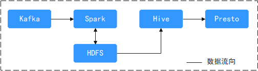
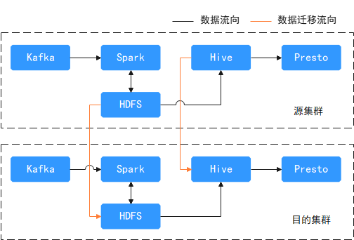

# 数据迁移到MRS前信息收集

由于离线大数据搬迁有一定的灵活性，迁移前需要掌握现有集群的详细信息，能够更好的进行迁移决策。

## 业务信息调研

1.  大数据平台及业务的架构图。
2.  大数据平台和业务的数据流图（包括：峰值和均值流量），识别平台数据接入源。大数据平台数据流入方式（实时数据上报、批量数据抽取），分析平台数据流向。数据在平台内各个组件间的流向。比如使用什么组件采集数据，采集完数据后数据如何流向下一层组件，使用什么组件存储数据，数据处理过程中的工作流等。
3.  业务作业类型：hive sql, spark sql,  spark python等，是否需要使用MRS的第三方包，参考[MRS应用开发样例](https://support.huaweicloud.com/devg3-mrs/mrs_07_010000.html)。
4.  调度系统：需要考虑调度系统对接MRS集群。
5.  迁移后，业务割接允许中断时长，识别平台业务优先级。识别在迁移过程中不能中断的业务，可短时中断的业务，整体业务迁移可接受的迁移时长，梳理业务迁移顺序。
6.  客户端部署要求，参考[集群外节点使用MRS客户端前提条件](安装客户端（3-x之前版本）.md#section3219221104310)。
7.  业务执行时间段和高峰时间段。
8.  大数据集群的数量和大数据集群功能划分，分析平台业务模型。各个集群或各个组件分别负责什么业务，处理什么类型的数据。比如实时/离线数据分别使用什么组件处理，数据格式类型，压缩算法等。

## 集群基本信息收集

**表 1**  集群基本信息

<table><thead align="left"><tr id="row19938199191014"><th class="cellrowborder" valign="top" width="25%" id="mcps1.2.4.1.1">
参数

</th>
<th class="cellrowborder" valign="top" width="25%" id="mcps1.2.4.1.2">
取值

</th>
<th class="cellrowborder" valign="top" width="50%" id="mcps1.2.4.1.3">
说明

</th>
</tr>
</thead>
<tbody><tr id="row15938119151010"><td class="cellrowborder" valign="top" width="25%" headers="mcps1.2.4.1.1 ">
集群名称

</td>
<td class="cellrowborder" valign="top" width="25%" headers="mcps1.2.4.1.2 ">
-

</td>
<td class="cellrowborder" valign="top" width="50%" headers="mcps1.2.4.1.3 ">
-

</td>
</tr>
<tr id="row11938395102"><td class="cellrowborder" valign="top" width="25%" headers="mcps1.2.4.1.1 ">
集群版本

</td>
<td class="cellrowborder" valign="top" width="25%" headers="mcps1.2.4.1.2 ">
-

</td>
<td class="cellrowborder" valign="top" width="50%" headers="mcps1.2.4.1.3 ">
MRS、CDM、FI等集群的版本。

</td>
</tr>
<tr id="row15938193101"><td class="cellrowborder" valign="top" width="25%" headers="mcps1.2.4.1.1 ">
节点数及规格

</td>
<td class="cellrowborder" valign="top" width="25%" headers="mcps1.2.4.1.2 ">
-

</td>
<td class="cellrowborder" valign="top" width="50%" headers="mcps1.2.4.1.3 ">
必填项，调研现有集群节点数和节点规格。

如果集群硬件异构，请填写多种规格和对应节点数。请参见<a href="#table31651551561">表2</a>

例如：

2台 32U64G机器部署NameNode + ResourceManager

2台 32U64G机器部署Hiveserver

20台 16U32G 机器部署DataNode和NodeManager

</td>
</tr>
<tr id="row7938992108"><td class="cellrowborder" valign="top" width="25%" headers="mcps1.2.4.1.1 ">
是否开启Kerberos认证

</td>
<td class="cellrowborder" valign="top" width="25%" headers="mcps1.2.4.1.2 ">
-

</td>
<td class="cellrowborder" valign="top" width="50%" headers="mcps1.2.4.1.3 ">
必填项： 是或否

</td>
</tr>
<tr id="row1093829141011"><td class="cellrowborder" valign="top" width="25%" headers="mcps1.2.4.1.1 ">
权限控制及说明

</td>
<td class="cellrowborder" valign="top" width="25%" headers="mcps1.2.4.1.2 ">
-

</td>
<td class="cellrowborder" valign="top" width="50%" headers="mcps1.2.4.1.3 ">
必填项，调研各个开启ACL权限控制的组件和配置。

涉及： Yarn 、Hive、 Impala、 HBase组件。

使用ranger、sentry或组件开源的权限能力进行权限控制。

</td>
</tr>
<tr id="row593912915104"><td class="cellrowborder" valign="top" width="25%" headers="mcps1.2.4.1.1 ">
所在region/AZ

</td>
<td class="cellrowborder" valign="top" width="25%" headers="mcps1.2.4.1.2 ">
-

</td>
<td class="cellrowborder" valign="top" width="50%" headers="mcps1.2.4.1.3 ">
云上资源填写项

</td>
</tr>
<tr id="row193919911012"><td class="cellrowborder" valign="top" width="25%" headers="mcps1.2.4.1.1 ">
虚拟私有云

</td>
<td class="cellrowborder" valign="top" width="25%" headers="mcps1.2.4.1.2 ">
-

</td>
<td class="cellrowborder" valign="top" width="50%" headers="mcps1.2.4.1.3 ">
云上资源填写项

</td>
</tr>
<tr id="row138601901431"><td class="cellrowborder" valign="top" width="25%" headers="mcps1.2.4.1.1 ">
子网

</td>
<td class="cellrowborder" valign="top" width="25%" headers="mcps1.2.4.1.2 ">
-

</td>
<td class="cellrowborder" valign="top" width="50%" headers="mcps1.2.4.1.3 ">
云上资源填写项

</td>
</tr>
<tr id="row16513164312"><td class="cellrowborder" valign="top" width="25%" headers="mcps1.2.4.1.1 ">
安全组

</td>
<td class="cellrowborder" valign="top" width="25%" headers="mcps1.2.4.1.2 ">
-

</td>
<td class="cellrowborder" valign="top" width="50%" headers="mcps1.2.4.1.3 ">
云上资源填写项

</td>
</tr>
</tbody>
</table>

**表 2**  硬件信息调研表

<table><tbody><tr id="row1117014558568"><td class="cellrowborder" valign="top">
节点组

</td>
<td class="cellrowborder" valign="top">
CPU和内存信息

</td>
<td class="cellrowborder" colspan="2" valign="top">
磁盘和网络（按节点组统计）

</td>
<td class="cellrowborder" colspan="3" valign="top">
HDFS

</td>
<td class="cellrowborder" colspan="2" valign="top">
Yarn

</td>
</tr>
<tr id="row12170455185613"><td class="cellrowborder" valign="top" width="11.111111111111112%">
-

</td>
<td class="cellrowborder" valign="top" width="11.111111111111112%">
-

</td>
<td class="cellrowborder" valign="top" width="11.111111111111112%">
磁盘信息（数据盘大小，磁盘IO，当前磁盘使用率和IO情况）

</td>
<td class="cellrowborder" valign="top" width="11.111111111111112%">
网络（网卡带宽大小，网络读写速度和峰值）

</td>
<td class="cellrowborder" valign="top" width="11.111111111111112%">
NameNode

</td>
<td class="cellrowborder" valign="top" width="11.111111111111112%">
DadtaNode

</td>
<td class="cellrowborder" valign="top" width="11.111111111111112%">
JouralNode

</td>
<td class="cellrowborder" valign="top" width="11.111111111111112%">
NodeManager

</td>
<td class="cellrowborder" valign="top" width="11.111111111111112%">
ResourceManager

</td>
</tr>
<tr id="row267604025819"><td class="cellrowborder" valign="top" width="11.111111111111112%">
master1

</td>
<td class="cellrowborder" valign="top" width="11.111111111111112%">
(16U64G)

</td>
<td class="cellrowborder" valign="top" width="11.111111111111112%">&nbsp;&nbsp;</td>
<td class="cellrowborder" valign="top" width="11.111111111111112%">&nbsp;&nbsp;</td>
<td class="cellrowborder" valign="top" width="11.111111111111112%">
1

</td>
<td class="cellrowborder" valign="top" width="11.111111111111112%">&nbsp;&nbsp;</td>
<td class="cellrowborder" valign="top" width="11.111111111111112%">
1

</td>
<td class="cellrowborder" valign="top" width="11.111111111111112%">&nbsp;&nbsp;</td>
<td class="cellrowborder" valign="top" width="11.111111111111112%">
1

</td>
</tr>
<tr id="row12963104075812"><td class="cellrowborder" valign="top" width="11.111111111111112%">
master2

</td>
<td class="cellrowborder" valign="top" width="11.111111111111112%">
(16U64G)

</td>
<td class="cellrowborder" valign="top" width="11.111111111111112%">&nbsp;&nbsp;</td>
<td class="cellrowborder" valign="top" width="11.111111111111112%">&nbsp;&nbsp;</td>
<td class="cellrowborder" valign="top" width="11.111111111111112%">
1

</td>
<td class="cellrowborder" valign="top" width="11.111111111111112%">&nbsp;&nbsp;</td>
<td class="cellrowborder" valign="top" width="11.111111111111112%">
1

</td>
<td class="cellrowborder" valign="top" width="11.111111111111112%">&nbsp;&nbsp;</td>
<td class="cellrowborder" valign="top" width="11.111111111111112%">
1

</td>
</tr>
<tr id="row1032454116583"><td class="cellrowborder" valign="top" width="11.111111111111112%">
master3

</td>
<td class="cellrowborder" valign="top" width="11.111111111111112%">
(16U64G)

</td>
<td class="cellrowborder" valign="top" width="11.111111111111112%">&nbsp;&nbsp;</td>
<td class="cellrowborder" valign="top" width="11.111111111111112%">&nbsp;&nbsp;</td>
<td class="cellrowborder" valign="top" width="11.111111111111112%">&nbsp;&nbsp;</td>
<td class="cellrowborder" valign="top" width="11.111111111111112%">&nbsp;&nbsp;</td>
<td class="cellrowborder" valign="top" width="11.111111111111112%">
1

</td>
<td class="cellrowborder" valign="top" width="11.111111111111112%">&nbsp;&nbsp;</td>
<td class="cellrowborder" valign="top" width="11.111111111111112%">&nbsp;&nbsp;</td>
</tr>
<tr id="row766034116589"><td class="cellrowborder" valign="top" width="11.111111111111112%">
Core-group1

</td>
<td class="cellrowborder" valign="top" width="11.111111111111112%">
(32U128G)*数量

</td>
<td class="cellrowborder" valign="top" width="11.111111111111112%">&nbsp;&nbsp;</td>
<td class="cellrowborder" valign="top" width="11.111111111111112%">&nbsp;&nbsp;</td>
<td class="cellrowborder" valign="top" width="11.111111111111112%">&nbsp;&nbsp;</td>
<td class="cellrowborder" valign="top" width="11.111111111111112%">
1

</td>
<td class="cellrowborder" valign="top" width="11.111111111111112%">&nbsp;&nbsp;</td>
<td class="cellrowborder" valign="top" width="11.111111111111112%">
1

</td>
<td class="cellrowborder" valign="top" width="11.111111111111112%">&nbsp;&nbsp;</td>
</tr>
<tr id="row11171105545620"><td class="cellrowborder" valign="top" width="11.111111111111112%">
Core-group1

</td>
<td class="cellrowborder" valign="top" width="11.111111111111112%">
(32U129G)

</td>
<td class="cellrowborder" valign="top" width="11.111111111111112%">&nbsp;&nbsp;</td>
<td class="cellrowborder" valign="top" width="11.111111111111112%">&nbsp;&nbsp;</td>
<td class="cellrowborder" valign="top" width="11.111111111111112%">&nbsp;&nbsp;</td>
<td class="cellrowborder" valign="top" width="11.111111111111112%">&nbsp;&nbsp;</td>
<td class="cellrowborder" valign="top" width="11.111111111111112%">&nbsp;&nbsp;</td>
<td class="cellrowborder" valign="top" width="11.111111111111112%">&nbsp;&nbsp;</td>
<td class="cellrowborder" valign="top" width="11.111111111111112%">&nbsp;&nbsp;</td>
</tr>
<tr id="row1417145545613"><td class="cellrowborder" valign="top" width="11.111111111111112%">
Core-group1

</td>
<td class="cellrowborder" valign="top" width="11.111111111111112%">
(32U130G)

</td>
<td class="cellrowborder" valign="top" width="11.111111111111112%">&nbsp;&nbsp;</td>
<td class="cellrowborder" valign="top" width="11.111111111111112%">&nbsp;&nbsp;</td>
<td class="cellrowborder" valign="top" width="11.111111111111112%">&nbsp;&nbsp;</td>
<td class="cellrowborder" valign="top" width="11.111111111111112%">&nbsp;&nbsp;</td>
<td class="cellrowborder" valign="top" width="11.111111111111112%">&nbsp;&nbsp;</td>
<td class="cellrowborder" valign="top" width="11.111111111111112%">&nbsp;&nbsp;</td>
<td class="cellrowborder" valign="top" width="11.111111111111112%">&nbsp;&nbsp;</td>
</tr>
</tbody>
</table>

## 大数据组件信息

使用的大数据组件信息和规划的新版本大数据集群版本信息比较，主要识别版本差异可能对迁移过程的影响，以及对迁移后业务兼容性的影响。

**表 3**  大数据组件信息

<table><thead align="left"><tr id="row1621747114511"><th class="cellrowborder" valign="top" width="25%" id="mcps1.2.5.1.1">
大数据组件

</th>
<th class="cellrowborder" valign="top" width="25%" id="mcps1.2.5.1.2">
源端集群版本

</th>
<th class="cellrowborder" valign="top" width="25%" id="mcps1.2.5.1.3">
目的端集群版本

（以MRS 1.9.2为例）

</th>
<th class="cellrowborder" valign="top" width="25%" id="mcps1.2.5.1.4">
说明

</th>
</tr>
</thead>
<tbody><tr id="row7294724516"><td class="cellrowborder" valign="top" width="25%" headers="mcps1.2.5.1.1 ">
HDFS/OBS（或其他文件存储系统）

</td>
<td class="cellrowborder" valign="top" width="25%" headers="mcps1.2.5.1.2 ">
Hadoop 2.8.3

</td>
<td class="cellrowborder" valign="top" width="25%" headers="mcps1.2.5.1.3 ">
Hadoop 2.8.3

</td>
<td class="cellrowborder" valign="top" width="25%" headers="mcps1.2.5.1.4 ">
-

</td>
</tr>
<tr id="row12218477452"><td class="cellrowborder" valign="top" width="25%" headers="mcps1.2.5.1.1 ">
Hive

</td>
<td class="cellrowborder" valign="top" width="25%" headers="mcps1.2.5.1.2 ">
1.2.1

</td>
<td class="cellrowborder" valign="top" width="25%" headers="mcps1.2.5.1.3 ">
2.3.3

</td>
<td class="cellrowborder" valign="top" width="25%" headers="mcps1.2.5.1.4 ">
存储元数据的数据库：mysql

</td>
</tr>
<tr id="row1284794519"><td class="cellrowborder" valign="top" width="25%" headers="mcps1.2.5.1.1 ">
HBase

</td>
<td class="cellrowborder" valign="top" width="25%" headers="mcps1.2.5.1.2 ">
1.3.1

</td>
<td class="cellrowborder" valign="top" width="25%" headers="mcps1.2.5.1.3 ">
1.3.1

</td>
<td class="cellrowborder" valign="top" width="25%" headers="mcps1.2.5.1.4 ">
-

</td>
</tr>
<tr id="row16220476457"><td class="cellrowborder" valign="top" width="25%" headers="mcps1.2.5.1.1 ">
Spark

</td>
<td class="cellrowborder" valign="top" width="25%" headers="mcps1.2.5.1.2 ">
2.2.2

</td>
<td class="cellrowborder" valign="top" width="25%" headers="mcps1.2.5.1.3 ">
2.2.2

</td>
<td class="cellrowborder" valign="top" width="25%" headers="mcps1.2.5.1.4 ">
-

</td>
</tr>
<tr id="row6586556184718"><td class="cellrowborder" valign="top" width="25%" headers="mcps1.2.5.1.1 ">
Kafka

</td>
<td class="cellrowborder" valign="top" width="25%" headers="mcps1.2.5.1.2 ">
1.1.0

</td>
<td class="cellrowborder" valign="top" width="25%" headers="mcps1.2.5.1.3 ">
1.1.0

</td>
<td class="cellrowborder" valign="top" width="25%" headers="mcps1.2.5.1.4 ">
-

</td>
</tr>
<tr id="row2086815617475"><td class="cellrowborder" valign="top" width="25%" headers="mcps1.2.5.1.1 ">
Oozie

</td>
<td class="cellrowborder" valign="top" width="25%" headers="mcps1.2.5.1.2 ">
2.x

</td>
<td class="cellrowborder" valign="top" width="25%" headers="mcps1.2.5.1.3 ">
自建

</td>
<td class="cellrowborder" valign="top" width="25%" headers="mcps1.2.5.1.4 ">
-

</td>
</tr>
<tr id="row1918205714474"><td class="cellrowborder" valign="top" width="25%" headers="mcps1.2.5.1.1 ">
mysql

</td>
<td class="cellrowborder" valign="top" width="25%" headers="mcps1.2.5.1.2 ">
5.7.1

</td>
<td class="cellrowborder" valign="top" width="25%" headers="mcps1.2.5.1.3 ">
RDS

</td>
<td class="cellrowborder" valign="top" width="25%" headers="mcps1.2.5.1.4 ">
-

</td>
</tr>
<tr id="row1424295764717"><td class="cellrowborder" valign="top" width="25%" headers="mcps1.2.5.1.1 ">
Flink

</td>
<td class="cellrowborder" valign="top" width="25%" headers="mcps1.2.5.1.2 ">
1.7

</td>
<td class="cellrowborder" valign="top" width="25%" headers="mcps1.2.5.1.3 ">
1.7

</td>
<td class="cellrowborder" valign="top" width="25%" headers="mcps1.2.5.1.4 ">
-

</td>
</tr>
<tr id="row12374710454"><td class="cellrowborder" valign="top" width="25%" headers="mcps1.2.5.1.1 ">
...

</td>
<td class="cellrowborder" valign="top" width="25%" headers="mcps1.2.5.1.2 ">
...

</td>
<td class="cellrowborder" valign="top" width="25%" headers="mcps1.2.5.1.3 ">
...

</td>
<td class="cellrowborder" valign="top" width="25%" headers="mcps1.2.5.1.4 ">
-

</td>
</tr>
</tbody>
</table>

## 待迁移的存量数据及数据量统计

如果使用HDFS作为文件存储系统，可以使用\` hadoop fs -du -h /user/test\`命令统计路径下的文件大小。

**表 4**  现有数据量统计

<table><thead align="left"><tr id="row20919182610251"><th class="cellrowborder" valign="top" width="25%" id="mcps1.2.5.1.1">
大数据组件

</th>
<th class="cellrowborder" valign="top" width="25%" id="mcps1.2.5.1.2">
待迁移数据的路径

</th>
<th class="cellrowborder" valign="top" width="25%" id="mcps1.2.5.1.3">
数据量大小

</th>
<th class="cellrowborder" valign="top" width="25%" id="mcps1.2.5.1.4">
文件个数或表个数

</th>
</tr>
</thead>
<tbody><tr id="row17919202602512"><td class="cellrowborder" valign="top" width="25%" headers="mcps1.2.5.1.1 ">
HDFS/OBS（或其他文件存储系统）

</td>
<td class="cellrowborder" valign="top" width="25%" headers="mcps1.2.5.1.2 ">
/user/helloworld

</td>
<td class="cellrowborder" valign="top" width="25%" headers="mcps1.2.5.1.3 ">
xx

</td>
<td class="cellrowborder" valign="top" width="25%" headers="mcps1.2.5.1.4 ">
总共：xxxx个文件

小于2M的文件数量：xxx个

</td>
</tr>
<tr id="row5920162672520"><td class="cellrowborder" valign="top" width="25%" headers="mcps1.2.5.1.1 ">
Hive

</td>
<td class="cellrowborder" valign="top" width="25%" headers="mcps1.2.5.1.2 ">
/user/hive/warehouse/

</td>
<td class="cellrowborder" valign="top" width="25%" headers="mcps1.2.5.1.3 ">
xx

</td>
<td class="cellrowborder" valign="top" width="25%" headers="mcps1.2.5.1.4 ">
表个数：xxx

</td>
</tr>
<tr id="row139201026102519"><td class="cellrowborder" valign="top" width="25%" headers="mcps1.2.5.1.1 ">
HBase

</td>
<td class="cellrowborder" valign="top" width="25%" headers="mcps1.2.5.1.2 ">
/hbase

</td>
<td class="cellrowborder" valign="top" width="25%" headers="mcps1.2.5.1.3 ">
xx

</td>
<td class="cellrowborder" valign="top" width="25%" headers="mcps1.2.5.1.4 ">
表个数：xx

Region个数：xx

</td>
</tr>
</tbody>
</table>

## 每天新增数据量统计

每天新增数据量主要评估数据增长速度（可以按天/小时等周期维度）。在第一次全量迁移数据后，后续可以定期搬迁老集群新增数据，直到业务完成最终割接。

**表 5**  新增数据量统计

<table><thead align="left"><tr id="row168112171733"><th class="cellrowborder" valign="top" width="33.33333333333333%" id="mcps1.2.4.1.1">
大数据组件

</th>
<th class="cellrowborder" valign="top" width="33.33333333333333%" id="mcps1.2.4.1.2">
待迁移的数据路径

</th>
<th class="cellrowborder" valign="top" width="33.33333333333333%" id="mcps1.2.4.1.3">
新增数据量大小

</th>
</tr>
</thead>
<tbody><tr id="row06817171313"><td class="cellrowborder" valign="top" width="33.33333333333333%" headers="mcps1.2.4.1.1 ">
HDFS/OBS（或其他文件存储系统）

</td>
<td class="cellrowborder" valign="top" width="33.33333333333333%" headers="mcps1.2.4.1.2 ">
/user/helloworld

</td>
<td class="cellrowborder" valign="top" width="33.33333333333333%" headers="mcps1.2.4.1.3 ">
xx

</td>
</tr>
<tr id="row1368221718319"><td class="cellrowborder" valign="top" width="33.33333333333333%" headers="mcps1.2.4.1.1 ">
Hive

</td>
<td class="cellrowborder" valign="top" width="33.33333333333333%" headers="mcps1.2.4.1.2 ">
/user/hive/warehouse/

</td>
<td class="cellrowborder" valign="top" width="33.33333333333333%" headers="mcps1.2.4.1.3 ">
xx

</td>
</tr>
<tr id="row3682717636"><td class="cellrowborder" valign="top" width="33.33333333333333%" headers="mcps1.2.4.1.1 ">
HBase

</td>
<td class="cellrowborder" valign="top" width="33.33333333333333%" headers="mcps1.2.4.1.2 ">
/hbase

</td>
<td class="cellrowborder" valign="top" width="33.33333333333333%" headers="mcps1.2.4.1.3 ">
xx

</td>
</tr>
</tbody>
</table>

## 网络出口带宽能力

-   迁移数据可以使用的最大网络带宽和专线带宽（是否可调）
-   迁移数据作业每天可以运行的时间段

## 流式Kafka集群信息收集

**表 6**  流式Kafka集群信息

<table><thead align="left"><tr id="row5714134817526"><th class="cellrowborder" valign="top" width="49.919999999999995%" id="mcps1.2.3.1.1">
收集信息项

</th>
<th class="cellrowborder" valign="top" width="50.080000000000005%" id="mcps1.2.3.1.2">
描述

</th>
</tr>
</thead>
<tbody><tr id="row1471424813523"><td class="cellrowborder" valign="top" width="49.919999999999995%" headers="mcps1.2.3.1.1 ">
kafka的topics数量和名称

</td>
<td class="cellrowborder" valign="top" width="50.080000000000005%" headers="mcps1.2.3.1.2 ">
-

</td>
</tr>
<tr id="row127147483527"><td class="cellrowborder" valign="top" width="49.919999999999995%" headers="mcps1.2.3.1.1 ">
kafka的本地数据暂存时间，如果每个topic配置不一样，按topic粒度收集

</td>
<td class="cellrowborder" valign="top" width="50.080000000000005%" headers="mcps1.2.3.1.2 ">
-

</td>
</tr>
<tr id="row37141148125218"><td class="cellrowborder" valign="top" width="49.919999999999995%" headers="mcps1.2.3.1.1 ">
每个topic的副本数和partition数量。（默认为2，副本数越多数据越可靠，也会消耗磁盘空间），如果每个topic配置不一样，按topic粒度收集

</td>
<td class="cellrowborder" valign="top" width="50.080000000000005%" headers="mcps1.2.3.1.2 ">
-

</td>
</tr>
<tr id="row157149484522"><td class="cellrowborder" valign="top" width="49.919999999999995%" headers="mcps1.2.3.1.1 ">
Kafka生产和消费的流量大小，细化到topic级别

</td>
<td class="cellrowborder" valign="top" width="50.080000000000005%" headers="mcps1.2.3.1.2 ">
-

</td>
</tr>
<tr id="row271474814523"><td class="cellrowborder" valign="top" width="49.919999999999995%" headers="mcps1.2.3.1.1 ">
kafka客户端ACK配置acks

</td>
<td class="cellrowborder" valign="top" width="50.080000000000005%" headers="mcps1.2.3.1.2 ">
-

</td>
</tr>
</tbody>
</table>

## 数据迁移模型样例

-   一个离线分析平台的客户业务系统框图，由spark streaming消费kafka数据存入HDFS上，HDFS上进行小文件合并后由Hive load加载到Hive表中，运营可以通过presto进行hive数据查询。

    **图 1**  源集群业务图  
    

-   针对大数据离线平台包括HDFS和Hive数据需要迁移，Kafka、 spark streaming、HDFS、Hive、presto的业务程序要在目的端集群上部署。

    **图 2**  迁移示意图  
    

