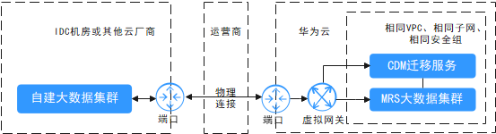
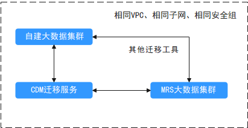
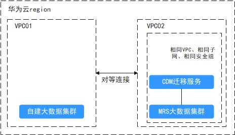
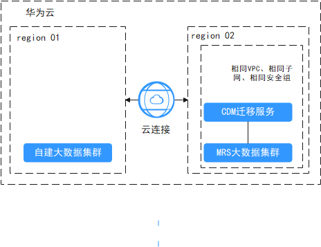

# 数据迁移到MRS前网络准备

进行大数据迁移时，需要保证源端集群和目的端集群之间的网络互通，例如用Hadoop distcp命令跨集群拷贝数据时候需要所有DataNode是网络互通。根据不同的迁移场景需要使用不通的方式先打通两套集群之间网络连接。

-   客户线下数据中心迁移数据到华为云MRS集群，通过云专线服务为用户搭建本地数据中心与云上VPC之间的专属连接通道。可以创建华为云的[云专线](https://www.huaweicloud.com/product/dc.html)服务或使用第三方的云专线服务来连通华为云网络。

    **图 1**  线下数据中心迁移  
    

-   客户在华为云上自建大数据集群（或老版本的MRS集群）需要迁移到华为云MRS集群，且在同一个region区域和VPC子网，可以使自建集群和MRS集群使用相同安全组、VPC、子网网络，从而保证网络连通。

    **图 2**  线上同region同VPC迁移  
    

-   客户在华为云上自建大数据集群（或老版本的MRS集群）需要迁移到华为云MRS集群，且在同一个region区域，但是使用不同VPC子网。需要使用[VPC对等连接](https://support.huaweicloud.com/usermanual-vpc/zh-cn_topic_0046655036.html)方式配置网络连通。

    **图 3**  线上同region不同VPC迁移  
    

-   客户在华为云上自建大数据集群（或老版本的MRS集群）需要迁移到华为云MRS集权，但在不同region区域，可以通过使用[云连接](https://support.huaweicloud.com/productdesc-cc/cc_01_0001.html)构建跨区域VPC的网络连接。

    **图 4**  线上不同region迁移  
    

