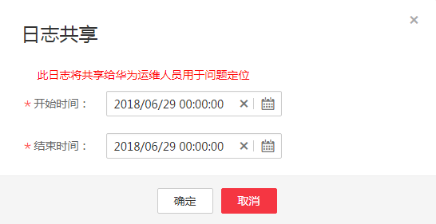

# 日志共享

当用户使用集群过程中出现问题需要华为云支持人员协助解决时，用户可先联系华为云支持人员，再通过“日志共享“功能提供特定时间段内的日志给华为云支持人员以便定位问题。

## 操作步骤

1.  登录MRS管理控制台。
2.  在左侧导航栏中选择“集群列表  \>  现有集群“，选中一个运行中的集群并单击集群名称，进入集群信息页面。
3.  在页面右上角单击“运维“，选择“日志共享“，进入“日志共享“界面。
4.  在“开始时间“和“结束时间“的输入框单击选择日期和时间。

    **图 1**  日志共享  
    

    > **说明：**   
    >-   “开始时间“和“结束时间“按照华为云支持人员的建议选取。  
    >-   “结束时间“的选择的时间必须大于“开始时间“选择的时间，否则，无法根据时间筛选日志。  

