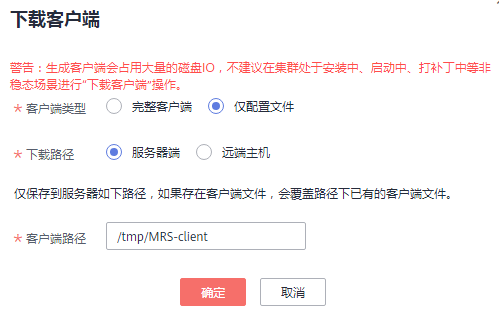

# 更新客户端（3.x之前版本）<a name="mrs_01_0089"></a>

> **说明：** 
>本章节适用于MRS 3.x之前版本的集群。MRS 3.x及之后版本，请参考[更新客户端（3.x及之后版本）](更新客户端（3-x及之后版本）.md)。

## 更新客户端配置文件<a name="section49706223568"></a>

**操作场景**

MRS集群提供了客户端，可以在连接服务端、查看任务结果或管理数据的场景中使用。用户使用MRS的客户端时，如果在MRS Manager修改了服务配置参数并重启了服务或者重启了服务，需要先下载并更新客户端配置文件。

用户创建集群时，默认在集群所有节点的“/opt/client“目录安装保存了原始客户端。集群创建完成后，仅Master节点的客户端可以直接使用，Core节点客户端在使用前需要更新客户端配置文件。

**操作步骤**

**方法一：所有版本集群均支持使用。**

1.  登录MRS Manager页面，具体请参见[访问MRS Manager（MRS 2.x及之前版本）](访问MRS-Manager（MRS-2-x及之前版本）.md)，然后选择“服务管理”。
2.  单击“下载客户端“。

    “客户端类型“选择“仅配置文件“，“下载路径“选择“服务器端“，单击“确定“开始生成客户端配置文件，文件生成后默认保存在主管理节点“/tmp/MRS-client“。文件保存路径支持自定义。

    **图 1**  下载客户端配置文件<a name="fig196531535987"></a>  
    

3.  查询并登录主Master节点。
4.  若在集群内使用客户端，执行以下命令切换到omm用户，若在集群外使用客户端，请切换到root用户：

    **sudo su - omm**

5.  执行以下命令切换客户端目录，例如“**/opt/Bigdata/client**”：

    **cd /opt/Bigdata/client**

6.  执行以下命令，更新客户端配置：

    **sh refreshConfig.sh** _客户端安装目录__客户端配置文件压缩包完整路径_

    例如，执行命令：

    **sh refreshConfig.sh /opt/Bigdata/client /tmp/MRS-client/MRS\_Services\_Client.tar**

    界面显示以下信息表示配置刷新更新成功：

    ```
    ReFresh components client config is complete.
    Succeed to refresh components client config.
    ```


**方法二：**

1.  集群安装完成之后，执行以下命令切换到omm用户，若在集群外使用客户端，请切换到root用户。

    **sudo su - omm**

2.  执行以下命令切换客户端目录，例如“**/opt/Bigdata/client**”。

    **cd /opt/Bigdata/client**

3.  执行以下命令并按照提示输入MRS Manager有下载权限的用户名和密码（例如，用户名为admin，密码为创建集群时设置的密码），更新客户端配置。

    **sh autoRefreshConfig.sh**

4.  命令执行后显示如下信息，其中XXX表示集群安装的组件名称，如需更新全部组件配置，单击“Enter“键，如需更新部分组件配置，请输入需要更新的组件名称，多个组件名称以逗号相隔。

    ```
    Components "xxx" have been installed in the cluster. Please input the comma-separated names of the components for which you want to update client configurations. If you press Enter without inputting any component name, the client configurations of all components will be updated:
    ```

    界面显示以下信息表示配置更新成功：

    ```
    Succeed to refresh components client config.
    ```

    界面显示以下信息表示用户名或者密码错误：

    ```
    login manager failed,Incorrect username or password.
    ```

    > **说明：** 
    >-   该脚本会自动连接到集群并调用refreshConfig.sh脚本下载并刷新客户端配置文件。
    >-   客户端默认使用安装目录下文件Version中的“wsom=xxx”所配置的浮动IP刷新客户端配置，如需刷新为其他集群的配置文件，请执行本步骤前修改Version文件中“wsom=xxx”的值为对应集群的浮动IP地址。


## 全量更新主Master节点的原始客户端<a name="section92959464575"></a>

**场景描述**

用户创建集群时，默认在集群所有节点的“/opt/client”目录安装保存了原始客户端。以下操作以“/opt/Bigdata/client”为例进行说明。

-   MRS普通集群，在console页面提交作业时，会使用master节点上预置安装的客户端进行作业提交。
-   用户也可使用master节点上预置安装的客户端来连接服务端、查看任务结果或管理数据等

对集群安装补丁后，用户需要重新更新master节点上的客户端，才能保证继续使用内置客户端功能。

**操作步骤**

1.  <a name="li6500547131416"></a>登录MRS Manager页面，具体请参见[访问MRS Manager（MRS 2.x及之前版本）](访问MRS-Manager（MRS-2-x及之前版本）.md)，然后选择“服务管理”。
2.  单击“下载客户端“。

    “客户端类型“选择“完整客户端“，“下载路径“选择“服务器端“，单击“确定“开始生成客户端配置文件，文件生成后默认保存在主管理节点“/tmp/MRS-client“。文件保存路径支持自定义。

3.  <a name="li14850170195112"></a>查询并登录主Master节点。
4.  <a name="li3635762195625"></a>在弹性云服务器，切换到**root**用户，并将安装包复制到目录“/opt“。

    **sudo su - root**

    **cp /tmp/MRS-client/MRS\_Services\_Client.tar /opt**

5.  在“/opt“目录执行以下命令，解压压缩包获取校验文件与客户端配置包。

    **tar -xvf MRS\_Services\_Client.tar**

6.  执行以下命令，校验文件包。

    **sha256sum -c MRS\_Services\_ClientConfig.tar.sha256**

    界面显示如下：

    ```
    MRS_Services_ClientConfig.tar: OK
    ```

7.  执行以下命令，解压“MRS\_Services\_ClientConfig.tar“。

    **tar -xvf MRS\_Services\_ClientConfig.tar**

8.  执行以下命令，移走原来老的客户端到/opt/Bigdata/client\_bak目录下

    **mv /opt/Bigdata/client** **/opt/Bigdata/client\_bak**

9.  执行以下命令，安装客户端到新的目录，客户端路径必须为“/opt/Bigdata/client“。

    **sh /opt/MRS\_Services\_ClientConfig/install.sh /opt/Bigdata/client**

    查看安装输出信息，如有以下结果表示客户端安装成功：

    ```
    Components client installation is complete.
    ```

10. 执行以下命令，修改/opt/Bigdata/client目录的所属用户和用户组。

    **chown omm:wheel /opt/Bigdata/client -R**

11. 执行以下命令配置环境变量：

    **source /opt/Bigdata/client/bigdata\_env**

12. 如果当前集群已启用Kerberos认证，执行以下命令认证当前用户。如果当前集群未启用Kerberos认证，则无需执行此命令。

    **kinit**_MRS集群用户_

    例如,  **kinit admin**

13. <a name="li6221236418107"></a>执行组件的客户端命令。

    例如，执行以下命令查看HDFS目录：

    **hdfs dfs -ls /**


## 全量更新备Master节点的原始客户端<a name="section1129715468573"></a>

1.  参见[1](#li6500547131416)\~[3](#li14850170195112)登录备Master节点，执行如下命令切换到omm用户。

    **sudo su - omm**

2.  在备master节点上执行如下命令，从主master节点拷贝下载的客户端包。

    **scp omm@**_master1节点__I__P地址_**:/tmp/MRS-client/MRS\_Services\_Client.tar  **/tmp/MRS-client/****

    > **说明：** 
    >-   该命令以master1节点为主master节点为例。
    >-   目的路径以备master节点的/tmp/MRS-client/目录为例，请根据实际路径修改。

3.  参见[4](#li3635762195625)\~[13](#li6221236418107)，更新备Master节点的客户端。

