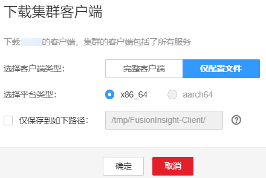

# 更新已安装客户端的配置<a name="admin_guide_000173"></a>

## 操作场景<a name="zh-cn_topic_0263899336_zh-cn_topic_0193213946_sbdc562e5115842a693e1418b1d8b7337"></a>

集群提供了客户端，可以在连接服务端、查看任务结果或管理数据的场景中使用。用户如果在Manager修改了服务配置参数并重启了服务，已安装的客户端需要重新下载并安装，或者使用配置文件更新客户端。

## 前提条件<a name="zh-cn_topic_0263899336_zh-cn_topic_0193213946_s134bab097eaf4f17a5c3940fd11e97e3"></a>

已安装客户端。

## 操作步骤<a name="zh-cn_topic_0263899336_zh-cn_topic_0193213946_scecf662ed55548db9a0b918697f2d909"></a>

**方法一：**

1.  登录FusionInsight Manager，在“集群”下拉列表中单击需要操作的集群名称。
2.  选择“更多  \>  下载客户端  \>  仅配置文件“。

    此时生成的压缩文件包含所有服务的配置文件。

    **图 1**  下载客户端配置文件<a name="zh-cn_topic_0263899336_fig147701326131920"></a>  
    

3.  是否在集群的节点中生成配置文件？
    -   是，勾选“仅保存到如下路径”，单击“确定”开始生成客户端文件，文件生成后默认保存在主管理节点“/tmp/FusionInsight-Client”。支持自定义其他目录且**omm**用户拥有目录的读、写与执行权限。然后执行[4](#zh-cn_topic_0263899336_zh-cn_topic_0193213946_l6af983f03121493ca3526296f5b650c3)。
    -   否，单击“确定”指定本地的保存位置，开始下载完整客户端，等待下载完成，然后执行[4](#zh-cn_topic_0263899336_zh-cn_topic_0193213946_l6af983f03121493ca3526296f5b650c3)。

4.  <a name="zh-cn_topic_0263899336_zh-cn_topic_0193213946_l6af983f03121493ca3526296f5b650c3"></a>使用WinSCP工具，以客户端安装用户将压缩文件保存到客户端安装的目录，例如“/opt/hadoopclient”。
5.  解压软件包。

    例如下载的客户端文件为“FusionInsight\_Cluster\_1\_Services\_Client.tar”执行如下命令进入客户端所在目录，解压文件到本地目录。

    **cd /opt/hadoopclient**

    **tar -xvf FusionInsight\_Cluster\_1\_Services\_Client.tar**

6.  校验软件包。

    执行**sha256sum**命令校验解压得到的文件，检查回显信息与sha256文件里面的内容是否一致，例如：

    **sha256sum -c FusionInsight\_**Cluster\_1\_**Services\_ClientConfig\_ConfigFiles.tar.sha256**

    ```
    FusionInsight_Cluster_1_Services_ClientConfig_ConfigFiles.tar: OK     
    ```

7.  解压获取配置文件。

    **tar -xvf FusionInsight\_**Cluster\_1\_**Services\_ClientConfig\_ConfigFiles.tar**

8.  在客户端安装目录下执行如下命令，使用配置文件更新客户端。

    **sh refreshConfig.sh **_客户端安装目录_ _配置文件所在目录_

    例如，执行以下命令：

    **sh refreshConfig.sh /opt/hadoopclient /opt/**hadoop**client/FusionInsight\_Cluster\_1\_Services\_ClientConfig\_ConfigFiles**

    界面显示以下信息表示配置刷新更新成功：

    ```
    Succeed to refresh components client config.
    ```


**方法二：**

1.  以**root**用户登录客户端安装节点。
2.  进入客户端安装的目录，例如“/opt/Bigdata/client”，执行以下命令更新配置文件：

    **cd /opt/Bigdata/client**

    **sh autoRefreshConfig.sh**

3.  按照提示输入FusionInsight Manager管理员用户名，密码以及FusionInsight Manager界面浮动IP。
4.  输入需要更新配置的组件名，组件名之间使用“,”分隔。如需更新所有组件配置，可直接单击回车键。

    界面显示以下信息表示配置刷新更新成功：

    ```
    Succeed to refresh components client config.
    ```


