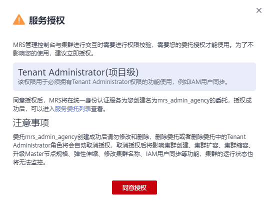

# 服务授权

MapReduce服务支持管理控制台与MRS集群进行交互，为您提供相关功能和集群状态监控。首次使用MapReduce服务需要进行服务授权。

进行服务授权后，MRS将在统一身份认证服务（IAM）为您创建名为mrs\_admin\_agency的委托，委托创建成功后请勿修改和删除，删除委托或者删除委托中的Tenant Administrator角色将会自动取消授权，取消授权后将影响集群创建、集群扩容、集群缩容、升级Master节点规格、弹性伸缩、修改集群名称、IAM用户同步等功能，集群的运行状态也将无法监控。

## 服务授权操作

1.  登录管理控制台。
2.  在服务列表中选择“大数据 \> MapReduce服务”，进入“服务授权”页面。

    **图 1**  服务授权  
    

3.  单击“同意授权”，完成服务授权。

    同意授权后，MRS将在统一身份认证服务为您创建名为mrs\_admin\_agency的委托，委托创建成功后请勿修改和删除，授权成功后，您就可以使用MRS服务。

    > **说明：** 
    >若创建委托失败，则需要您登录到“统一身份认证服务”管理控制台，对委托进行删除或联系管理员增加限额。

