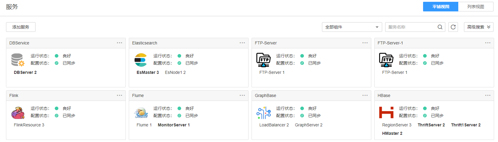

# 服务管理概述

## 总览

登录FusionInsight Manager以后，选择“集群 \>  _待操作集群的名称_  \> 服务”后，打开服务管理页面，包含功能区和服务列表。

**图 1**  服务管理页面  

## 功能区

服务管理页面的功能区支持选择视图类型，以及通过服务类型筛选和搜索服务。通过高级搜索可以根据“运行状态“和“配置状态“选择所需要的服务。

## 服务列表

服务管理页面的服务列表包含了集群中所有已安装的服务。如果选择“平铺视图“，则显示为窗格样式；如果选择“列表视图“，则显示为表格样式。

> **说明：** 
>本章节默认以“平铺视图“进行介绍。

服务列表可显示每个服务的运行状态、配置状态、角色的类型以及对应的实例个数。同时可以执行部分服务维护任务，例如启动、停止、重启服务等。

**表 1**  服务运行状态

<table><thead align="left"><tr id="row5367935711130"><th class="cellrowborder" valign="top" width="25%" id="mcps1.2.3.1.1">
状态

</th>
<th class="cellrowborder" valign="top" width="75%" id="mcps1.2.3.1.2">
说明

</th>
</tr>
</thead>
<tbody><tr id="row3709936911130"><td class="cellrowborder" valign="top" width="25%" headers="mcps1.2.3.1.1 ">
良好

</td>
<td class="cellrowborder" valign="top" width="75%" headers="mcps1.2.3.1.2 ">
表示服务当前运行正常。

</td>
</tr>
<tr id="row4603969911130"><td class="cellrowborder" valign="top" width="25%" headers="mcps1.2.3.1.1 ">
故障

</td>
<td class="cellrowborder" valign="top" width="75%" headers="mcps1.2.3.1.2 ">
表示服务当前无法正常工作。

</td>
</tr>
<tr id="row1810572611130"><td class="cellrowborder" valign="top" width="25%" headers="mcps1.2.3.1.1 ">
亚健康

</td>
<td class="cellrowborder" valign="top" width="75%" headers="mcps1.2.3.1.2 ">
表示服务部分增强功能无法正常工作。

</td>
</tr>
<tr id="row1372168011130"><td class="cellrowborder" valign="top" width="25%" headers="mcps1.2.3.1.1 ">
未启动

</td>
<td class="cellrowborder" valign="top" width="75%" headers="mcps1.2.3.1.2 ">
表示服务已停止。

</td>
</tr>
<tr id="row4621349511130"><td class="cellrowborder" valign="top" width="25%" headers="mcps1.2.3.1.1 ">
未知

</td>
<td class="cellrowborder" valign="top" width="75%" headers="mcps1.2.3.1.2 ">
表示服务的初始状态信息无法检测。

</td>
</tr>
<tr id="row172941820569"><td class="cellrowborder" valign="top" width="25%" headers="mcps1.2.3.1.1 ">
正在启动

</td>
<td class="cellrowborder" valign="top" width="75%" headers="mcps1.2.3.1.2 ">
表示服务正在执行启动过程。

</td>
</tr>
<tr id="row18402152010612"><td class="cellrowborder" valign="top" width="25%" headers="mcps1.2.3.1.1 ">
正在停止

</td>
<td class="cellrowborder" valign="top" width="75%" headers="mcps1.2.3.1.2 ">
表示服务正在执行停止过程。

</td>
</tr>
<tr id="row452862012615"><td class="cellrowborder" valign="top" width="25%" headers="mcps1.2.3.1.1 ">
启动失败

</td>
<td class="cellrowborder" valign="top" width="75%" headers="mcps1.2.3.1.2 ">
表示服务启动操作失败。

</td>
</tr>
<tr id="row1565412012618"><td class="cellrowborder" valign="top" width="25%" headers="mcps1.2.3.1.1 ">
停止失败

</td>
<td class="cellrowborder" valign="top" width="75%" headers="mcps1.2.3.1.2 ">
表示服务停止操作失败。

</td>
</tr>
</tbody>
</table>

> **说明：** 
>-   服务的运行状态为“故障”，会触发告警，请根据告警信息处理。
>-   HBase、Hive、Spark和Loader可显示“亚健康“（Subhealthy）状态。
>    -   Yarn已安装且不正常时，HBase处于“亚健康“状态。如启用多实例功能，则已安装的所有HBase服务实例处于“亚健康“状态。
>    -   HBase已安装且状态不正常时，Hive、Spark和Loader处于“亚健康“状态。
>    -   启用多实例功能后，任意一个HBase服务实例已安装且不正常时，Loader处于“亚健康”状态。
>    -   启用多实例功能后，某一个HBase服务实例已安装且不正常时，对应的Hive和Spark服务实例处于“亚健康“状态，即HBase2已安装且不正常时，Hive2和Spark2为“亚健康“状态。

**表 2**  服务配置状态

<table><thead align="left"><tr id="row618961081138"><th class="cellrowborder" valign="top" width="25%" id="mcps1.2.3.1.1">
状态

</th>
<th class="cellrowborder" valign="top" width="75%" id="mcps1.2.3.1.2">
说明

</th>
</tr>
</thead>
<tbody><tr id="row489620201138"><td class="cellrowborder" valign="top" width="25%" headers="mcps1.2.3.1.1 ">
已同步

</td>
<td class="cellrowborder" valign="top" width="75%" headers="mcps1.2.3.1.2 ">
表示服务所有参数配置已在集群内全部生效。

</td>
</tr>
<tr id="row413555691138"><td class="cellrowborder" valign="top" width="25%" headers="mcps1.2.3.1.1 ">
配置过期

</td>
<td class="cellrowborder" valign="top" width="75%" headers="mcps1.2.3.1.2 ">
表示修改服务参数后，最新的配置未同步且未生效，需要同步配置且重启相应服务。可点击配置状态后的图标查看过期的配置项。

</td>
</tr>
<tr id="row476987411138"><td class="cellrowborder" valign="top" width="25%" headers="mcps1.2.3.1.1 ">
失败

</td>
<td class="cellrowborder" valign="top" width="75%" headers="mcps1.2.3.1.2 ">
表示同步参数配置过程中出现通信或读写异常等操作。尝试使用“同步配置”恢复。

</td>
</tr>
<tr id="row39731721138"><td class="cellrowborder" valign="top" width="25%" headers="mcps1.2.3.1.1 ">
正在同步

</td>
<td class="cellrowborder" valign="top" width="75%" headers="mcps1.2.3.1.2 ">
表示正在同步服务参数配置。

</td>
</tr>
<tr id="row663889231138"><td class="cellrowborder" valign="top" width="25%" headers="mcps1.2.3.1.1 ">
未知

</td>
<td class="cellrowborder" valign="top" width="75%" headers="mcps1.2.3.1.2 ">
表示服务配置的初始状态信息无法检测。

</td>
</tr>
</tbody>
</table>

服务列表中单击服务对应菜单，可对服务进行简单的维护管理操作，具体如[表3](#table17943743105914)所示。

**表 3**  基本维护管理功能

<table><thead align="left"><tr id="row294464319592"><th class="cellrowborder" valign="top" width="46.160000000000004%" id="mcps1.2.3.1.1">
操作入口

</th>
<th class="cellrowborder" valign="top" width="53.839999999999996%" id="mcps1.2.3.1.2">
说明

</th>
</tr>
</thead>
<tbody><tr id="row4511952133818"><td class="cellrowborder" valign="top" width="46.160000000000004%" headers="mcps1.2.3.1.1 ">
“启动服务”

</td>
<td class="cellrowborder" valign="top" width="53.839999999999996%" headers="mcps1.2.3.1.2 ">
启动集群中指定服务。

</td>
</tr>
<tr id="row7873145384011"><td class="cellrowborder" valign="top" width="46.160000000000004%" headers="mcps1.2.3.1.1 ">
“停止服务”

</td>
<td class="cellrowborder" valign="top" width="53.839999999999996%" headers="mcps1.2.3.1.2 ">
将集群中指定服务停止。

</td>
</tr>
<tr id="row13559154104113"><td class="cellrowborder" valign="top" width="46.160000000000004%" headers="mcps1.2.3.1.1 ">
“重启服务”

</td>
<td class="cellrowborder" valign="top" width="53.839999999999996%" headers="mcps1.2.3.1.2 ">
将集群中指定服务重启。

 说明： 

某个服务可能被其他服务依赖，重启该服务则导致其他服务不可用，需要勾选“同时重启上层服务”。请根据对话框的服务列表确认是否可以执行操作，集群中由于依赖关系服务的重启为串行进行。单个服务的重启时长如<a href="#table1143215941919">表4</a>所示。

</td>
</tr>
<tr id="row11377930205112"><td class="cellrowborder" valign="top" width="46.160000000000004%" headers="mcps1.2.3.1.1 ">
“滚动重启服务”

</td>
<td class="cellrowborder" valign="top" width="53.839999999999996%" headers="mcps1.2.3.1.2 ">
为集群中指定服务提供不中断业务的重启操作，具体参数配置可参考<a href="滚动重启集群.md#zh-cn_topic_0118210076_t65f951fcfc8a4a37b6c7f3481125fe35">表1</a>。

</td>
</tr>
<tr id="row9939434205111"><td class="cellrowborder" valign="top" width="46.160000000000004%" headers="mcps1.2.3.1.1 ">
“同步配置”

</td>
<td class="cellrowborder" valign="top" width="53.839999999999996%" headers="mcps1.2.3.1.2 "><ul id="ul9152164544410"><li>为集群中指定服务启用新的配置参数。</li><li>为集群中“配置状态”为“配置过期”的服务，下发新的配置参数。</li></ul>

 说明： 

部分服务同步配置后需重启服务使配置生效。

</td>
</tr>
</tbody>
</table>

**表 4**  重启时长

<table><thead align="left"><tr id="row194321959111911"><th class="cellrowborder" valign="top" width="12.26%" id="mcps1.2.5.1.1">
服务名称

</th>
<th class="cellrowborder" valign="top" width="19.439999999999998%" id="mcps1.2.5.1.2">
重启时长

</th>
<th class="cellrowborder" valign="top" width="20.94%" id="mcps1.2.5.1.3">
启动时长

</th>
<th class="cellrowborder" valign="top" width="47.36%" id="mcps1.2.5.1.4">
附加说明

</th>
</tr>
</thead>
<tbody><tr id="row926612487140"><td class="cellrowborder" valign="top" width="12.26%" headers="mcps1.2.5.1.1 ">
ClickHouse

</td>
<td class="cellrowborder" valign="top" width="19.439999999999998%" headers="mcps1.2.5.1.2 ">
4min

</td>
<td class="cellrowborder" valign="top" width="20.94%" headers="mcps1.2.5.1.3 ">
ClickHouseServer：2min

ClickHouseBalancer：2min

</td>
<td class="cellrowborder" valign="top" width="47.36%" headers="mcps1.2.5.1.4 ">
-

</td>
</tr>
<tr id="row1943235911918"><td class="cellrowborder" valign="top" width="12.26%" headers="mcps1.2.5.1.1 ">
HDFS

</td>
<td class="cellrowborder" valign="top" width="19.439999999999998%" headers="mcps1.2.5.1.2 ">
10min+x

</td>
<td class="cellrowborder" valign="top" width="20.94%" headers="mcps1.2.5.1.3 ">
NameNode：4min+x

DataNode：2min

JournalNode：2min

Zkfc：2min

</td>
<td class="cellrowborder" valign="top" width="47.36%" headers="mcps1.2.5.1.4 ">
x为NameNode元数据加载时长，每千万文件大约耗时2分钟，例如5000万文件x为10min。由于受DataNode数据块上报影响启动时间有一定浮动。

</td>
</tr>
<tr id="row343219597196"><td class="cellrowborder" valign="top" width="12.26%" headers="mcps1.2.5.1.1 ">
Yarn

</td>
<td class="cellrowborder" valign="top" width="19.439999999999998%" headers="mcps1.2.5.1.2 ">
5min+x

</td>
<td class="cellrowborder" valign="top" width="20.94%" headers="mcps1.2.5.1.3 ">
ResourceManager：3min+x

NodeManager：2min

</td>
<td class="cellrowborder" valign="top" width="47.36%" headers="mcps1.2.5.1.4 ">
x为ResourceManager保留任务数恢复时长，每1万保留任务大约需要1分钟

</td>
</tr>
<tr id="row12433105911918"><td class="cellrowborder" valign="top" width="12.26%" headers="mcps1.2.5.1.1 ">
MapReduce

</td>
<td class="cellrowborder" valign="top" width="19.439999999999998%" headers="mcps1.2.5.1.2 ">
2min+x

</td>
<td class="cellrowborder" valign="top" width="20.94%" headers="mcps1.2.5.1.3 ">
JobHistoryServer：2min+x

</td>
<td class="cellrowborder" valign="top" width="47.36%" headers="mcps1.2.5.1.4 ">
x为历史任务扫描时长，每10万任务大约2.5min

</td>
</tr>
<tr id="row743345911912"><td class="cellrowborder" valign="top" width="12.26%" headers="mcps1.2.5.1.1 ">
Zookeeper

</td>
<td class="cellrowborder" valign="top" width="19.439999999999998%" headers="mcps1.2.5.1.2 ">
2min+x

</td>
<td class="cellrowborder" valign="top" width="20.94%" headers="mcps1.2.5.1.3 ">
quorumpeer：2min+x

</td>
<td class="cellrowborder" valign="top" width="47.36%" headers="mcps1.2.5.1.4 ">
x为加载znode节点时长，每100万znode大约1min

</td>
</tr>
<tr id="row11434105912196"><td class="cellrowborder" valign="top" width="12.26%" headers="mcps1.2.5.1.1 ">
Hive

</td>
<td class="cellrowborder" valign="top" width="19.439999999999998%" headers="mcps1.2.5.1.2 ">
3.5min

</td>
<td class="cellrowborder" valign="top" width="20.94%" headers="mcps1.2.5.1.3 ">
HiveServer：3min

MetaStore：1min30s

WebHcat：1min

Hive整体服务：3min

</td>
<td class="cellrowborder" valign="top" width="47.36%" headers="mcps1.2.5.1.4 ">
-

</td>
</tr>
<tr id="row134347590197"><td class="cellrowborder" valign="top" width="12.26%" headers="mcps1.2.5.1.1 ">
Spark2x

</td>
<td class="cellrowborder" valign="top" width="19.439999999999998%" headers="mcps1.2.5.1.2 ">
5min

</td>
<td class="cellrowborder" valign="top" width="20.94%" headers="mcps1.2.5.1.3 ">
JobHistory2x：5min

SparkResource2x：5min

JDBCServer2x：5min

</td>
<td class="cellrowborder" valign="top" width="47.36%" headers="mcps1.2.5.1.4 ">
-

</td>
</tr>
<tr id="row64341159151912"><td class="cellrowborder" valign="top" width="12.26%" headers="mcps1.2.5.1.1 ">
Flink

</td>
<td class="cellrowborder" valign="top" width="19.439999999999998%" headers="mcps1.2.5.1.2 ">
4min

</td>
<td class="cellrowborder" valign="top" width="20.94%" headers="mcps1.2.5.1.3 ">
FlinkResource：1min

FlinkServer：3min

</td>
<td class="cellrowborder" valign="top" width="47.36%" headers="mcps1.2.5.1.4 ">
-

</td>
</tr>
<tr id="row174355591192"><td class="cellrowborder" valign="top" width="12.26%" headers="mcps1.2.5.1.1 ">
Kafka

</td>
<td class="cellrowborder" valign="top" width="19.439999999999998%" headers="mcps1.2.5.1.2 ">
2min+x

</td>
<td class="cellrowborder" valign="top" width="20.94%" headers="mcps1.2.5.1.3 ">
Broker：1min+x

</td>
<td class="cellrowborder" valign="top" width="47.36%" headers="mcps1.2.5.1.4 ">
x为数据恢复时长，单实例20000 partition启动所需时长大约2mins。

</td>
</tr>
<tr id="row1743512595199"><td class="cellrowborder" valign="top" width="12.26%" headers="mcps1.2.5.1.1 ">
Storm

</td>
<td class="cellrowborder" valign="top" width="19.439999999999998%" headers="mcps1.2.5.1.2 ">
6min

</td>
<td class="cellrowborder" valign="top" width="20.94%" headers="mcps1.2.5.1.3 ">
Nimbus：3mins

UI：1min

Supervisor：1min

Logviewer：1min

</td>
<td class="cellrowborder" valign="top" width="47.36%" headers="mcps1.2.5.1.4 ">
-

</td>
</tr>
<tr id="row243615971917"><td class="cellrowborder" valign="top" width="12.26%" headers="mcps1.2.5.1.1 ">
Flume

</td>
<td class="cellrowborder" valign="top" width="19.439999999999998%" headers="mcps1.2.5.1.2 ">
3min

</td>
<td class="cellrowborder" valign="top" width="20.94%" headers="mcps1.2.5.1.3 ">
Flume：2 min

MonitorServer：1min

</td>
<td class="cellrowborder" valign="top" width="47.36%" headers="mcps1.2.5.1.4 ">
-

</td>
</tr>
</tbody>
</table>

