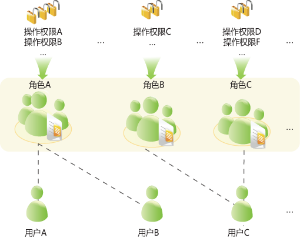

# 权限模型

## 基于角色的权限控制

FusionInsight通过采用RBAC（role-based access control，基于角色的权限控制）方式对大数据系统进行权限管理，将系统中各组件零散的权限管理功能集中呈现和管理，对普通用户屏蔽掉了内部的权限管理细节，对管理员简化了权限管理的操作方法，提升权限管理的易用性和用户体验。

FusionInsight权限模型由“用户－用户组－角色－权限”四类对象构成。

**图 1**  权限模型  

-   **权限**

    由组件侧定义，允许访问组件某个资源的能力。不同组件针对自己的资源，有不同的权限。

    例如：

    -   HDFS针对文件资源权限，有读、写、执行等权限。
    -   HBase针对表资源权限，有创建、读、写等权限。

-   **角色**

    组件权限的一个集合，一个角色可以包含多个组件的多个权限，不同的角色也可以拥有同一个组件的同一个资源的权限。

-   **用户组**

    用户的集合，当用户组关联某个或者多个角色后，该用户组内的用户就将拥有这些角色所定义的组件权限。

    不同用户组可以关联同一个角色，一个用户组也可以不关联任何角色，该用户组原则上将不具有任何组件资源的权限。

    > **说明：** 
    >部分组件针对特定的默认用户组，系统默认赋予了部分权限。

-   **用户**

    系统的访问者，每个用户的权限由该用户关联的用户组和角色所对应的权限构成，用户需要加入用户组或者关联角色来获得对应的权限。

## 基于策略的权限控制

Ranger组件通过PBAC（policy-based access control，基于策略的权限控制）方式进行权限管理，可对HDFS、Hive、HBase等组件进行更加细粒度的数据访问控制。

> **说明：** 
>组件同时只支持一种权限控制机制，当组件启用Ranger权限控制策略后，通过FusionInsight Manager创建的角色中关于该组件的权限将失效（HDFS与Yarn的组件ACL规则仍将生效），用户需通过Ranger管理界面添加策略进行资源的赋权。

Ranger的权限模型由多条权限策略组成，权限策略主要由以下几方面组成：

-   资源

    组件所提供的可由用户访问的对象，例如HDFS的文件或文件夹、Yarn中的队列、Hive中的数据库/表/列等。

-   用户

    系统的访问者，每个用户的权限由该用户关联的策略来获得。LDAP中的用户、用户组、角色信息会周期性的同步至Ranger。

-   权限

    策略中针对资源可配置各种访问条件，例如文件的读写，具体可以配置允许条件、拒绝条件以及例外条件等。

