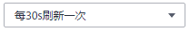

# 查看事件列表

事件列表显示了集群中的所有事件信息，如重启服务、停止服务等。

事件列表默认按时间顺序排列，时间最近的告警显示在最前端。

事件信息中的各字段说明如[表1 事件说明](#zh-cn_topic_0173397435_table5924273517010)所示。

**表 1**  事件说明

<table><thead align="left"><tr id="zh-cn_topic_0173397435_row2217974117010"><th class="cellrowborder" valign="top" width="20%" id="mcps1.2.3.1.1">
参数

</th>
<th class="cellrowborder" valign="top" width="80%" id="mcps1.2.3.1.2">
参数说明

</th>
</tr>
</thead>
<tbody><tr id="row16726132616323"><td class="cellrowborder" valign="top" width="20%" headers="mcps1.2.3.1.1 ">
事件ID

</td>
<td class="cellrowborder" valign="top" width="80%" headers="mcps1.2.3.1.2 ">
事件的ID。

</td>
</tr>
<tr id="zh-cn_topic_0173397435_row595250417010"><td class="cellrowborder" valign="top" width="20%" headers="mcps1.2.3.1.1 ">
事件级别

</td>
<td class="cellrowborder" valign="top" width="80%" headers="mcps1.2.3.1.2 ">
事件级别。

MRS 3.x之前版本集群事件级别为：

<ul id="ul5867101115831"><li>致命</li><li>严重</li><li>一般</li><li>提示</li></ul>

MRS 3.x及之后版本集群事件级别为：

<ul id="ul141060124817"><li>紧急</li><li>重要</li><li>次要</li><li>提示</li></ul>
</td>
</tr>
<tr id="zh-cn_topic_0173397435_row431321819572"><td class="cellrowborder" valign="top" width="20%" headers="mcps1.2.3.1.1 ">
事件名称

</td>
<td class="cellrowborder" valign="top" width="80%" headers="mcps1.2.3.1.2 ">
产生事件的名称。

</td>
</tr>
<tr id="zh-cn_topic_0173397435_row3264057817010"><td class="cellrowborder" valign="top" width="20%" headers="mcps1.2.3.1.1 ">
生成时间

</td>
<td class="cellrowborder" valign="top" width="80%" headers="mcps1.2.3.1.2 ">
产生事件的时间。

</td>
</tr>
<tr id="row1413215177258"><td class="cellrowborder" valign="top" width="20%" headers="mcps1.2.3.1.1 ">
定位信息

</td>
<td class="cellrowborder" valign="top" width="80%" headers="mcps1.2.3.1.2 ">
定位事件的详细信息。

</td>
</tr>
</tbody>
</table>

**表 2**  按钮说明

<table><thead align="left"><tr id="zh-cn_topic_0173397435_row48561247151843"><th class="cellrowborder" valign="top" width="29.92%" id="mcps1.2.3.1.1">
按钮

</th>
<th class="cellrowborder" valign="top" width="70.08%" id="mcps1.2.3.1.2">
说明

</th>
</tr>
</thead>
<tbody><tr id="zh-cn_topic_0173397435_row1839341310159"><td class="cellrowborder" valign="top" width="29.92%" headers="mcps1.2.3.1.1 ">

</td>
<td class="cellrowborder" valign="top" width="70.08%" headers="mcps1.2.3.1.2 ">
在下拉框中选择刷新事件列表的周期。

<ul id="zh-cn_topic_0173397435_ul92563324164"><li>每30s刷新一次</li><li>每60s刷新一次</li><li>停止</li></ul>
</td>
</tr>
<tr id="zh-cn_topic_0173397435_row42104918151843"><td class="cellrowborder" valign="top" width="29.92%" headers="mcps1.2.3.1.1 ">

</td>
<td class="cellrowborder" valign="top" width="70.08%" headers="mcps1.2.3.1.2 ">
单击，手动刷新事件列表。

</td>
</tr>
<tr id="zh-cn_topic_0173397435_row2681169324"><td class="cellrowborder" valign="top" width="29.92%" headers="mcps1.2.3.1.1 ">
高级搜索

</td>
<td class="cellrowborder" valign="top" width="70.08%" headers="mcps1.2.3.1.2 ">
单击“高级搜索”显示事件搜索区域，设置查询条件后，单击“搜索”，查看指定的事件信息。单击“重置”清除输入的搜索条件。

</td>
</tr>
</tbody>
</table>

## 导出事件

1.  选择“集群列表 \> 现有集群“，单击集群名称进入集群详情页面。
2.  单击“告警管理 \> 事件”。
3.  单击“全部导出”。
4.  在弹框内选择保存类型，单击“确定”。

