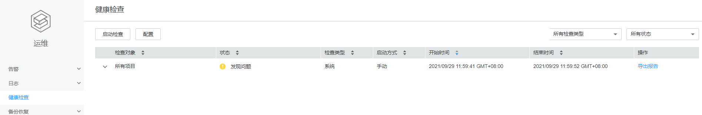

# 查看健康检查任务

## 操作场景

管理员可以在健康检查的管理中心查看所有健康检查任务，便于在修改某些配置之后的场景对比修改前后是否对集群产生影响。

## 操作步骤

1.  登录FusionInsight Manager。
2.  选择“运维  \>  健康检查“。

    **图 1**  健康检查  
    

    默认显示所有已保存的检查报告，以列表形式展示，包含如下所示的信息：

    **表 1**  健康检查报告记录

    
    <table><thead align="left"><tr id="zh-cn_topic_0263899580_row14219165171713"><th class="cellrowborder" valign="top" width="25%" id="mcps1.2.3.1.1">
项目

    </th>
    <th class="cellrowborder" valign="top" width="75%" id="mcps1.2.3.1.2">
说明

    </th>
    </tr>
    </thead>
    <tbody><tr id="zh-cn_topic_0263899580_row1321918512179"><td class="cellrowborder" valign="top" width="25%" headers="mcps1.2.3.1.1 ">
检查对象

    </td>
    <td class="cellrowborder" valign="top" width="75%" headers="mcps1.2.3.1.2 ">
表示被检查的对象，可打开下拉菜单查看详情。

    </td>
    </tr>
    <tr id="zh-cn_topic_0263899580_row6219165161716"><td class="cellrowborder" valign="top" width="25%" headers="mcps1.2.3.1.1 ">
状态

    </td>
    <td class="cellrowborder" valign="top" width="75%" headers="mcps1.2.3.1.2 ">
表示检查的结果状态，包含未发现问题、发现问题和检查中。

    </td>
    </tr>
    <tr id="zh-cn_topic_0263899580_row124099110141"><td class="cellrowborder" valign="top" width="25%" headers="mcps1.2.3.1.1 ">
检查类型

    </td>
    <td class="cellrowborder" valign="top" width="75%" headers="mcps1.2.3.1.2 ">
表示执行检查的主体，包含“系统”、“集群”、“主机”、“服务”和“OMS”五个检查维度。集群维度默认包含所有检查。

    </td>
    </tr>
    <tr id="zh-cn_topic_0263899580_row1842992518191"><td class="cellrowborder" valign="top" width="25%" headers="mcps1.2.3.1.1 ">
启动方式

    </td>
    <td class="cellrowborder" valign="top" width="75%" headers="mcps1.2.3.1.2 ">
表示此次检查的属性，是否自动触发或手动执行。

    </td>
    </tr>
    <tr id="zh-cn_topic_0263899580_row202211955172"><td class="cellrowborder" valign="top" width="25%" headers="mcps1.2.3.1.1 ">
开始时间

    </td>
    <td class="cellrowborder" valign="top" width="75%" headers="mcps1.2.3.1.2 ">
表示此次检查的开始时间。

    </td>
    </tr>
    <tr id="zh-cn_topic_0263899580_row71382020194815"><td class="cellrowborder" valign="top" width="25%" headers="mcps1.2.3.1.1 ">
结束时间

    </td>
    <td class="cellrowborder" valign="top" width="75%" headers="mcps1.2.3.1.2 ">
表示此次检查的结束时间。

    </td>
    </tr>
    <tr id="zh-cn_topic_0263899580_row2088612683515"><td class="cellrowborder" valign="top" width="25%" headers="mcps1.2.3.1.1 ">
操作

    </td>
    <td class="cellrowborder" valign="top" width="75%" headers="mcps1.2.3.1.2 ">
支持“导出报告”和“查看帮助”。

    </td>
    </tr>
    </tbody>
    </table>

    > **说明：** 
    >-   在检查记录列表右上方，可以筛选指定的检查对象和结果状态。
    >-   如果检查类型为集群时，“查看帮助”在“检查对象”的下拉菜单中。
    >-   系统执行健康检查时，涉及检查对象的监控指标数据时，并非以当前实时的监控数据进行判断，而是收集近期的历史数据，因此存在时间延迟。

