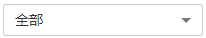

# 查看告警列表

告警列表显示了MRS集群中的所有告警信息，如主机故障、磁盘使用率超过阈值、组件异常等。

MRS管理控制台“告警管理“只能查询MRS中未清除告警的基本信息，查看详细信息或管理告警具体请参见[查看与手动清除告警](查看与手动清除告警.md)。

告警列表默认按时间顺序排列，时间最近的告警显示在最前端。

告警信息中的各字段说明如[表1](#table5924273517010)所示。

**表 1**  告警说明

<table><thead align="left"><tr id="row2217974117010"><th class="cellrowborder" valign="top" width="20%" id="mcps1.2.3.1.1">
参数

</th>
<th class="cellrowborder" valign="top" width="80%" id="mcps1.2.3.1.2">
参数说明

</th>
</tr>
</thead>
<tbody><tr id="row595250417010"><td class="cellrowborder" valign="top" width="20%" headers="mcps1.2.3.1.1 ">
级别

</td>
<td class="cellrowborder" valign="top" width="80%" headers="mcps1.2.3.1.2 ">
告警级别。

<ul id="ul5867101115831"><li>致命</li><li>严重</li><li>一般</li><li>提示</li></ul>
</td>
</tr>
<tr id="row431321819572"><td class="cellrowborder" valign="top" width="20%" headers="mcps1.2.3.1.1 ">
服务

</td>
<td class="cellrowborder" valign="top" width="80%" headers="mcps1.2.3.1.2 ">
产生告警的服务名称。

</td>
</tr>
<tr id="row1556529017010"><td class="cellrowborder" valign="top" width="20%" headers="mcps1.2.3.1.1 ">
描述

</td>
<td class="cellrowborder" valign="top" width="80%" headers="mcps1.2.3.1.2 ">
告警描述信息。

</td>
</tr>
<tr id="row3264057817010"><td class="cellrowborder" valign="top" width="20%" headers="mcps1.2.3.1.1 ">
生成时间

</td>
<td class="cellrowborder" valign="top" width="80%" headers="mcps1.2.3.1.2 ">
产生告警的时间。

</td>
</tr>
</tbody>
</table>

**表 2**  按钮说明

<table><thead align="left"><tr id="row48561247151843"><th class="cellrowborder" valign="top" width="29.92%" id="mcps1.2.3.1.1">
按钮

</th>
<th class="cellrowborder" valign="top" width="70.08%" id="mcps1.2.3.1.2">
说明

</th>
</tr>
</thead>
<tbody><tr id="row1839341310159"><td class="cellrowborder" valign="top" width="29.92%" headers="mcps1.2.3.1.1 ">

</td>
<td class="cellrowborder" valign="top" width="70.08%" headers="mcps1.2.3.1.2 ">
在下拉框中选择刷新告警列表的周期。

<ul id="ul92563324164"><li>每30s刷新一次</li><li>每60s刷新一次</li><li>停止刷新</li></ul>
</td>
</tr>
<tr id="row53160630151843"><td class="cellrowborder" valign="top" width="29.92%" headers="mcps1.2.3.1.1 ">

</td>
<td class="cellrowborder" valign="top" width="70.08%" headers="mcps1.2.3.1.2 ">
在下拉框中选择告警级别，筛选告警。

<ul id="ul24662286151939"><li>全部：表示筛选所有告警</li><li>致命：表示筛选“致命”级别的告警</li><li>严重：表示筛选“严重”级别的告警</li><li>一般：表示筛选“一般”级别的告警</li><li>提示：表示筛选“提示”级别的告警</li></ul>
</td>
</tr>
<tr id="row42104918151843"><td class="cellrowborder" valign="top" width="29.92%" headers="mcps1.2.3.1.1 ">

</td>
<td class="cellrowborder" valign="top" width="70.08%" headers="mcps1.2.3.1.2 ">
单击，手动刷新告警列表。

</td>
</tr>
<tr id="row2681169324"><td class="cellrowborder" valign="top" width="29.92%" headers="mcps1.2.3.1.1 ">
高级搜索

</td>
<td class="cellrowborder" valign="top" width="70.08%" headers="mcps1.2.3.1.2 ">
单击“高级搜索”显示告警搜索区域，设置查询条件后，单击“搜索”，查看指定的告警信息。单击“重置”清除输入的搜索条件。

</td>
</tr>
</tbody>
</table>

