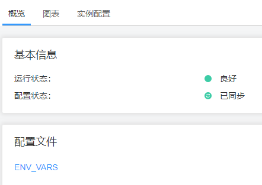

# 查看实例配置文件

## 操作场景

FusionInsight Manager支持在管理页面上直接查看实例节点上实际的环境变量、角色配置等配置文件内容，运维人员在需要快速排查实例对应配置项是否配置错误或者需要查看部分隐藏类型的配置项时，可直接在FusionInsight Manager上进行查看，帮助用户快速分析配置问题。

## 操作步骤

1.  登录FusionInsight Manager。
2.  选择“集群 \>  _待操作的集群名称_  \> 服务”。
3.  单击服务视图中指定的服务名称，并选择“实例“页签。
4.  单击需要查看配置的实例名称，在概览页面的“配置文件”区域内，系统会显示该实例相关的配置文件列表。

    **图 1**  查看实例配置文件  
    

5.  单击要查看的配置文件的名称，可查看配置文件内具体的配置参数值内容。

    如需获取该配置文件，可单击“下载至本地”按钮，将该配置文件内容下载到本地PC。

    > **说明：** 
    >集群内的节点故障时，将无法查看配置文件，请修复故障的节点后再查看。

