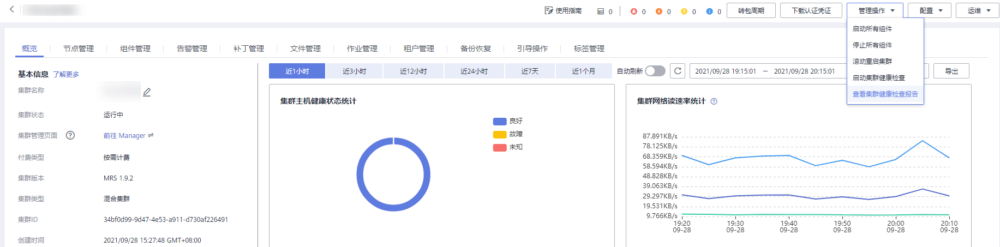

# 查看并导出检查报告

## 操作场景

为了满足对健康检查结果的进一步具体分析，您可以在MRS中查看以及导出健康检查的结果。

> **说明：** 
>系统健康检查的范围包含Manager、服务级别和主机级别的健康检查：
>-   Manager关注集群统一管理平台是否提供管理功能。
>-   服务级别关注组件是否能够提供正常的服务。
>-   主机级别关注主机的一系列指标是否正常。
>系统健康检查可以包含三方面检查项：各检查对象的“健康状态”、相关的告警和自定义的监控指标，检查结果并不能等同于界面上显示的“健康状态”。

## 前提条件

已执行健康检查。

## 操作步骤

1.  在集群详情页，单击页面右上角“管理操作 \> 查看集群健康检查报告”。

    

2.  在健康检查的报告面板上单击“导出报告”导出健康检查报告，可查看检查项的完整信息。

