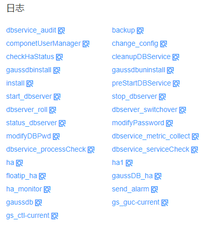

# 查看角色实例日志

## 操作场景

FusionInsight Manager支持在线直接查看各角色实例的日志内容，

## 操作步骤

1.  登录FusionInsight Manager。
2.  选择“集群 \>  _待操作的集群名称_  \> 服务 \>  _服务名称_  \> 实例”，单击需要查看日志的实例名称，进入实例状态页面。
3.  在“日志”区域，单击要查看的日志文件名称，即可在线预览对应日志内容。

    > **说明：** 
    >-   在“主机”页面单击主机名称，在主机详情页面的“实例”区域，也可查看该主机上所有角色实例的日志文件。
    >-   日志内容默认最多显示100行，可单击“加载更多”按钮查看更多日志内容。单击“下载”按钮，可将该日志文件下载到本地。如需批量下载服务日志，请参考[下载日志](下载日志.md#admin_guide_000075)。

    **图 1**  查看实例日志  
    

