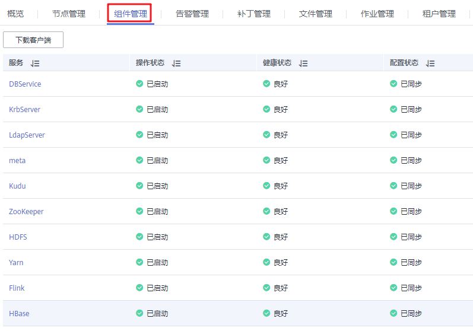
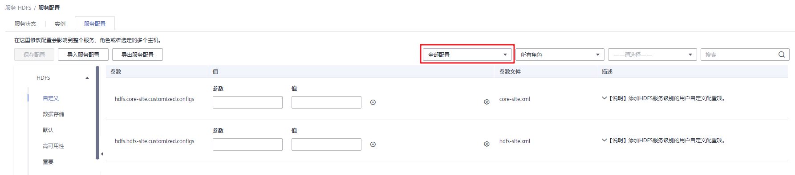

# 查看配置

用户可以在MRS上查看服务（含角色）和角色实例的配置。

## 前提条件

已完成IAM用户同步（在集群详情页的“概览”页签，单击“IAM用户同步“右侧的“点击同步”进行IAM用户同步）。

**图 1**  IAM用户同步  

## 操作步骤

-   查看服务的配置。
    1.  在集群详情页，单击“组件管理”。

        **图 2**  组件管理  
        

        > **说明：**   
        >针对MRS 1.8.10及之前版本，具体请参见[查看配置](查看配置-109.md)。  

    2.  单击服务列表中指定的服务名称。
    3.  单击“服务配置”。
    4.  将页面右侧“基础配置”切换为“全部配置”，界面上将显示该服务的全部配置参数导航树，导航树从上到下的根节点分别为服务名称和角色名称。

        **图 3**  全部配置  
        

    5.  在导航树选择指定的参数，修改参数值。支持在“搜索”输入参数名直接搜索并显示结果。

        在服务节点下的参数属于服务配置参数，在角色节点下的参数是角色配置参数。

    6.  在“——请选择——”选项（该选项仅在MRS 1.8.2及之后版本有效）中选择“非默认”，界面上显示参数值为非默认值的参数。

-   查看角色实例的配置。
    1.  在集群详情页，单击“组件管理”。

        **图 4**  组件管理  
        

        > **说明：**   
        >针对MRS 1.8.10及之前版本，具体请参见[查看配置](查看配置-109.md)。  

    2.  单击服务列表中指定的服务名称。
    3.  单击“实例”页签。
    4.  单击角色实例列表中指定的角色实例名称。
    5.  单击“实例配置”。
    6.  将页面右侧“基础配置”切换为“全部配置”，界面上将显示该角色实例的全部配置参数导航树。
    7.  在导航树选择指定的参数，修改参数值。支持在“搜索”输入参数名直接搜索并显示结果。
    8.  在“——请选择——”选项（该选项仅在MRS 1.8.2及之后版本有效）中选择“非默认”，界面上显示参数值为非默认值的参数。

