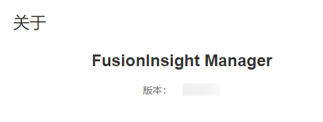

# 查询FusionInsight Manager版本号<a name="admin_guide_000003"></a>

管理员通过查看FusionInsight Manager版本号，可以进行下一步的系统升级及日常维护操作。

-   界面方式

    登录FusionInsight Manager，在主页界面，单击右上角的，在下拉框中单击“关于”，在弹框中查看FusionInsight Manager版本号。

    **图 1**  查看版本号<a name="zh-cn_topic_0263899628_fig1446416383379"></a>  
    

-   命令方式
    1.  以**root**用户登录FusionInsight Manager主管理节点。
    2.  执行如下命令，查看FusionInsight\_Manager的版本号及平台信息。

        **su - omm**

        **cd $\{BIGDATA\_HOME\}/om-server/om/sbin/pack**

        **./queryManager.sh**

        显示如下：

        ```
             Version             Package                                                          Cputype
             ***                 FusionInsight_Manager_***                                        x86_64
        ```

        > **说明：** 
        >此处版本号\*\*\*以实际查询的版本号为准。


