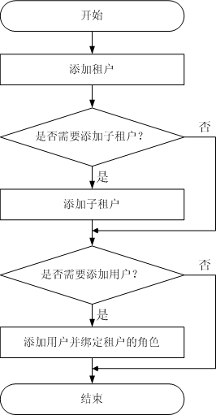

# 流程概述

在实际业务中，管理员需要先明确使用集群资源的业务场景，规划租户。然后在FusionInsight Manager界面添加租户，并配置租户的动态资源、存储资源以及所关联的服务。

创建租户的具体操作流程如[流程概述](流程概述.md)所示。

**图 1**  创建租户流程  

创建租户的操作说明如[表1](#t986256797c9741f79fb27fed0559d8cb)所示。

**表 1**  创建租户的操作说明

<table><thead align="left"><tr id="r93a8818928644c0aa7d925580b81d3e6"><th class="cellrowborder" valign="top" width="36.84%" id="mcps1.2.3.1.1">
操作

</th>
<th class="cellrowborder" valign="top" width="63.160000000000004%" id="mcps1.2.3.1.2">
说明

</th>
</tr>
</thead>
<tbody><tr id="r33c814fd55204c15a6af1dce292767b1"><td class="cellrowborder" valign="top" width="36.84%" headers="mcps1.2.3.1.1 ">
添加租户

</td>
<td class="cellrowborder" valign="top" width="63.160000000000004%" headers="mcps1.2.3.1.2 ">
可配置待添加租户的计算资源、存储资源和关联服务。

</td>
</tr>
<tr id="r216c6336201c4649a606da1e0e9c7931"><td class="cellrowborder" valign="top" width="36.84%" headers="mcps1.2.3.1.1 ">
添加子租户

</td>
<td class="cellrowborder" valign="top" width="63.160000000000004%" headers="mcps1.2.3.1.2 ">
可配置待添加子租户的计算资源、存储资源和关联服务。

</td>
</tr>
<tr id="r36fec56865644e60b48a6a41f41613b2"><td class="cellrowborder" valign="top" width="36.84%" headers="mcps1.2.3.1.1 ">
添加用户并绑定租户的角色

</td>
<td class="cellrowborder" valign="top" width="63.160000000000004%" headers="mcps1.2.3.1.2 ">
若一个用户想要使用“tenant1”租户包含的资源，或为“tenant1”租户添加/删除子租户，则需要同时绑定“Manager_tenant”和“tenant1_<em id="i1335714232348">集群ID</em>”两个角色。

</td>
</tr>
</tbody>
</table>

