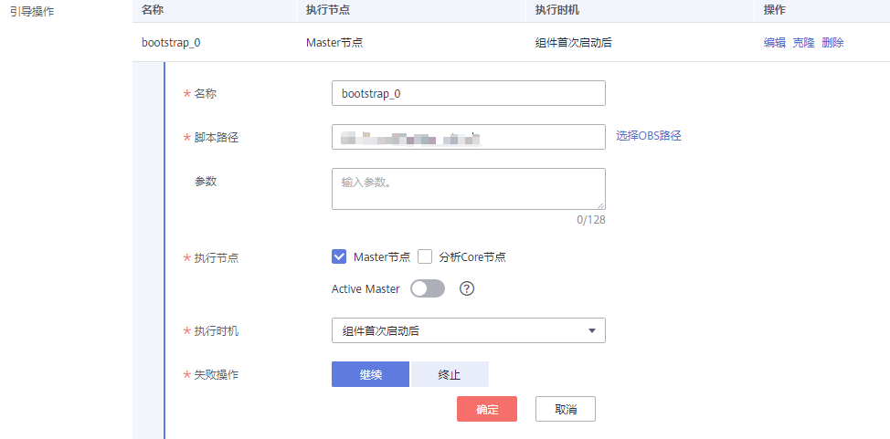
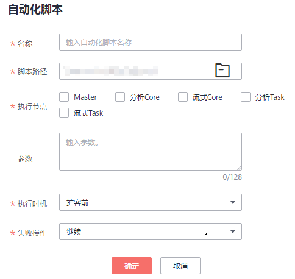

# 添加引导操作

## 在创建集群时添加引导操作

1.  登录MRS管理控制台。
2.  单击“购买集群”，进入“购买集群“页面。
3.  在购买集群页面，选择“自定义购买”。
4.  在“高级配置“区域的引导操作栏，单击“添加“。

    **图 1**  添加引导操作  
    

    **表 1**  参数描述

    
    <table><thead align="left"><tr id="row1574783017401"><th class="cellrowborder" valign="top" width="27%" id="mcps1.2.3.1.1">
参数

    </th>
    <th class="cellrowborder" valign="top" width="73%" id="mcps1.2.3.1.2">
说明

    </th>
    </tr>
    </thead>
    <tbody><tr id="row77471830174011"><td class="cellrowborder" valign="top" width="27%" headers="mcps1.2.3.1.1 ">
名称

    </td>
    <td class="cellrowborder" valign="top" width="73%" headers="mcps1.2.3.1.2 ">
引导操作脚本的名称。

    
只能由数字、英文字符、空格、中划线和下划线组成，且不能以空格开头。

    
可输入的字符串长度为1～64个字符。

    
 说明： 

同一集群内，不允许配置相同的名称。不同集群之间，可以配置相同的名称。

    

    </td>
    </tr>
    <tr id="row374783034013"><td class="cellrowborder" valign="top" width="27%" headers="mcps1.2.3.1.1 ">
脚本路径

    </td>
    <td class="cellrowborder" valign="top" width="73%" headers="mcps1.2.3.1.2 ">
脚本的路径。路径可以是OBS桶的路径或虚拟机本地的路径。

    <ul id="ul107475303406"><li>OBS桶的路径，必须以obs:://开头，以.sh结尾。如zeppelin安装示例脚本：obs://mrs-samples-bootstrap-cn-north-1/zeppelin/zeppelin_install.sh</li><li>虚拟机本地的路径，脚本所在的路径必须以‘/’开头，以.sh结尾。</li></ul>
    </td>
    </tr>
    <tr id="row116331135103210"><td class="cellrowborder" valign="top" width="27%" headers="mcps1.2.3.1.1 ">
参数

    </td>
    <td class="cellrowborder" valign="top" width="73%" headers="mcps1.2.3.1.2 ">
引导操作脚本参数。

    </td>
    </tr>
    <tr id="row274823064014"><td class="cellrowborder" valign="top" width="27%" headers="mcps1.2.3.1.1 ">
执行节点

    </td>
    <td class="cellrowborder" valign="top" width="73%" headers="mcps1.2.3.1.2 ">
选择引导操作脚本所执行的节点类型。

    </td>
    </tr>
    <tr id="row15749153054013"><td class="cellrowborder" valign="top" width="27%" headers="mcps1.2.3.1.1 ">
执行时机

    </td>
    <td class="cellrowborder" valign="top" width="73%" headers="mcps1.2.3.1.2 ">
选择引导操作脚本执行的时间。

    <ul id="ul7461220103311"><li>组件首次启动前</li><li>组件首次启动后</li></ul>
    </td>
    </tr>
    <tr id="row474917307402"><td class="cellrowborder" valign="top" width="27%" headers="mcps1.2.3.1.1 ">
失败操作

    </td>
    <td class="cellrowborder" valign="top" width="73%" headers="mcps1.2.3.1.2 ">
该脚本执行失败后，是否继续执行后续脚本和创建集群。
 说明： 

建议您设置为“继续”，无论此引导操作是否执行成功，则集群都能继续创建。

    

    

    </td>
    </tr>
    </tbody>
    </table>

5.  单击“确定”。

    添加成功后，可以通过“操作”列进行编辑、克隆和删除。

## 在弹性伸缩集群页面添加自动化脚本

1.  登录MRS管理控制台。
2.  选择“集群列表 \> 现有集群”，选中一个运行中的集群并单击集群名称。进入集群详情页面。
3.  在“节点管理”页签Task节点组的“操作”列单击“弹性伸缩“，进入“弹性伸缩“页面。

    当集群没有Task节点时，先单击“配置Task节点”增加Task节点，再执行该步骤。

4.  配置资源计划。

    资源计划可调控节点数量，也会对实际价格有影响，请谨慎操作。

    配置操作：

    1.  在弹性伸缩页面，开启弹性伸缩功能。

        **图 2**  弹性伸缩页面  
        

    2.  节点数量范围的“默认范围“设置为“2-2“，表示除资源计划规定时间范围外，其他时间Task节点数量固定为2个。
    3.  单击默认范围下方的“配置指定时间段的节点数量范围“。
    4.  配置“时间范围“和“节点数量范围“。此处“时间范围“设置为“07:00-13:00“，“节点数量范围“设置为“5-5“，表示在该时间范围内，Task节点数量固定为5个。参数详情请参考[表2](配置弹性伸缩规则.md#table1846575414619)。

        可以单击“配置指定时间段的节点数量范围“配置多条资源计划。

5.  （可选）配置自动化脚本。

    1.  在“高级配置“项选择“现在配置“。
    2.  单击“添加“，进入“自动化脚本“配置页面。

    **图 3**  自动化脚本  
    

    1.  配置“名称”、“脚本路径”、“执行节点类型”、“参数”、“执行时机”、“失败操作”。参数详情请参考[表3](配置弹性伸缩规则.md#table15644113520578)。
    2.  单击“确定“保存自动化脚本配置。

6.  勾选“我同意授权MRS服务根据以上策略自动进行节点扩容/缩容操作。“。
7.  单击“确定“，完成弹性伸缩集群设置。

